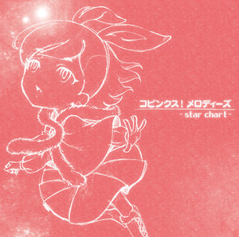

# 2024年1月29日 佳林ちゃんHBNM配信中！

## 宮本佳林 LIVE 2023秋～Hello! Brand new me～ in 広島

[【Hello! Project STREAM】宮本佳林 LIVE 2023秋～Hello! Brand new me～ in 広島](https://www.up-fc.jp/helloproject-stream/item_Detail.php?@DB_ID@=445)

佳林ちゃんの2023年秋の単独ライブ Hello! Brand new me（HBNM）の最終公演（広島）の映像が配信サイトで見れますよう！

ダイジェストは無料で見れますよ！！！

[<i class="fa-lg fa-brands fa-youtube"></i> KARIN MIYAMOTO LIVE 2023 AUTUMN～Hello! Brand new me～ for JLOX](https://www.youtube.com/watch?v=dvdtHzcPWtk)

## 「Hello!」と「Brand new me」

MCでも言っている通りですね、佳林ちゃんはハロプロエッグになってから**15周年**なんです！

> ハロプロエッグに加入して**15年**。Juice=Juiceとしてデビューして**10年**

このハロプロとしての歴史が「**Hello!**」なわけですね。

そして、Juice=Juice卒業後もソロとして活動中！新しい宮本佳林がどんどん現れます！それが「**Brand new me**」なわけです。

今回のHBNMではその15年の歴史がギュッと凝縮されてます。さらに！新曲もどどどどっとあります。そしてそして、未来の宮本佳林を期待させるような仕掛けもあるのです。。

## コピンクメドレーからエッグ（研修生）メドレー！

| 年     | 出来事      |      
|--------|---------------- |
| 2008年 | **ハロプロエッグ加入** |
| 2010年 | モーニング娘。9期オーディション落選。 『ピンクス』『コピンクス』で「**コピンク**」役でナレーション参加。|
| 2011年 | スマイレージ2期オーディション落選（最終審査）。  モーニング娘。10期『元気印』オーディション落選。|
| 2012年 | モーニング娘。11期『スッピン歌姫』オーディション落選|

### コピンクス

HBNMでも

* **カリーナノッテ**
* **最高視感度**
* **リバース**

がメドレーで披露されていました。佳林ちゃんがエッグ時代に「**コピンク**」名義の楽曲があるんです。これがよい！！！

[コピンクス！メロディーズ〜star chart〜](http://www.up-front-create.com/jyoujyougundan/discography/detail/UFCW-1053)

このミニアルバムまじで神アルバムです。各種配信サービスにありますので、、みなさんぜひ。。（<small>児玉雨子さんの作詞デビュー？でもあるんです。。。素晴らしいです。。。</small>）

なんていうんでしょうね。。佳林ちゃんの本当に夜空からキラキラ✨と光の粒を散らしながら現れる妖精🧚のようなですね。。

佳林ちゃんにはアニメ・ゲーム的なヲタク要素みたいなのもあると思うんですよね。声優さんのキャラソンとかアルバムとかあるじゃないですか。2000年代的ななんというのでしょう。。。ああいう感じの素晴らしさがここにあるんですよ！

私はHBNM清水公演に参加してですね、、ちょうど『コピンクス』は静岡の番組ということもあって、なかなかエモいシチュエーションだったのです（<small>駿府城公園もあったり…</small>）。

### スマイレージ2期オーディション

改めて年表見て驚くのが、こんなにもオーディションで落選しているのか…と。

特にエッグ時代のメドレーとして配信でも

* **有頂天LOVE**

をハロプロ研修生の**橋田歩果**ちゃんが披露していました。これは「スマイレージ2期オーディション」の最終審査の課題曲だったわけですね。

それをデビュー間近に迫ったハロプロ研修生が披露するというのも、なんかこう、胸に来ませんか！

### モーニング娘。9期・10期オーディション

また、最近で言うとこれも見てほしい！

[<i class="fa-lg fa-brands fa-youtube"></i>【M-line Music#125】Hello! Project ハイライト モーニング娘。「女と男のララバイゲーム」](https://www.youtube.com/watch?v=v8ax7vZ3Qc8&t=1068s)

> 2011年組と呼ばれているデビュー組がいまして、こっから新メン入れないって言ったんですよ（つんくさんが）。私にとって2011年はすっごい傷ついた年で！

2010年のモーニング娘。の映像なんですが、佳林ちゃんがこの当時の気持ちを熱く語っています。当時佳林ちゃんはこのモーニング娘。のオーディションに参加しているわけですね。

たしかに、モーニングの9期・10期とスマイレージ2期でどどどっとハロプロエッグがデビューしていって、自分がそこに入らなかったというのを見ると胸が苦しいものがありますね。。

佳林ちゃんのメラメラ🔥とした気持ちとか、ステージに立つための困難を痛いほど知っているというのが伝わるんですよね。だからこそ決して妥協しないし最高をつねに目指していて気がまったく緩まない感じがある。

## Juice=Juice メドレー

|   年   |     出来事      |
|--------|-------------- |
| 2013年 | **Juice=Juice結成** （オリジナルメンバー）|
| 2015年 | Juice=Juice 初の**単独ホール公演** （中野サンプラザ）  **LIVE MISSION 220**（全国で単独ライブを220公演！） |
| 2016年 | Juice=Juice 初の**単独武道館公演** |
| 2017年 | Juice=Juice 初の**ワールドツアー** |
| 2019年 | Juice=Juice 初の**単独国立代々木競技場第一体育館公演**|
| 2020年 | Juice=Juice **卒業**（武道館）|

デビューの機会を苦しい思いで見届けながら、佳林ちゃんはオリジナルメンバーとして **Juice=Juice** が結成されるわけです！

**LIVE MISSION 220** やばいですよね。。当時『武道館』というテレビドラマも出演していて、まさに結成直後のJuice=Juiceというアイドルグループがものすごい量の現場を経験してですね、最終的には本当に**武道館**に結びつくわけです。

HBNMでも

* **Wonderful World**

ありますよね。これがその武道館初公演でも披露されていまして、、

[<i class="fa-lg fa-brands fa-youtube"></i> Juice=Juice『Wonderful World』（Juice=Juice LIVE MISSION FINAL at 日本武道館）](https://www.youtube.com/watch?v=cyFB7sB6CYs)

これがすごいのよ。最後に佳林ちゃんが「みんなで歌うよ～」って言って、

>  \\\\ La La La ... //

ってみんなで歌うわけです（<small>ファンの方たちがまたすごいのは「いつまでも Only You～」っていう主線じゃないのも歌ってる笑</small>）。さらに「みんなだけで歌って～」

> \\\\ La La La ... //

ってなるじゃない。で、ひとしきり歌ったと思ったら、まだ、

> \\\\ La La La ... //

が続くんですよ！　このときの佳林ちゃんがすごい！ パッとOK、OKって感じで一緒に歌い出すんです。そして、ゆっくり

> La～ La～ La～ ... Foooooooo!!! 

と言って、武道館の万というファンたちをまとめて、さらに！

> こーのー世界はー **みんなーのーものーーーー！！**

🎉🎉🎉🎉🎉

で、銀テープ！ 素晴らしすぎませんか！！！！！

HBNMでもみんなで「La La La」って歌えるんです！　こういう歴史が詰まっているんですよ！！！

## ソロ曲！

| 年     | 出来事           |
|------- |---------------- |
| 2020年 | **M-line Club** 加入|
| 2021年 | M-line Special 2021 ～Make a Wish～ 開催   **単独ライブ**『**アマリリス**』『**ダリア**』開催   **1stシングル**「どうして僕らにはやる気がないのか/氷点下/規格外のロマンス」発売 |
| 2022年 | M-line Special 2022 ～My Wish～ 開催   **単独ライブ**『**アメジスト**』開催   **2ndシングル** 「なんてったって I Love You/ハウリング」発売   **舞台** STAGE VANGUARD「悪嬢転生」開催   **1stアルバム**「ヒトリトイロ」発売 |
| 2023年 | M-line Special 2023 ～Magical Wish～ 開催   **単独ライブ**『ヒトリトイロ』開催   **舞台** STAGE VANGUARD「悪嬢転生」リニューアル公演 開催   **単独ライブ**『Hello! Brand new me』開催   **3rdシングル** 『バンビーナ・バンビーノ/Lonely Bus』発売 |
| 2024年 | M-line Special 2024 ～Many Wishes～ 開催   **単独ライブ**『Hello! Brand new me RETURNS』開催

単独武道館、ワールドツアー、単独代々木公演ともうJuice=Juiceはハロプロに**どん！！！！** と何て言うんですか？確立したもう何かなんですよ。

新メンバーも加入してJuice=Juiceは最強グループになってですね、佳林ちゃんはその大きな財産を残してハロプロを卒業するわけです。

そこからのソロ活動がまたすごいのなんの！！

### オリジナル曲！

HBNMでもたっくさんオリジナル曲

* 「**氷点下**」「**少女K**」「**イイオンナごっこ**」「**どうして僕らにはやる気がないのか**」「**自分ファースト**」「**夜明けまでのララバイ**」「**なんてったって I Love You**」「**落ちこぼれのガラクタだって**」

が見れます！！　特に2022年に発売されたアルバム「ヒトリトイロ」の表題にもある通りですね、佳林ちゃんは「ヒトリトイロ」なんですよ！

そこに貫かれているのは、なんでしょうね、、ソロとしてあらゆる困難と戦う佳林ちゃんだったり、**スーパーアイドル**として新しい宮本佳林だったり、、

そして、HBNMではもちろん2023年の新曲

* 「**バンビーナ・バンビーノ**」「**Lonly Bus**」「**BAD**」「**Beautiful Song**」「**ソリスト・ダンス**」「**パラレルハート**」

が聴けます！ Brand new me なのよ！

### ソリスト・ダンス

全部語りたい何かなんですけど「ソリスト・ダンス」について話させてください。。。

私が初めてこの曲を聴いたのはHBNMのZepp DiverCity公演でした。

> ひとり DANCE DANCE ありのまま 〔…〕 そして だんだん 自由自在 大胆 飛び出す 舞台 そう 人生は独壇場

佳林ちゃんはですね、昨年の夏にたっくさんアイドルフェスに参加してたんですね。私も**SPARK**という山中湖で行われたフェスに参加してきまして、そのトップバッターが佳林ちゃんだったんですよ。

アイドルグループがたっくさんある中でほとんど唯一のソロ名義出演でした。

そこで広いステージを圧倒的なパフォーマンスで走り回るあの宮本佳林のカッコよさ？

ソロ活動でたっくさんの困難があったはずなんです。でも、それと真正面に向き合い、そしてちゃんと答えるんですよ。もがき苦しみながらも最高のパフォーマンスで応答する。

私は初めてこれ聴いたとき、あまりにも感動しまして涙が止まりませんでした😭

でね？　昨年末怒涛の新曲リリイベがあるんですけど（<small>その話もどこかでしたいんですけど</small>）、そこで「ソリスト・ダンス」がスーパーアイドル曲に進化してるんですよ！

[<i class="fa-lg fa-brands fa-tiktok"></i> アイドル曲コールに自信ある方集まれ！](https://www.tiktok.com/@karin_miyamoto/video/7298638408769948929)

* 👏👏👏👏
* フッフー！
* オーイオーイオイオイオイオイ！
* <small>ｳｰ!</small> オイ！<small>ｳｰ!</small> オイ！<small>ｳｰ!</small> オイ！<small>ｳｰ!</small> オイ！
* L・O・V・E Lovely かりん！
* かーりん！かーりん！

もう、コールぜんぶあるやん。。この進化したソリスト・ダンスがラスト（<small>ダブルアンコール前</small>）にありますので、ぜひ！！！

## スーパーアイドル 宮本佳林

私がまたグッと宮本佳林に引き込まれたのはですね、、宮本佳林は高らかに「**スーパーアイドル**」を宣言するんですよ。

HBNMでも、森高千里の

* **私がオバさんになっても**

を森高風の衣装で披露するんですよ。単独ライブ「ヒトリトイロ」のときも後藤真希・松浦亜弥・藤本美貴に自らを並べる演出があったりと、佳林ちゃんは高みを見ているのです。

佳林ちゃんはその約束にパフォーマンスで答えるんですよ。私たちは宮本佳林にその絶大な信頼があるから、この宣言もワクワクしかないんです。

いつか万の会場でたとえば「Beautiful Song」をやってくれたらやばい。

[<i class="fa-lg fa-brands fa-youtube"></i>【M-line Music#117】VTR② 宮本佳林「Beautiful Song」 宮本佳林 LIVE 2023秋～Hello! Brand new me～（10.7 Zepp DiverCity）](https://www.youtube.com/watch?v=doV8B5rZrLA&t=700s)

こちらもぜひ。。

## ＊

というですね、濃密な佳林ちゃんの15年そしてこれからの未来なわけですが、それギュッを見せてくれるのが「Hello! Brand new me」なわけです。

しかも！ リニューアル公演も決定しております！

[宮本佳林 LIVE 2024春～Hello! Brand new me～RETURNS](http://www.jp-r.co.jp/karin_miyamoto/event/detail/7c11b40461aa0c158c7fbc69cbdc96591016e117)

このすっごい速さで走り続ける佳林ちゃんを見逃すな！！　15年という歴史があるにもかかわらず遅すぎるということはないのです！（<small>いうて私もつい最近なのです</small>） だって、これから先まだまだ続いていくのだから！！！！