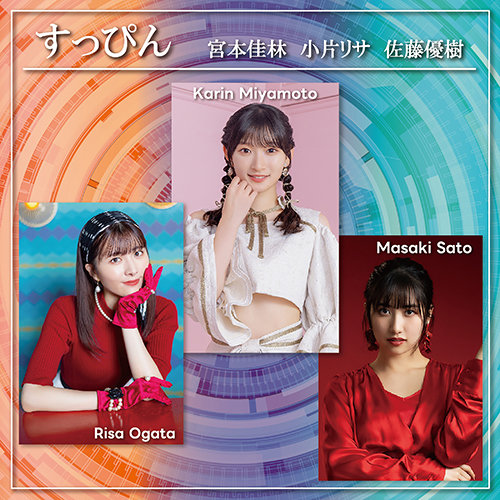

# 2024年1月30日 JOYSOUNDでまるかりん新曲配信！すっぴんも！

先日、カラオケJOYSOUNDで

* 宮本佳林「バンビーナ・バンビーノ」（[JOYSOUND](https://www.joysound.com/web/search/song/991204)）
* 小片リサ「映画の趣味が合うだけ」（[JOYSOUND](https://www.joysound.com/web/search/song/1000080)）
* 宮本佳林・小片リサ・佐藤優樹「すっぴん」（[JOYSOUND](https://www.joysound.com/web/search/song/1007730)）

が配信されました🎤

## 宮本佳林「バンビーナ・バンビーノ」

### ブチ上げちゃいましょう～ 👆👆

[<i class="fa-lg fa-brands fa-youtube"></i> 宮本佳林『バンビーナ・バンビーノ』Promotion Edit](https://www.youtube.com/watch?v=2p9U27l1yVY)

めちゃめちゃよくないですか！？

たくさん好きなところあるんですけど、たとえば、

> どん底落ちた自己肯定感～ ブチ上げちゃいましょう～ 👆👆

「どん底」ってところで音が潜る（？）んですよ。ごぽぉん…って（伝われ）。そして、水面からバシャって飛び出てくる感じで、サビですわ。ﾊﾟﾊﾟﾊﾟﾊﾟﾝ！

> っあーなたの言葉でキラキラさせて 褒めれば伸びる子 **バンビーナ！**

くーーーーーーー！いい！

### 代々木25周年で初披露

この音源はたしかですね、

* 宮本佳林の雑談ラジオ

の、2023年9月9日（土）深夜0:30 放送で初OAだったんですね。ラジオで初OAされるの興奮しますよね。。で、衝撃走るわけですよ。

めっちゃサンバカーニバル的な感じで、お、お、**おおおお！！！** みたいな。

> これぞ！ LOVEパワー！ 👆 \\\\ Hey //

ここいいぃ！ また佳林ちゃんが「パワー」って言うのいい。「頑張れる明日も」なのよ。

で、9月9日（土）ってのがまた重要なんですね。というのも、9月10日（日）に、**国立代々木競技場　第一体育館**で、

* Hello! Project 25th ANNIVERSARY CONCERT

がありまして、その夜公演に佳林ちゃんが参加するからなんですね。。なんか佳林ちゃんも放送中にちょい匂わせするんですよ。。いま聞かないと後悔するよ。。みたいな！？

で、1万人以上の前で「バンビーナ・バンビーノ」を初披露！

かっこいいわぁ。。25周年ということもあり、ハロプロの歴代の名曲を現役メンバーとオリジナルメンバーがコラボレーションするという、エモすぎてエモすぎてコンサートなんですけども、そこで新曲を披露するのがまたよくないですか！？

## 小片リサ「映画の趣味が合うだけ」

[<i class="fa-lg fa-brands fa-youtube"></i> 小片リサ『映画の趣味が合うだけ』Promotion Edit](https://www.youtube.com/watch?v=11D-FGWW_Ew)

こちらもいいいいいい！

**まるかりん** がほとんど同時期にシングルをリリースするってのがまたエモい。で、また「バンビーナ・バンビーノ」とは全然違う方向性！

### 声のニュアンス！

 [2024年1月28日 M-line Music #127 感想](./20240128.md)

 ここでも書いてるんですけど、りさまるの[e]の母音が好きなのよ！

 > だって映画の趣味が合うだ**け～**👈 今夜渋谷は曇りのちあ**め～**👈

てか、何て言ったらいいのでしょうか。声がｷｭﾝって絞られた高音感というのか。ほかにも、

> 君（き**み**）はどう？

の「**み**」のところでｷｭﾝってなるんよ。。これがいい！！！

このね、、声でニュアンスをめっちゃ表現してる感じがあるんですよね。。決して大声ではないのですけど、訴えかけるような、、そこに胸が締め付けられるんですよ…

### MVやばい

まあ、とくに間奏のところですよ。デートやん。Vlogやん。思い出やん。

りさまるのね、、自然な感じ？　リアルな感じ？　これがまあ、たまらんのよ。

[<i class="fa-lg fa-brands fa-youtube"></i> 小片リサ『どっち』Music Video](https://www.youtube.com/watch?v=Nr9y0AsU0qs)

それで言うとですね、『どっち』もいいんですよ。。

りさまるはやっぱり街を私服衣装で歩くイメージがやっぱりあって、一方で、佳林ちゃんはアイドル衣装！でスタジオのセット！みたいなところで歌って踊る感じ。

## 宮本佳林・小片リサ・佐藤優樹「すっぴん」

まあね、**宮本佳林**と**小片リサ**（私たちは**まるかりん**と呼ぶ）は M-line の**双璧**であり**両翼**であり**風神・雷神**なんですよ。

お互いに作品やパフォーマンスと向き合う気持ちは同じでも全く対照的なものに仕上がったりしてですね、、このコントラストが素晴らしいのですわ。

そんな**まるかりん**がですよ？　なんと**佐藤優樹（まーちゃん）**と！

歌ってるんですわ。。各種配信サービスにあるからすぐに聴くんだよ。。

[iTunes Store](https://itunes.apple.com/jp/album/1715991716?&at=1001l39aB&ct=mosspp&?app=itunes) [レコチョク](https://recochoku.jp/album/A1030245642) [mora(ハイレゾ)](https://mora.jp/package/43000030/UFDL-1524-HR/)

### 歌割がソロ

この曲がまた面白いのはですね、歌割がソロなんですよ。たとえば、1サビが

> ねぇ すっぴんで生きていこう そんな簡単じゃないけど（**りさまる**）   躓いたって泣いたって私 一人じゃない（**佳林ちゃん**）   もう一編始めてみよう どこまで行けるだろう（**まーちゃん**）   空回り遠回りしたっていい 私のすべて（**佳林ちゃん**）

こうなんですね。サビに限らずほとんどすべてがこうなんですよ。また、2サビでは

> そう すっぴんで生きていこう 綺麗事じゃないけれど（**佳林ちゃん**）   吐き出したくて泣きたくて君は 我慢してた（**まーちゃん**）   じゃあ天辺（<small>てっぺん</small>）をめざして行こう どこまで行けるだろう（**佳林ちゃん**）   満足でも不足でも心で叫んでいる（**りさまる**）

分かりますか？？ 1サビとパートが違うのよ！！

たとえば「すっぴんで生きていこう」は1番ならりさまる、2番なら佳林ちゃんみたいな。二人の歌声は歌い方レベルで全然違うからこそ、こういうパラレル感がね、、よいのですねーーーー！！！

### 待ちに待った「すっぴん」

この曲はTBS「ふるさとの未来」のオープニング曲で番組冒頭にサビだけ流れるんですね。私は初めて聴いたとき、え？めっちゃいい曲やん！と。え？しかも、

* **宮本佳林**
* **小片リサ**
* **佐藤優樹**

？？？？　豪華すぎるか？　で、フルを聴きたくて聴きたくて首を長くして待っていたんですね。

初めて聴いたのが、たぶん、2023年の春頃で、ようやくその時が来ます・・・（<small>これを配信してくれる M-line Music マジ神</small>）

[<i class="fa-lg fa-brands fa-youtube"></i> 【M-line Music#124】VTR③ 宮本佳林・小片リサ・佐藤優樹「すっぴん」 ナルチカ 2023 OCHA NORMA in 備前（11.19 備前市市民センター）(23:50～)]( https://www.youtube.com/watch?v=hssWGXiFBDY&t=23m50s)

この備前のOCHA NORMAのライブにゲストでこの三人が集まるってことで、もう、絶対すっぴん初披露じゃん！ってなりまして、行きました👍

また、まるかりんが同じステージに立つのは私の記憶が正しければ、2023年8月31日の船堀MSMW以来なんですよ。まるかりんが…まるかりんが…ってなってですね、、「すっぴん」が聴けて、来てよかった～ってなってたらですよ。。。

[<i class="fa-lg fa-brands fa-instagram"></i> karin_miyamoto.official（2023年11月19日）](https://www.instagram.com/p/Cz0pAa8Pjvy/)

**ふぁああああああああああああああああああああああああああ**

こういうことするのよ！！　ああぁぁぁあああああ！！！

この投稿があった瞬間ちょうどある佳林党員の方と一緒にいまして、まるかりん良いですよね、、って話を延々としてるところにこれが投下されたので、もう昇天なのよ😇

## ＊

らんららららーん🎵 らんらららららーん🎵