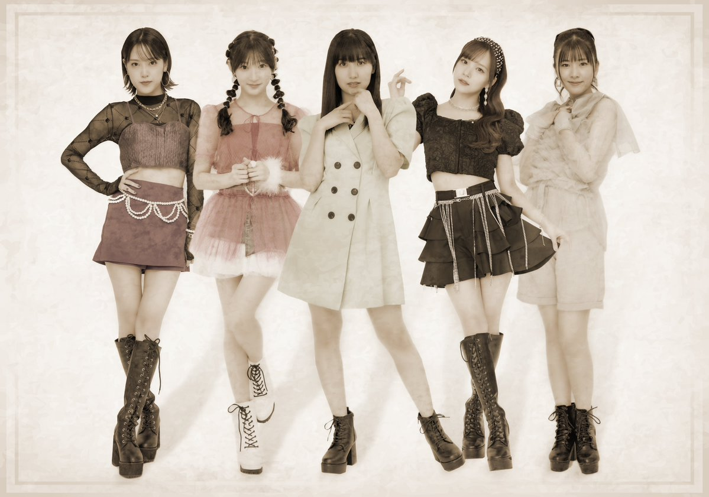
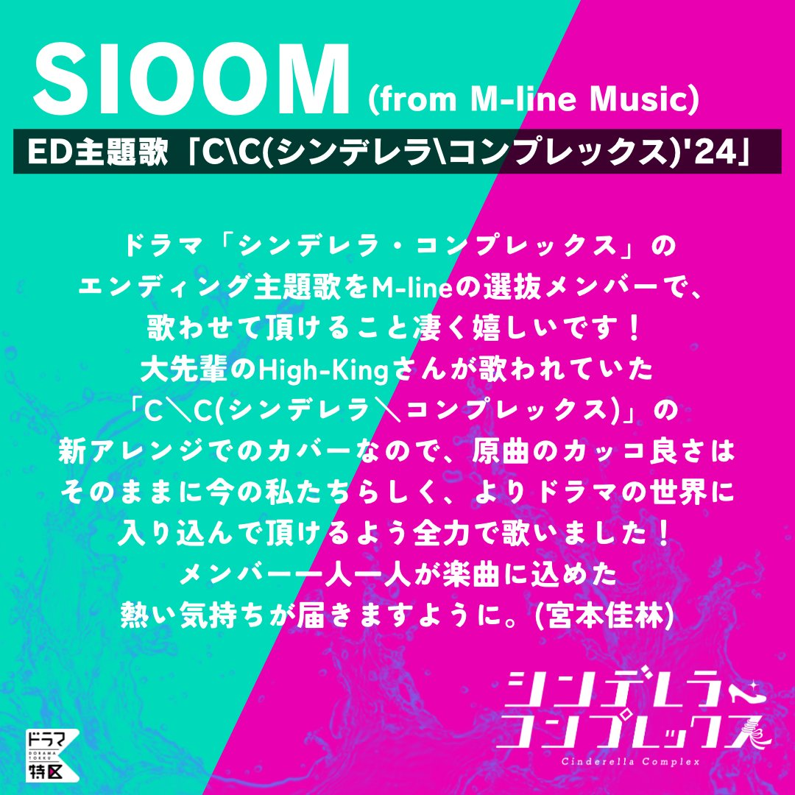

## M-line Music 新ユニット <big>SIOOM</big> 爆誕！！！

### 伝説のユニット High-King

まずは、こちらをご覧ください。。

はい、、言わずと知れた <big>**High-King**</big> です。

2008年に結成されたハロプロの伝説のユニットなんですけども、メンバーを見てください、、、

* **高橋愛**
* **田中れいな**
* **清水佐紀**
* **矢島舞美**
* **前田憂佳**

えぐすぎる！ 改めても何ですかこれは、、、各グループのエースを集めた夢のユニットなんですよ。。

### 伝説の名曲「シンデレラ\コンプレックス」

そして！ これも言わずと知れた名曲！

* High-King「<big>**C\C**</big><small>(シンデレラ\コンプレックス)</small>」



今でも繰り返し歌い継がれております。。かっこいい。。

> ロンリー ロンリー ロンリー   GIVE ME LOVE GIME LOVE GIVE ME   ピュアに時が過ぎて   シンデレラ コンプレックス

もう、めっちゃつんく曲！<small>（つんくの声もめっちゃ聴こえるのよ）</small> これぞハロプロ！ っていう楽曲ですわ。

### M-line Music 新ユニット！！「SIOOM」！！！！！

そしてですよ、、、2024年にM-line Musicのメンバーから、、、

* **宮本佳林**
* **小片リサ**
* **佐藤優樹**
* **稲場愛香**
* **小関舞**

<big>**！？！？！？！？！？！？**</big>

夢が過ぎる。このメンバーでなんと新ユニット

* <big>**SIOOM**</big><small> (from M-line Music)</small>

が結成されました！！！！👏👏👏👏👏👏👏👏 

**SIOOM**（シオーム）。。。**S**と**I**と**O**と**O**と**M**。。。もう言わずもがななんですよ。。。

### ドラマ「シンデレラ・コンプレックス」の主題歌「C\C '24」！！！



そう！ この新ユニットで！！ 主題歌

* SIOOM「<big>**C\C**</big><small>(シンデレラ\コンプレックス)</small><big>**'24**<big>」

を歌います！！！ なんてことだ！！！！！ あの！ 夢のユニット High-King が16年の時を超えて！！ **SIOOM** という名で！ うわあああ！？！？ えもぉ・・・

MBSの深夜ドラマ枠「ドラマ特区」で2024年2月29日から放送される

* **シンデレラ・コンプレックス**

の主題歌です！！ 予告もございます・・・



> 不倫から始まる地獄のラブサイコスリラー！

MAJI☆KAYO

後ろから聴こえてきますね。。。

> 誰か迎えに来てよ<small>（稲場愛香）</small> いい子にしてるのに・・・<small>（佐藤優樹）</small>

あああああ・・・早く音源が聴きたい！！！ え？ でも、配信は2月29日？？？ もうあと少しやん！！！

### 宮本佳林からのメッセージ

これを読んでくださいよ。。。

まず、**SIOOM**を代表しているのが

* **宮本佳林**

というところにグッとくるものがあるじゃないですか！ そして、

> **メンバー一人一人が楽曲に込めた熱い気持ちが届きますように。**

ですよ。。このね、、、まず、今の M-line を開拓したのは佳林ちゃんであり、そして、小片リサ、佐藤優樹、小関舞、稲場愛香、… が佳林ちゃんに続いてM-lineを盛り上げていき、佳林ちゃんが M-line のメンバーに信頼を寄せており、メンバーたちの思いを受け取り、こういうコメントをしているということなのですよ。。。

熱い。。。素晴らしい！！！

そしてですね、、本日の佳林ちゃんのブログ

* [2024年2月13日『ヘアアレンジ』（『かりんの頭の中』）](https://ameblo.jp/miyamotokarin-official/entry-12840411665.html)

> そして！   発表になりましたが   M-line Musicのメンバーでの新ユニット   SIOOM（from M-line Music）で   MBSドラマ特区   
「シンデレラ・コンプレックス」の   エンディング主題歌＆楽曲配信が決定になりました     めっちゃ嬉しいです     **もっとたくさんの方に**   **M-lineメンバーの活動が届きますように。**

ここなんですよ！！！ 佳林ちゃんは「M-line メンバー」にも愛がすごくあって！ なにより、佳林ちゃんがこれだけ大きく盛り上げてきた M-line ですから！！ もっともっとたくさんの方に届いてほしいと思うわけですよ！！

### 布教したい

きっと、いまはハロプロあるいはM-lineから離れている方でも、**High-King** のメンバー 

* **高橋愛、田中れいな、清水佐紀、矢島舞美、前田憂佳**

を見て、このヤバさが分かる方はいらっしゃると思うんですね？ 実はいまこれくらいに熱いことが起きている！ ってことをですね、、ぜひ知ってほしい。

改めて見てくださいよ、、

* **宮本佳林、小片リサ、佐藤優樹、稲場愛香、小関舞**

ですよ？！ とんでもないメンバーですよ。。

たとえば、

* **宮本佳林、小片リサ、佐藤優樹**

この3人で「**すっぴん**」という楽曲を配信したり、

* **小片リサ、稲場愛香、小関舞**

という3人で「 **- Mi RooM -** 」というイベントを開いたりということはあって、それもとんでもないことだったのですが、いよいよ

* **宮本佳林、小片リサ、佐藤優樹、稲場愛香、小関舞**

この5人を集めちゃいましたよ。。。

えええええぐぅう！！

私の知る限りですね、この5人が同じステージに立ったのは、2022年12月24日にめぐろパーシモンホール大ホールで開かれたMSMWだけです。

映像としてはこちらが残っております。<small>（[M-line Music LIVE映像 MSMW2022](./MSMW2022.md) こちらにまとめてありますので合わせてどうぞ。。。）</small>

* [<i class="fa-lg fa-brands fa-youtube"></i> ツアー日記（宮本佳林・小片リサ・小関舞・佐藤優樹・稲場愛香）](https://www.youtube.com/watch?v=E4jYcxSlJgM&t=27m52s){:target="_blank"}
  * 宮本佳林・小片リサ・小関舞・佐藤優樹・稲場愛香「ぴったりしたいX'mas!」
  * 宮本佳林・小片リサ・小関舞・稲場愛香「恋はマグネット」

### ＊

このニュースが私たちに飛び込んできたのが、2024年2月13日の朝方だったので、みんな起きて、え？ええ？？？ ってどんどん広がってく感じも何かグッときましたよね。。。