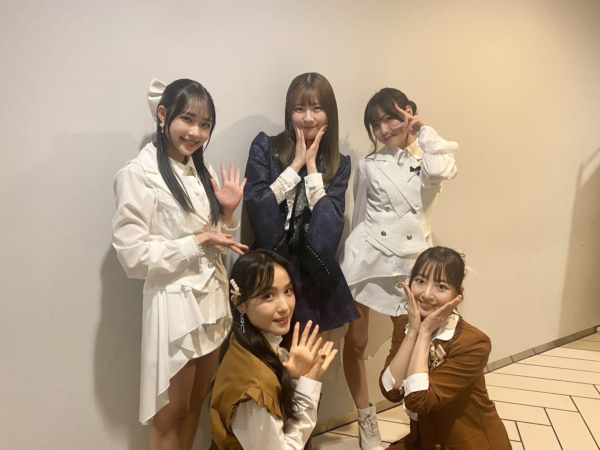
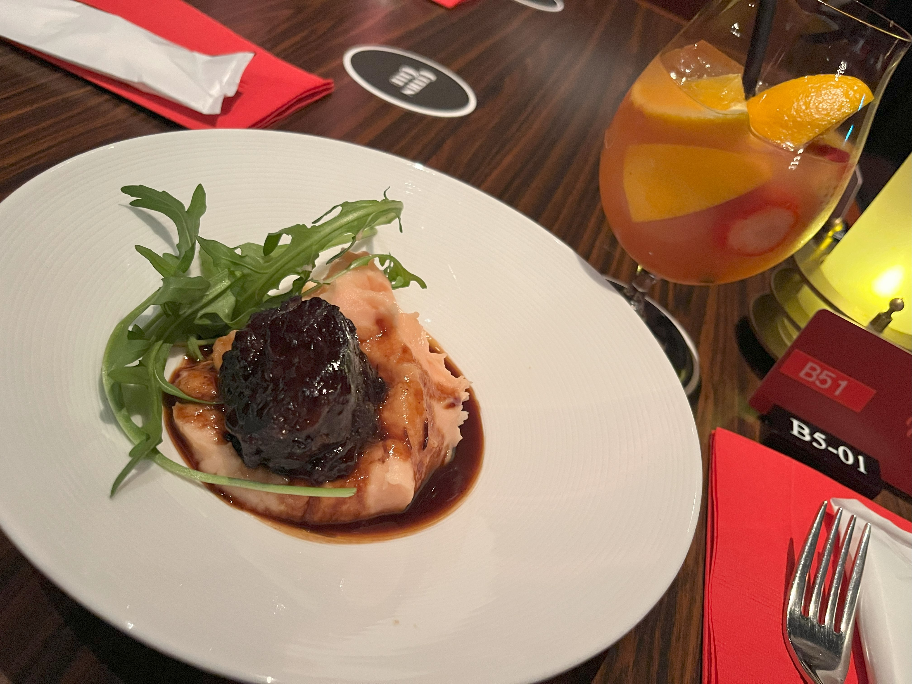
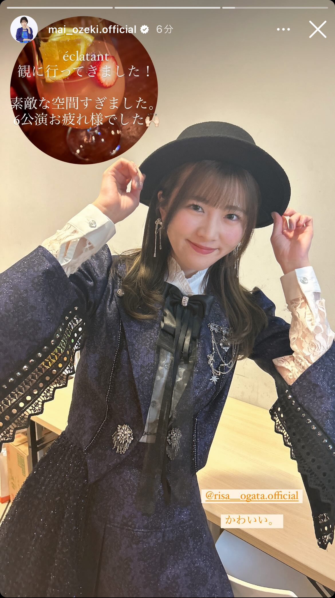
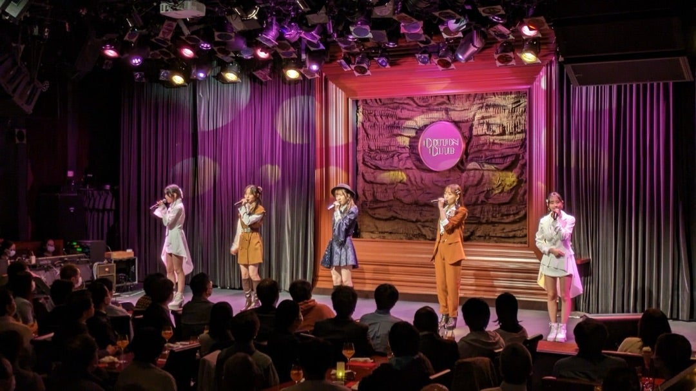
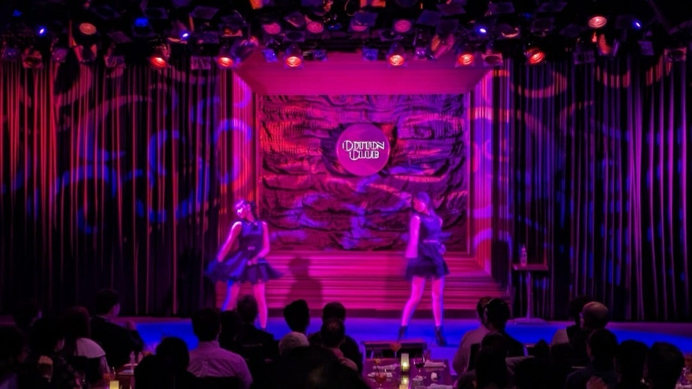
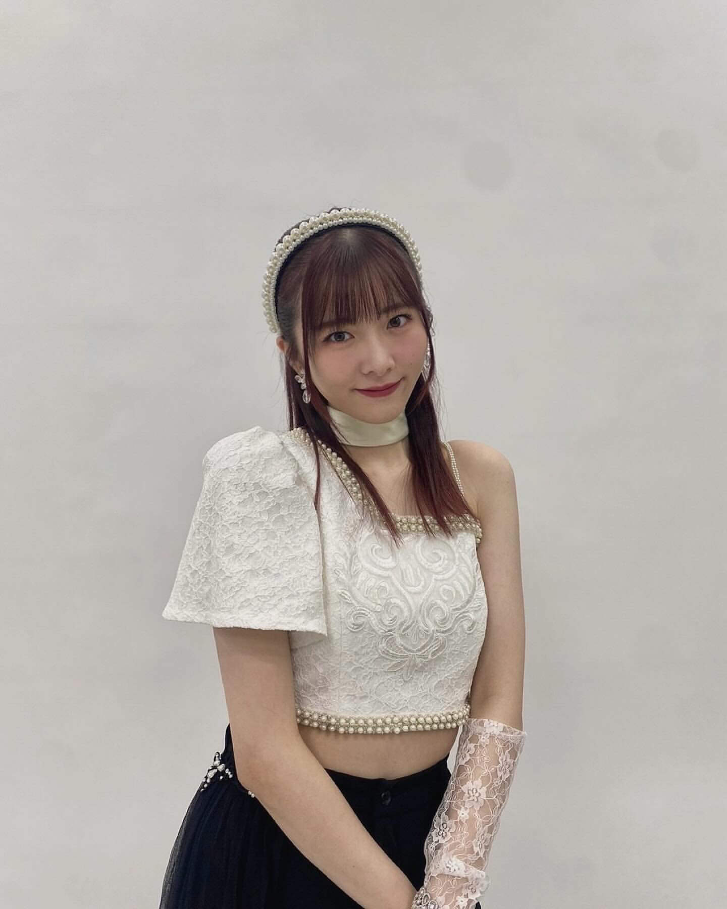
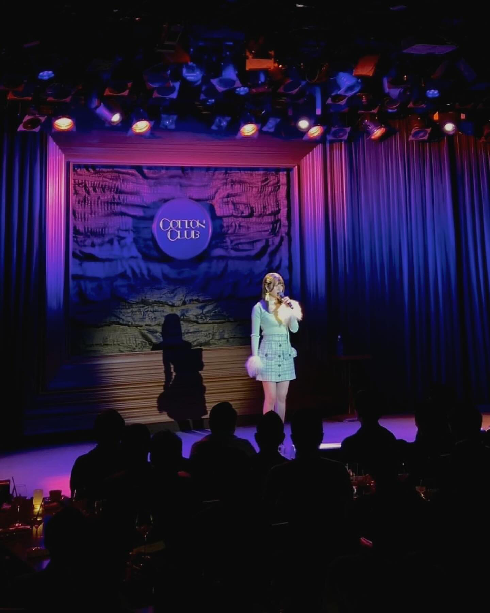

## 2024年3月15日 éclatant レポ！（2024年3月 COTTON CLUB）～ 春のエクラタン ～

先日<small>（2024年3月11日～13日）</small> **COTTON CLUB** にて開かれました

* <big>**RISA OGATA CONCERT「éclatant」✨**</big>

に参加しました👍

出演者は

* **小片リサ**、**Bitter & Sweet**

そして、Support Dancerの

* **松永里愛**、**入江里咲**

素敵！ コンサートもとても素敵でしたので詳しくレポを書かせてください、、

### コラボメニュー

éclatant は**ディナーショー形式**となっております。私が注文しましたのは

* **SAKURAtant** <small>ピンクグレープフルーツにライトオレンジの白ワインをフロート。季節を先取りした桜色の一杯。</small>
* **桜色のマッシュポテトと国産牛の赤ワイン煮込み** <small>小片さんが大好きなマッシュポテトに赤ワインとカシスで旨味が凝縮された柔らかい煮込みをあわせました。</small>

めちゃめちゃオシャレじゃないですか！？ もうね、、お味も美味しくて、、カクテルも混ぜるとまた味も変わったりですね、、

### 目次 {#目次}
* [1曲目：小片リサ「ちいさな世界」、2曲目：小片リサ「Happyを止めないで」](#song1-2)
* [MC(1)、3曲目：小片リサ・Bitter & Sweet・松永里愛・入江里咲「春 ビューティフル エブリデイ」](#song3)
* [4曲目：Bitter & Sweet「贈りものには愛がある」](#song4)
* [5曲目：小片リサ「真夜中のドア ～Stay with me～」](#song5)
* [6曲目：小片リサ・田﨑あさひ・入江里咲「サクラ色の約束」](#song6)
* [7曲目：小片リサ「風になる」](#song7)
* [8曲目：小片リサ「裸の"Mew"」](#song8)
* [MC（2）🥂](#MC2)
* [9曲目：小片リサ・Bitter & Sweet「桜色舞うころ」](#song9)
* [10曲目：Bitter & Sweet「恋心」](#song10)
* [11曲目：松永里愛・入江里咲「Mon Amour」](#song11)
* [ダンストラック ～ 12曲目：小片リサ・松永里愛・入江里咲「抱きしめて…涙」](#song12)
* [13曲目：小片リサ・Bitter & Sweet・松永里愛・入江里咲「次の角を曲がれ」](#song13)
* [14曲目：小片リサ・長谷川萌美・松永里愛「女の子にしかわかんない丁度があるの」](#song14)
* [15曲目：小片リサ「じらして愛して」／小片リサ「ムーンナイト・シークレット」](#song15)
* [16曲目：小片リサ／松永里愛・入江里咲<small>（back dancer）</small>「映画の趣味が合うだけ」、17曲目：小片リサ「Oh, Sunny Days!](#song16-17)
* [MC(3) ～ ラスト：小片リサ・Bitter & Sweet・松永里愛・入江里咲「青春コレクション」](#song17)
* [アンコール曲：小片リサ「君が好き」](#song18)

### 1曲目：小片リサ「ちいさな世界」、2曲目：小片リサ「Happyを止めないで」 {#song1-2}

さあ！ 登場したのはこちらのお衣装のりさまる！<small>（まいちゃんも来ていたみたいです！ お写真がめちゃ素敵なのでお借りしております）</small>

魔法学校の女子学生みたいな感じしません？ ハリー・ポッターに登場しそうな！

このハットがまた可愛いですよね🥰

2曲目の **Happyを止めないで** で

> 一緒に Woo Woo Woo

というところで息を吹きかけるような振り付けをするのですが、会場全体に魔法をかけるみたいな感じがして！

COTTON CLUB という贅沢な空間でコーディネートされた衣装と素敵な歌声でキラキラと輝く世界観が現れるのです、、、

[<i class="fa-solid fa-square-caret-up"></i> 目次](#目次)

### MC(1)、3曲目：小片リサ・Bitter & Sweet・松永里愛・入江里咲「春 ビューティフル エブリデイ」 {#song3}

りさまるのオリジナル新曲を2曲披露しまして、ごあいさつMCでした。

**éclatant** はフランス語で **音楽的な意味で**

* キラキラと鳴り響く

という意味があるというお話がありました。本当にぴったりなのよ。

というわけで、りさまるから

* Bitter & Sweetさん、松永里愛ちゃん、入江里咲ちゃん

が紹介されまして、会場客席の後ろから左右に分かれて登場しました！ そして、流れるのは

* **春 ビューティフル エブリデイ**

素敵🌸 そうなのです、今回の éclatant は**春色**なのです！ コラボメニューも**桜色**を中心としたメニューでしたから、楽曲も**桜色**なのです！！ こういう季節感も味わえるのが éclatant なのです、、

一気になんでしょうね、、春の陽気に包まれたというか、このときにすごく幸せな気持ちになりました

> IT'S SO BEAUTIFUL EVERYDAY 始まりの季節ね

よい、、

[<i class="fa-solid fa-square-caret-up"></i> 目次](#目次)

### 4曲目：Bitter & Sweet「贈りものには愛がある」 {#song4}

続きまして、Bitter & Sweet さんの

* **贈りものには愛がある**

です！ COTTON CLUB の素晴らしい音響とお二人の美しい歌声が作るハーモニーがそれはそれは良いんですよ！

うっとりと聴き惚れていました… わぁ… なんて美しいのだろう… って

「夕日が茜色に」という詞もあったりと**自然**の恵みみたいなものを感じたんすよね、、、良かったなあ、、、

[<i class="fa-solid fa-square-caret-up"></i> 目次](#目次)

### 5曲目：小片リサ「真夜中のドア ～Stay with me～」 {#song5}

はい、、、**bon voyage!** **Coeur à Coeur** **éclatant** と続くこのシリーズの中でも長く大切に歌い続けられているこちらの曲です、、、COTTON CLUB の大人の嗜好の雰囲気にぴったりなんですよね、、

頭上にはシャンデリアとミラーボールがあって、、目の前にはオシャレなディナーとカクテルが合って、、

* 真夜中のドア ～Stay with me～

ですよ、、ああ、贅沢で豪華な時間を過ごしてるなあ、、、って身体が幸福感に包まれるんですね、、、

[<i class="fa-solid fa-square-caret-up"></i> 目次](#目次)

### 6曲目：小片リサ・田﨑あさひ・入江里咲「サクラ色の約束」 {#song6}

私は初めましての楽曲でした！ **éclatant** はここも良いんですよ！ 素敵な楽曲に出会える場でもあるのです

もうすっかり大好きな曲になりました！ COTTON CLUB は照明もすごくて！ まるで花びらが春風に舞い上がっているかのような空間を作るんです

暖かい爽やかな風がたしかに吹いてました🌸

[<i class="fa-solid fa-square-caret-up"></i> 目次](#目次)

### 7曲目：小片リサ「風になる」 {#song7}

はい！ つじあやのさんのカバーで「風になる」です！ 「猫の恩返し」やCMでもお馴染みですね🥰

> 陽のあたる坂道を 自転車で駆け上る 君と失くした想い出乗せていくよ ラララララ 口ずさむ くちびるを染めていく 君と見つけた幸せ花のように

素敵！！ りさまるにぴったりなんですよ！！ ね！ 会場が陽気だったり春風に包まれているのが想像できると思うんです！

[<i class="fa-solid fa-square-caret-up"></i> 目次](#目次)

### 8曲目：小片リサ「裸の"Mew"」 {#song8}

さて、、打って変わってですよ、、こちらTLでも話題になっていたのですけど、、とりわけ最終公演の **裸の"Mew"** があまりにも感情が込められていて、、胸が締め付けられるような表現力だったんです、、、

> Mew...

ここのですね、、苦しく叫びたいほどの気持ちを抑えつけられたからこそ、、震えるような歌声で、、、

それを思ったのがやっぱり私だけではなくてTL上でも多くの方が同じことを言っていて、、すごいです、、、

[<i class="fa-solid fa-square-caret-up"></i> 目次](#目次)

### MC（2）🥂 {#MC2}

さて！ ここでステージ上にみなさんが集まりまして、コラボカクテル

* **SAKURAtant**<small>（サクラタン）</small>

をみなさんでもって乾杯をする時間です！

せっかくなのでフランス語で…ということでりさまるの掛け声で

> Santé!

といってグラスを交わすのです！ 素敵！！！！

[<i class="fa-solid fa-square-caret-up"></i> 目次](#目次)

### 9曲目：小片リサ・Bitter & Sweet「桜色舞うころ」 {#song9}

はい、、こちらは中島美嘉さんのカバーです

こちらはですね、、、とってもやさしい手触りといいますか、、、陽気！春風！という感じとはまた違いまして、、

静かに芽吹きはじめる感じというか、、、あの「ふわり恋時計」のときのりさまるのあのやさしさに近い、、、

羽毛のような軽く柔らかい、、、

でいて、自然を感じるんすよね、、、本当にすごいですよ、、音楽が世界観を構築していて、その空間に私たちはたしかに身を置いていて、、

[<i class="fa-solid fa-square-caret-up"></i> 目次](#目次)

### 10曲目：Bitter & Sweet「恋心」 {#song10}

さて、ビタスイさんオリジナル曲2曲目の「恋心」です

この流れで聴くとまた違って聴こえるんですよね、、本当に不思議、、、

なんというか卒業間近の別れの悲しさみたいなのを感じてですね、、、しっとりと切ない感じに春の要素が加わってたというか、、、

音楽が空間を変えるように、空間も音楽を変えるといいますか、、そういう奇跡をわたしはたしかに感じました、、、

[<i class="fa-solid fa-square-caret-up"></i> 目次](#目次)

### 11曲目：松永里愛・入江里咲「Mon Amour」 {#song11}

さて！！！ こちらも打って変わって情熱的なこちらの曲です！！！

序盤の可愛らしい白い衣装と対比的な**黒いドレス**！！

フラメンコ的な雰囲気のこちらの楽曲をですね、りあいちゃんとりさちがカッコよく決めるんですよ、、、

この時間はたしかに私たちはスペインの情熱的なダンスホールに私たちはいましたわ、、、

[<i class="fa-solid fa-square-caret-up"></i> 目次](#目次)

### ダンストラック ～ 12曲目：小片リサ・松永里愛・入江里咲「抱きしめて…涙」 {#song12}

さて、黒いドレスの Support Dancer と対比的な白い**ワンショルダー**衣装のりさまる！！

このダンストラックめちゃめちゃかっこいいんですよ、、、なんていったらいいんだろう、、、古い映画のような感じというか、、、もう大好きで、、、

そして、披露されるのが**音楽ガッタス**の

* **抱きしめて…涙**

選曲さすがか！！！！ 一気にダンサブルでノリノリになりました！！ ここから後半って感じです

最近思うんですけど、**まるかりん** にかつての **石川梨華** × **吉澤ひとみ** の面影を感じるんですね？ 

音楽ガッタスがやたらりさまるに似合うのもそれがあるのかなーとか、、サッカー<small>（フットサル）</small>要素とかもあると思うんですけど、、

フェイクのりさまるもよかった～ 高音のりさまる私大好きで、、、

[<i class="fa-solid fa-square-caret-up"></i> 目次](#目次)

### 13曲目：小片リサ・Bitter & Sweet・松永里愛・入江里咲「次の角を曲がれ」 {#song13}

さあ！ 「抱きしめて…涙」のアウトロでビタスイさんもステージに現れてですね、、始まるのが éclatant ではおなじみの

* **次の角を曲がれ**

です！！

序盤の桜色に彩られた陽気や春風とは違ってですね、一気に強くて信念を貫く感じのこの曲なんすよ！

> 星空が広がってるさ⭐

ここでステージ上に横並びになって5人が星を描くところとかカッコよかったな～

[<i class="fa-solid fa-square-caret-up"></i> 目次](#目次)

### 14曲目：小片リサ・長谷川萌美・松永里愛「女の子にしかわかんない丁度があるの」 {#song14}

今度はこちらの組み合あわでBerryz工房の

* **女の子にしかわかんない丁度があるの**

です！ 不思議な楽曲ですよね笑

Berryz工房の**サクラハサク**とか**フラれパターン**とか**Happy! Stand UP**とかあの不思議としか言いようがない妙にノリが良くて面白い癖になる楽曲あるじゃない<small>（伝われ）</small>

さすがの選曲ですよね、、正直わたしは聴いたことあったかもしれないんすけども、ほぼほぼ初めましてで、もうすっかりハマっちゃいました

間奏で3人が不思議な振り付けで踊ってるところとかカッコよさと面白さがあって、、癖になります、、

[<i class="fa-solid fa-square-caret-up"></i> 目次](#目次)

### 15曲目：小片リサ「じらして愛して」／小片リサ「ムーンナイト・シークレット」 {#song15}

こちらは回替わりのりさまるオリジナル曲でした！ 

**じらして愛して**はもうめちゃめちゃ大好きな曲なんでめっちゃ嬉しかったんすけど、**ムーンナイト・シークレット**でさらに大歓喜でした！！！！

私の記憶では **Happyを止めないで** **虹を超える** よりも披露は早かったのですがまだ未音源のこちらの曲！！！

この時間ではミラーボールがめちゃめちゃ仕事してました笑

楽曲的には都会っぽい雰囲気なので、月夜と夜景という雰囲気なんすよね！

もうみんなそうだと思うんですけど、みんなこの曲大好きででも聞くことができるのは今のところ **éclatant** だけなので、、、いやー嬉しかったー！！！

[<i class="fa-solid fa-square-caret-up"></i> 目次](#目次)

### 16曲目：小片リサ／松永里愛・入江里咲<small>（back dancer）</small>「映画の趣味が合うだけ」、17曲目：小片リサ「Oh, Sunny Days!」 {#song16-17}

はい、りさまるオリジナル曲のターン！という感じですね！

* **Oh, Sunny Days!**

はお馴染みの降臨曲です！ 客席のみんなも手を振りながら、りさまるの

> 進むよ！ Go！ 🔫

で何人かが撃ち抜かれるという笑

めちゃめちゃ微笑ましかったのは！ COTTON CLUB には会場の後方にバーカウンターがあってそこに凛々しいスーツを着たスタッフさんたちが立ち並んでいたんですけど、めちゃめちゃ振りコピ完璧なんです！！！

本当に素敵ですよね🥰✨ あの時間の幸福感なんですよ！！ ああ素敵な空間だな～って！

[<i class="fa-solid fa-square-caret-up"></i> 目次](#目次)

### MC(3) ～ ラスト：小片リサ・Bitter & Sweet・松永里愛・入江里咲「青春コレクション」 {#song17}

さあ、早いもので最後のMCです！

りさちが可愛らしかったですね🥰 パフォーマンス中もすごく楽しそうな気持ちがこちらにも伝わってきて、MCでもその気持ちを届けてくれて嬉しい気持ちになりました！

そして、最後の楽曲が！

* **青春コレクション**

素晴らしい！！！！

最後にふさわしいですよね！ 序盤の春曲の感じがここにきてまた帰ってくるんですよ！ 春に包まれるんすよ！！

* [<i class="fa-lg fa-brands fa-youtube"></i> モーニング娘。「青春コレクション」MV](https://www.youtube.com/watch?v=OnsdCVSs0WA){:target="_blank"}

きっとみなさんもそうだと思うのですが、こちらの楽曲はMVのイメージがあると思うんですね！ 陽の当たる芝の上の感じ！ で飛び跳ねるメンバーたち！

COTTON CLUB には草花、春風、太陽がたしかにあって暖かかったな～ 私の今年の春は完全にここから始まりました。ここが桜前線でしたわ

[<i class="fa-solid fa-square-caret-up"></i> 目次](#目次)

### アンコール曲：小片リサ「君が好き」 {#song18}

いったん終幕しまして、会場の手拍子アンコールで登場したのがこちらのりさまる！！！

<big>か、か、かわいいいいいいいいいいいいいいいいいい</big>

で、毎度おなじみ？ ラストのMCは本当にノープランなようで笑 ほわほわほわ～としててすごく癒されるんです、、、

ここで言っていたのですが、COTTONのスタッフさんの振りコピはなんと「青春コレクション」でもやっていたらしく、それがすごく完璧らしいのです笑 りさまるとCOTTON CLUBの関係ももう月日をかなり重ねていてかなり親しみあるんですよね🥰 素敵だ…

で、披露されたのが初披露新曲

* <big>**君が好き**</big>

なんて純でまっすぐなタイトルなのでしょう、、、楽曲もこのタイトルにふさわしく純でまっすぐなしっとり曲でした、、、

最後にこういうことするやん！！！

[<i class="fa-solid fa-square-caret-up"></i> 目次](#目次)

### ＊

最終公演ではダブルアンコールもありまして、あわわわ！ と現れたりさまるが

> 今日はみなさんとね、目も合わせましたし、みなさん友だち！ ってことで！

というすごくうれしいひとこと！！！ あーこの幸福感なんだよなー！！