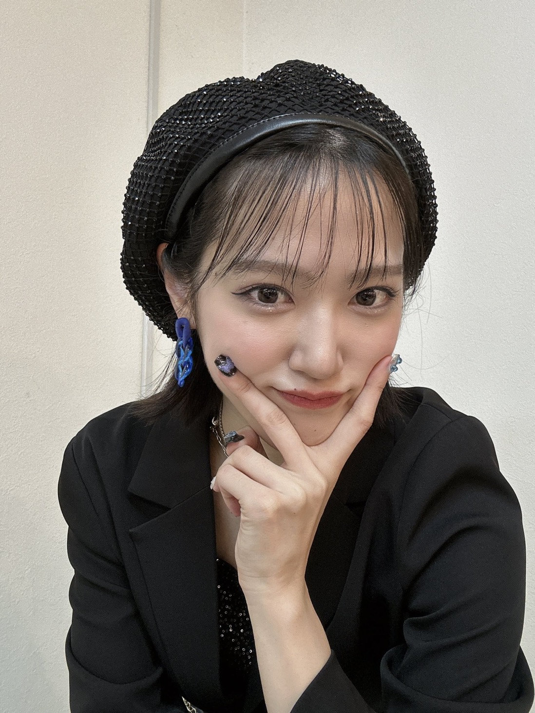

## 2024年3月17日 [#MSMW](https://twitter.com/search?q=%23MSMW){:target="_blank"} レポ！（3.16 福岡 DRUM LOGOS）～ ロック🤘 ～

さて、、ますます盛り上がりを見せる

* <big>**M-line Special 2024 ～Many well wishes～**</big>

の

* 3月16日（土） 福岡 DRUM LOGS

の2公演に参加しました👍

出演者は

* **稲場愛香**
* **小関舞**
* **浅倉樹々**
* **夏焼雅**<small>(ゲスト)</small>

のこちらの4人でした～

めずらしい組み合わせ！

<big>**※ めーーっちゃネタバレなのでご注意を！**</big>

<small>（便宜上？〇曲目って書きますが順番かなり自信ありませんのでおゆるしを）</small>

### 舞ちゃんベレー帽かわ

毎公演いろいろな変化を見せてくれる皆様なのですが、、舞ちゃんベレー帽でしたよ！ 前髪も薄めで！ 可愛い…

舞ちゃんのベレー帽と言えばですね、、2023年のバーイベのこちら

もありましたよね🥰

可愛い…

ききちゃんも大阪・滋賀公演のときは髪明るめだったのが今回は暗めだったり、こういうのも楽しみなんですよね～ 印象がガラッと変わります

### 1曲目：稲場愛香・小関舞・浅倉樹々・夏焼雅「私が言う前に抱きしめなきゃね」

MSMWの1曲目はゲストも含めて全員登場しまして強い曲で私たちを圧倒しがちだったりするわけですけども、今回は**わた抱き**でした！

強い！

ちょうどこの時間には佳林ちゃんが札幌で単独ライブ **HBNMR**<small>（～ Hello! Brand new me ～RETURNS）</small> の初日公演をしておりました！<small>（そこでは2ndアルバムリリースの発表もあったり！ めでたい！）</small>

まるかりん不在のMSMWというのは実はかなりめずらしいです。というより、なかったと言っていい<small>（MSMWの2公演目 2021年2月6日の大阪・愛知の同時開催のとき道重さゆみ・PINK CRES.・工藤遥というメンバー構成のMSMWがありました）</small>。

それも何でしょう、舞ちゃんやまなかんが M-line Club に加入してから積み上げたものがあって、まるかりんがソロ活動に専念しながらMSMWを続けられる…みたいなこう何かを感じまして、、

前回の大阪・滋賀MSMWでは

* 宮本佳林・浅倉樹々・小関舞

で**わた抱き**をしていたので、何というのでしょうか、、いいですよね！？

### MC(1)

冒頭まなかんから

> M-line Special 2024 ～Many well wishes～ にお越しのみなさん！ こんにちは～

という挨拶がありました！

この挨拶も通例であれば**まるかりん**のどちらかがしていましたが、今回は**まなかん**でした！

というのも、今回はまなかんが**座長**！ ということで舞ちゃん

> 登りつめたね～笑

登りつめたかはさておき笑 こういうまるかりん不在のMSMWが実現しているのも、まなかんや舞ちゃんが M-line で積み上げたものがあるからですよね。佳林ちゃんやりさまるが改めてすごいとも思いますし、まなかんや舞ちゃんも改めてすごいなって思います。

ここに雅ちゃんが**ゲスト**としているのも何か感慨深いものがありますよね。雅ちゃんの M-line Special に対する溢れる思いはとても伝わるので、こうして歴史的なMSMWに立ち会っているというのも何かこうね、、感動的なのです

ききちゃんもつばきを卒業して専門学校に通いながら、こうして会える機会を作ってくれているわけで、MSMWの存在の偉大さだったり、ききちゃんたちメンバーの気持ちが嬉しかったり、、感謝なのです

### 2曲目～3曲目：稲場愛香「アレコレしたい」／小関舞「世の中薔薇色」

ソロ曲のコーナーですね！

どちらもコールが楽しい！

> ＼＼超！絶！かわいい！まなかーん！／／

とか笑 **アレコレしたい**のサビではお立ち台に上がるまなかんと客席の間でハイタッチをするような振り付けになっています。まなかんも全員とハイタッチするぞ～という感じでひとりひとり見てくれて！

**世の中薔薇色** も

> ＼＼しますわ～／／

とか

> ＼＼なる～／／

とか笑 面白いですよね笑

こちらもお立ち台に上がって

> マジでごめんね✋

ってやったり！ 楽しい～

### 4曲目：小関舞・浅倉樹々「ドキドキベイビー」

いいですよね～この曲！ めちゃめちゃ可愛くて🥰

後のMCで雅ちゃんが言っていたのですが、2曲目以降は会場後方の2階から眺めていたらしくて！

この曲で

> ドキ！ドキ！ドキ！ドキ！ベイビー！🫶

って、観客も含めてみんな踊っているのですが、その後姿がとても愛おしかったということで撮影していたみたいなんです笑

雅ちゃんのこういう愛情がすごく好きです！ また、舞ちゃんとききちゃんが可愛いんだ！ M-line Club でいうと末っ子2人組ですもんね？ それを見守るお姉ちゃんの雅ちゃんなんですよ！

### 5曲目：稲場愛香・小関舞・浅倉樹々「抱きしめられてみたい」

来ました！ つばき曲！ 樹々を中心にしてまなまいが左右に分かれるという感じだったのですが、ききちゃんの本物だ～という感じとサビの

> 境目がなくなるまでギュッて ああ 抱きしめられて **みたい**

ここのユニゾン！！！！

私ユニゾンがめっちゃ好きなんですけど、3人の歌声の重なりがぴったりとしていてですね、倍増される感じがあるんですよ！！ そして、間奏から続く落ちサビ

> 境目がなくなるまでギュッて ああ 抱きしめられてみたい

がききちゃん！！！ よい！！！

### MC(2)～稲場愛香・小関舞～

まなかんはMSMWでは2023年8月に来ているのですが、舞ちゃんは初めてでした！

遠征の話になりまして、福岡というと美味しい食べ物がたくさんありますから！ 楽屋で用意される食事を楽しみにしていました🥰

舞ちゃんは朝6時台に家を出て飛行機で福岡に来たということで、遠征民とほとんど同じ行動なわけです笑

1公演目と2公演目の間の時間もほとんど間もなく<small>（まなかん「整理番号何番から～ってのが聴こえてたよ！はやい！」）</small>、ヲタたちもきっとあまり食べる間もなかったんですよね。で！ 会場は**天神**にありましたので公演終わりに

> 舞ちゃん「みなさんはカッって🍻やるんですよね！」

って笑 私も九州にヲタ仲間さんがいまして、その方に会って公演終わりに食事に行くというのも目的のひとつでしたし、きっとそういう方もたくさんいるんですよね笑

九州料理美味しかったな～ ご当地の美味しいものを食べながらライブの感想でわいわい盛り上がるのがまた楽しいんですよね～

### 6曲目：稲場愛香・浅倉樹々「Fantasyが始まる」

**！！**

結構衝撃的でした！ まなかんとききちゃんで**Fantasy**！

ダンスもめっちゃカッコいいですよね～ まなかんの長い髪も舞い踊っていてですね、、

ラストのフェイク部分はまなかんでした！ これがカッコいいのなんの！ まなかんってダンスはもちろんなんですけど、重量感のあるあの歌声もすごいっすよね、、あの時間ヤバかったなあ・・・

### 7曲目～8曲目：稲場愛香「記憶の迷路」／小関舞「ミステリーナイト」

