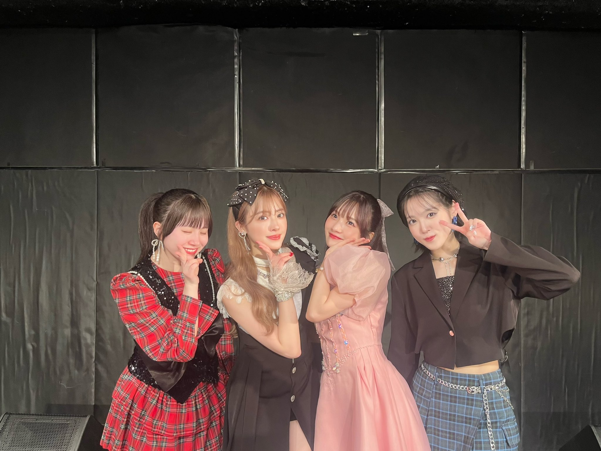
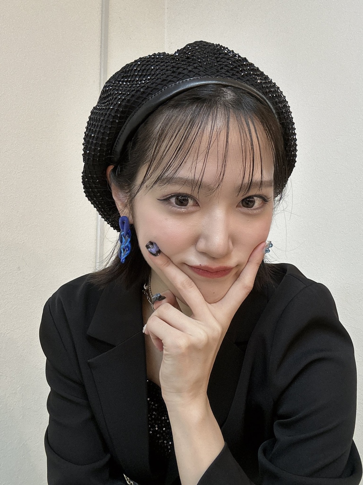
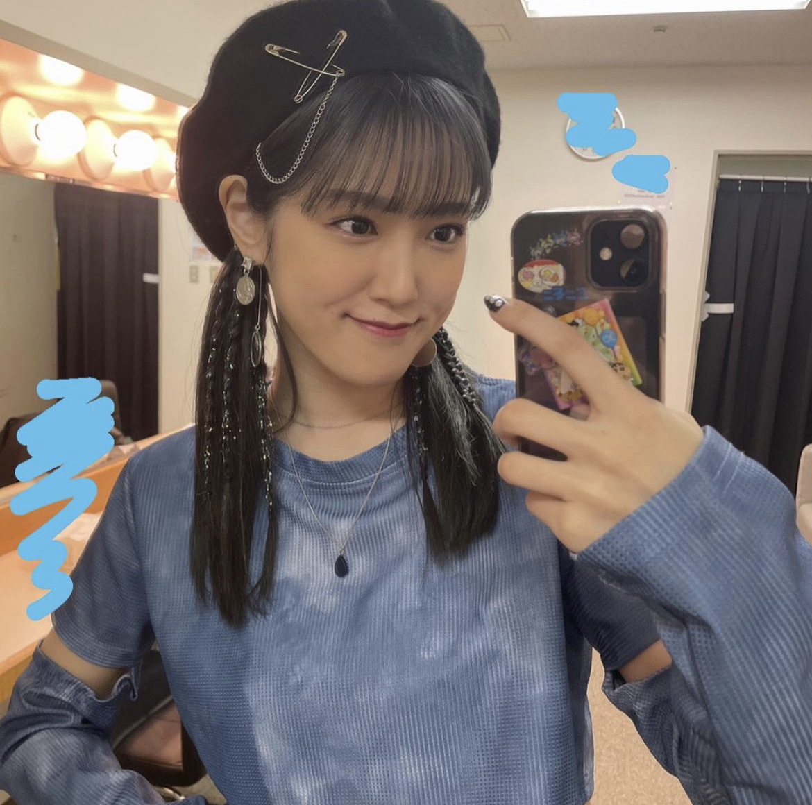

## 2024年3月20日 [#MSMW](https://twitter.com/search?q=%23MSMW){:target="_blank"} レポ！（3.16 福岡 DRUM LOGOS）～ ロック🤘 ～

さて、、ますます盛り上がりを見せる

* <big>**M-line Special 2024 ～Many well wishes～**</big>

の

* 3月16日（土） 福岡 DRUM LOGS

の2公演に参加しました👍

出演者は

* **稲場愛香**
* **小関舞**
* **浅倉樹々**
* **夏焼雅**<small>(ゲスト)</small>

のこちらの4人でした～

めずらしい組み合わせ！

<big>**※ めーーっちゃネタバレなのでご注意を！**</big>

<small>（便宜上？〇曲目って書きますが順番かなり自信ありませんのでおゆるしを）</small>

### 舞ちゃんベレー帽かわ

毎公演いろいろな変化を見せてくれる皆様なのですが、、舞ちゃんベレー帽でしたよ！ 前髪も薄めで！ 可愛い…

舞ちゃんのベレー帽と言えばですね、、2023年のバーイベのこちら

もありましたよね🥰

可愛い…

ききちゃんも大阪・滋賀公演のときは髪明るめだったのが今回は暗めだったり、こういうのも楽しみなんですよね～ 印象がガラッと変わります

### 目次 {#目次}
* [1曲目：稲場愛香・小関舞・浅倉樹々・夏焼雅「私が言う前に抱きしめなきゃね」](#song1)
* [MC(1)](#MC1)
* [2曲目～4曲目：稲場愛香「アレコレしたい」・浅倉樹々「100回のKISS」・小関舞「世の中薔薇色」](#song2-4)
* [5曲目：小関舞・浅倉樹々「ドキドキベイビー」](#song5)
* [6曲目：稲場愛香・小関舞・浅倉樹々「抱きしめられてみたい」](#song6)
* [MC(2)～稲場愛香・小関舞～](#MC2)
* [7曲目：稲場愛香・浅倉樹々「Fantasyが始まる」](#song7)
* [8曲目～9曲目：稲場愛香「記憶の迷路」／小関舞「ミステリーナイト！」](#song8-9)
* [10曲目：稲場愛香・小関舞「ブギウギLOVE」](#song10)
* [11曲目：稲場愛香・浅倉樹々・夏焼雅「寒いね。」](#song11)
* [12曲目：稲場愛香・小関舞・浅倉樹々・夏焼雅「イジワルしないで抱きしめてよ」](#song12)
* [MC(3)～夏焼雅・浅倉樹々～](#MC3)
* [13曲目：浅倉樹々「僕らの輝き」](#song13)
* [14曲目：夏焼雅「1/3の純情な感情」](#song14)
* [15曲目：稲場愛香・小関舞・浅倉樹希「カラダだけが大人になったんじゃない」](#song15)
* [16曲目：稲場愛香・小関舞・浅倉樹々・夏焼雅「友情 純情 oh 青春」](#song16)
* [MC(ラスト)](#MC4)
* [ラスト：稲場愛香・小関舞・浅倉樹々・夏焼雅「かっちょ良い歌」](#song17)

### 1曲目：稲場愛香・小関舞・浅倉樹々・夏焼雅「私が言う前に抱きしめなきゃね」 {#song1}

MSMWの1曲目はゲストも含めて全員登場しまして強い曲で私たちを圧倒しがちだったりするわけですけども、今回は**わた抱き**でした！

強い！

ちょうどこの時間には佳林ちゃんが札幌で単独ライブ **HBNMR**<small>（～ Hello! Brand new me ～RETURNS）</small> の初日公演をしておりました！<small>（そこでは2ndアルバムリリースの発表もあったり！ めでたい！）</small>

まるかりん不在のMSMWというのは実はかなりめずらしいです。というより、なかったと言っていい<small>（MSMWの2公演目 2021年2月6日の大阪・愛知の同時開催のとき道重さゆみ・PINK CRES.・工藤遥というメンバー構成のMSMWがありました）</small>。

それも何でしょう、舞ちゃんやまなかんが M-line Club に加入してから積み上げたものがあって、まるかりんがソロ活動に専念しながらMSMWを続けられる…みたいなこう何かを感じまして、、

前回の大阪・滋賀MSMWでは

* 宮本佳林・浅倉樹々・小関舞

で**わた抱き**をしていたので、何というのでしょうか、、いいですよね！？

[<i class="fa-solid fa-square-caret-up"></i> 目次](#目次)

### MC(1) {#MC1}

冒頭まなかんから

> M-line Special 2024 ～Many well wishes～ にお越しのみなさん！ こんにちは～

という挨拶がありました！

この挨拶も通例であれば**まるかりん**のどちらかがしていましたが、今回は**まなかん**でした！

というのも、今回はまなかんが**座長**！ ということで舞ちゃん

> 登りつめたね～笑

登りつめたかはさておき笑 こういうまるかりん不在のMSMWが実現しているのも、まなかんや舞ちゃんが M-line で積み上げたものがあるからですよね。佳林ちゃんやりさまるが改めてすごいとも思いますし、まなかんや舞ちゃんも改めてすごいなって思います。

ここに雅ちゃんが**ゲスト**としているのも何か感慨深いものがありますよね。雅ちゃんの M-line Special に対する溢れる思いはとても伝わるので、こうして歴史的なMSMWに立ち会っているというのも何かこうね、、感動的なのです

ききちゃんもつばきを卒業して専門学校に通いながら、こうして会える機会を作ってくれているわけで、MSMWの存在の偉大さだったり、ききちゃんたちメンバーの気持ちが嬉しかったり、、感謝なのです

[<i class="fa-solid fa-square-caret-up"></i> 目次](#目次)

### 2曲目～4曲目：稲場愛香「アレコレしたい」・浅倉樹々「100回のKISS」・小関舞「世の中薔薇色」 {#song2-4}

ソロ曲のコーナーですね！

**アレコレしたい**はコールが楽しいですよね

> ＼＼超！絶！かわいい！まなかーん！／／

とか笑 サビではお立ち台に上がるまなかんと客席の間でハイタッチをするような振り付けになっています。まなかんも全員とハイタッチするぞ～という感じでひとりひとり見てくれて！

**100回のKISS** は聞けば聞くほどいいですよね、、うっとりするというか溶けそうになります、、間奏の

> Wow wow haaaaaaaaa yeah yeah

ここですよ、、ききちゃんから溢れる暖かい優しい空気がまた心地いいのです

**世の中薔薇色** もコールが楽しい！

> ＼＼しますわ～／／

とか

> ＼＼なる～／／

とか笑 面白いですよね笑

こちらもお立ち台に上がって

> マジでごめんね✋

ってやったり！ 楽しい～

[<i class="fa-solid fa-square-caret-up"></i> 目次](#目次)

### 5曲目：小関舞・浅倉樹々「ドキドキベイビー」 {#song5}

いいですよね～この曲！ めちゃめちゃ可愛くて🥰

後のMCで雅ちゃんが言っていたのですが、2曲目以降は会場後方の2階から眺めていたらしくて！

この曲で

> ドキ！ドキ！ドキ！ドキ！ベイビー！🫶

って、観客も含めてみんな踊っているのですが、その後姿がとても愛おしかったということで撮影していたみたいなんです笑

雅ちゃんのこういう愛情がすごく好きです！ また、舞ちゃんとききちゃんが可愛いんだ！ M-line Club でいうと末っ子2人組ですもんね？ それを見守るお姉ちゃんの雅ちゃんなんですよ！

[<i class="fa-solid fa-square-caret-up"></i> 目次](#目次)

### 6曲目：稲場愛香・小関舞・浅倉樹々「抱きしめられてみたい」 {#song6}

来ました！ つばき曲！ 樹々を中心にしてまなまいが左右に分かれるという感じだったのですが、ききちゃんの本物だ～という感じとサビの

> 境目がなくなるまでギュッて ああ 抱きしめられて **みたい**

ここのユニゾン！！！！

私ユニゾンがめっちゃ好きなんですけど、3人の歌声の重なりがぴったりとしていてですね、倍増される感じがあるんですよ！！ そして、間奏から続く落ちサビ

> 境目がなくなるまでギュッて ああ 抱きしめられてみたい

がききちゃん！！！ よい！！！

[<i class="fa-solid fa-square-caret-up"></i> 目次](#目次)

### MC(2)～稲場愛香・小関舞～ {#MC2}

まなかんはMSMWでは2023年8月に来ているのですが、舞ちゃんは初めてでした！

遠征の話になりまして、福岡というと美味しい食べ物がたくさんありますから！ 楽屋で用意される食事を楽しみにしていました🥰

舞ちゃんは朝6時台に家を出て飛行機で福岡に来たということで、遠征民とほとんど同じ行動なわけです笑

1公演目と2公演目の間の時間もほとんど間もなく<small>（まなかん「整理番号何番から～ってのが聴こえてたよ！はやい！」）</small>、ヲタたちもきっとあまり食べる間もなかったんですよね。で！ 会場は**天神**にありましたので公演終わりに

> 舞ちゃん「みなさんはカッって🍻やるんですよね！」

って笑 私も九州にヲタ仲間さんがいまして、その方に会って公演終わりに食事に行くというのも目的のひとつでしたし、きっとそういう方もたくさんいるんですよね笑

九州料理美味しかったな～ ご当地の美味しいものを食べながらライブの感想でわいわい盛り上がるのがまた楽しいんですよね～

[<i class="fa-solid fa-square-caret-up"></i> 目次](#目次)

### 7曲目：稲場愛香・浅倉樹々「Fantasyが始まる」 {#song7}

**！！**

結構衝撃的でした！ まなかんとききちゃんで**Fantasy**！

ダンスもめっちゃカッコいいですよね～ まなかんの長い髪も舞い踊っていてですね、、

ラストのフェイク部分はまなかんでした！ これがカッコいいのなんの！ まなかんってダンスはもちろんなんですけど、重量感のあるあの歌声もすごいっすよね、、あの時間ヤバかったなあ・・・

[<i class="fa-solid fa-square-caret-up"></i> 目次](#目次)

### 8曲目～9曲目：稲場愛香「記憶の迷路」／小関舞「ミステリーナイト！」 {#song8-9}

**記憶の迷路** ダンスもバッキバキでまなかんにぴったりの曲なわけですが、歌もよい！

まなかんの歌声って密度が高いといいますか重量感があると思うんですね、ねっとりとなまめかしい、、歌い出しの

> あ・ま・い

からグッときますよね、、

**ミステリーナイト！** 記憶の迷路と並ぶとまたいいですね、、こちらも妖艶で大人っぽい、、セクシーなMV衣装の印象もありますよね、、

舞ちゃんの新衣装にもぴったり合っている感じします

[<i class="fa-solid fa-square-caret-up"></i> 目次](#目次)

### 10曲目：稲場愛香・小関舞「ブギウギLOVE」 {#song10}

カッコいい、、またさ！ まなかんが**ピンクドレス**で舞ちゃんが**黒ジャケット**というのもあって、ブギウギでありつつ社交ダンス感もありませんか？ レトロな感じもまたいいんですよね～

最後の二人が背中を合わせてポーズを決めるところも見惚れちゃいます、、

改めて私たちは幸福ですよ！ **ブギウギLOVE** はカントリーのメンバーとしてはまなかんにとって最後のシングルになるのですが、発売は2016年3月9日なんですね？ つまり、**8年**（！？）の時間を超えて２人が同じステージに立ってこの曲を披露しているってことなんですよ！

しかも、昨年の Mi RooM 公演から少しずつ**まなまい**の定番曲になりつつあるんです！

[<i class="fa-solid fa-square-caret-up"></i> 目次](#目次)

### 11曲目：稲場愛香・浅倉樹々・夏焼雅「寒いね。」 {#song11}

はい！ ここから雅ちゃんが再登場です！

サビ終わりの

> でもいいの そばにいてね

のところで、たとえば、まなかんと雅ちゃんがききちゃんを左右から抱きしめるんですよ、、**ｷｬｰ** ってなりまして！

こういう振り付けあったのか… と思いまして、映像を確認いたしました

* [<i class="fa-lg fa-brands fa-youtube"></i> スマイレージ 「寒いね。」（Live Ver.）](https://www.youtube.com/watch?v=VDFAXMSSt2o){:target="_blank"}

こちらの1分45秒～にまろとあやちょが抱き合っております

でも、この映像よりもっとでした！！ もう密着でした！！！

[<i class="fa-solid fa-square-caret-up"></i> 目次](#目次)

### 12曲目：稲場愛香・小関舞・浅倉樹々・夏焼雅「イジワルしないで抱きしめてよ」 {#song12}

雅ちゃんと言えば！ というところももはやある **イジワルしないで抱きしめてよ**

**ローズクォーツ**はもう雅ちゃんなのよ！

イジ抱きってやっぱり朋子のイメージだったり、MVのスカーレット衣装？のイメージもあるので雅ちゃんにぴったりですよね。

でいてダンスも激しい！！ 私ここ好きです。それこそ、サビの

> 私のローズクォーツ

のところって最後だけ、バン！バン！バン！って

> 私の**ロ**<small>！</small> **オ**<small>！ズ</small>**クォ**<small>！</small>ーツ

って！（伝われ）

[<i class="fa-solid fa-square-caret-up"></i> 目次](#目次)

### MC(3)～夏焼雅・浅倉樹々～ {#MC3}

ここのトークも面白かった～ ききちゃんがBuono!大好きということもあり、ききちゃんにとっても夢のような時間だったんですよね🥰

ききちゃんのBuono!トークも大好きな気持ちがめちゃめちゃ伝わるんすよね！ アルバム「Café Buono!」が大好きで「星の羊たち」もつい先日繰り返し聴いてました！ みたいな

ちょうどこの日に福岡ではL'Arc〜en〜Cielもコンサートをしてましてその話もしてました

両親がラルクが好きで車でもずっと流れてて、だから、今回のライブでも煽り方とかお立ち台に片足乗せたりとか！ **ロック**なんですよ！

雅ちゃんのトークも面白かった🤣

> 雅ちゃん「熊井ちゃんがスイカゲームにハマっててスイカできたよー！ってLINEで共有してくれるの！」   ききちゃん「可愛い😊」  雅ちゃん「正直やれば誰でもできるのね？ 私たちもできちゃってたんだけど、すごいねー！って言ってあげるのよ」   ききちゃん「優しい世界😊」

優しい世界😊

[<i class="fa-solid fa-square-caret-up"></i> 目次](#目次)

### 13曲目：浅倉樹々「僕らの輝き」 {#song13}

さあ、、ここから**ロック**なMSMWです！

ロックが大好きなききちゃんが歌う**僕らの輝き**

> 勇ましい！💪 輝きの方へ

もうね、私も**ヘドバン**でした🤘

コールも楽しいんですよ！！！

> ・！・！・！おい！・！・！・！おい！ Wow Wow Wow！

って！ ラストパートもリズムが激しくなって揺れるのよ！！！

[<i class="fa-solid fa-square-caret-up"></i> 目次](#目次)

### 14曲目：夏焼雅「1/3の純情な感情」 {#song14}

からの！ **1/3の純情な感情** ！！！！ えぐい！！！！

もとはロックバンド**SIAM SHADE**の曲ですね～ Buono!カバーがあります👍

> 壊れるほど愛しても 1/3 も伝わらない 純情な感情は空回り I love you さえ言えないでいる My heart

めーっちゃロック！！！！

ラルクの話とかもあったし、ロックの流れがあったので、90年代ロックのターン！！！ って感じでめちゃめちゃ盛り上がりました！！

[<i class="fa-solid fa-square-caret-up"></i> 目次](#目次)

### 15曲目：稲場愛香・小関舞・浅倉樹希「カラダだけが大人になったんじゃない」 {#song15}

この流れがありましたから、この曲も結構エレキギター唸ってるのもあってめっちゃ**ロック**強めに聞こえました！

あーりーの

> 負けない～よ～

あるじゃないですか！！！ ここはまなかん、まいちゃん、3人って感じだったんですけど、舞ちゃんなのよ！！！

> <big>**負けないぃぃぃよぉおおお！！！**</big>

もうね、、舞ちゃんが歌い上げるときのあのカッコよさ！！！！ いい！ カッコいい！！！

[<i class="fa-solid fa-square-caret-up"></i> 目次](#目次)

### 16曲目：稲場愛香・小関舞・浅倉樹々・夏焼雅「友情 純情 oh 青春」 {#song16}

この曲もね！？ イントロがエレキの低い**ｼﾞｬｼﾞｬｼﾞｬｼﾞｬ**で始まるじゃない、このロックの流れがあるじゃない、だからもうね、、バンドサウンド感がより増しまして！！

> おいおいおいおい！

楽しい、、この曲の頃には身体の何かが揺れ滾っててヤバかったです、、ぐっちゃぐちゃでした👍

> 時代がぁあああ！

この曲もラストスパートでリズムが細かくなってね、、、死んじゃう

[<i class="fa-solid fa-square-caret-up"></i> 目次](#目次)

### MC(ラスト) {#MC4}

あっという間なのよ、、改めてまなかん座長の話がありまして、スタッフさんから

> 稲場に任せた

という話があり、LINEでグループ作ってしきってセットリストを決めて、、

しかも、通しのリハーサルは一度もしていないらしいのです、、M-line Special がヤバいのってここですよね、、全員ソロでの活動があるから準備する時間は限られているしその調整がとても大変なわけです、、、

その中で覚えられる曲数というのも限りがある中で、それぞれのメンバーが経験している曲だったりを考慮に入れつつセットリストを考える、、っていう

これを毎週やってるんですよ！？ 本当に感謝しかないのです、、、どの公演に言っても毎回新しい要素が必ずあるし、、本当にすごい

[<i class="fa-solid fa-square-caret-up"></i> 目次](#目次)

### ラスト：稲場愛香・小関舞・浅倉樹々・夏焼雅「かっちょ良い歌」 {#song17}

ふぁあああ！ この曲もエレキギターが唸っているぅ！！！ ロック！！！！

> Say!  ＼おい! おい!／  Come on!  ＼おい! おい!／  Say!  ＼おい! おい!／  みんなでいっしょにはい？  ＼おいおいおい！／   Say!  ＼おい! おい!／  Come on!  ＼おい! おい!／  Say!  ＼おい! おい!／  もっともっと大きな声で！  **＼おいおいおいおいおいおいおいおいおいおいおいおい！／**

からの！

> ほらねピンチをチャンスに できるやつらが勝利をつかむ ラッキーなパンチが飛び出しちゃうのも実力なんだよ！ わかるかい！

いいや！楽しすぎるやろうがあああああ！

後半の畳みかけるロックセトリなのよ！！！！ そしてラストに**かっちょ良い歌**！！！！

いやああああ、本当にね、、エッグいのよ！！！

[<i class="fa-solid fa-square-caret-up"></i> 目次](#目次)

### ＊

ライブハウスのドリンク・・・ライブ終わりに一気に飲み干したよね👍