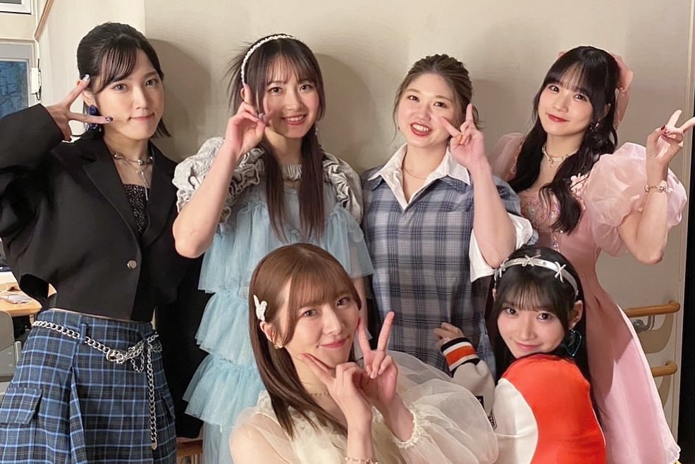
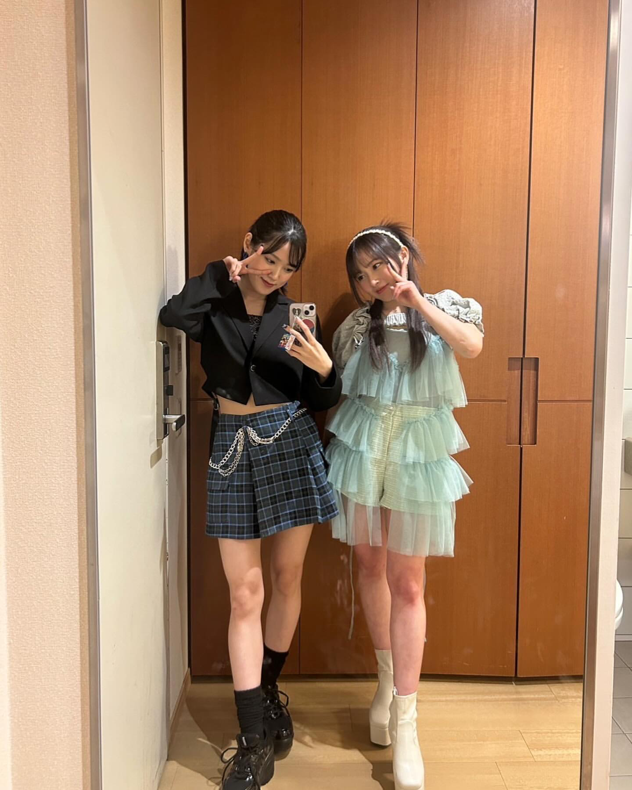
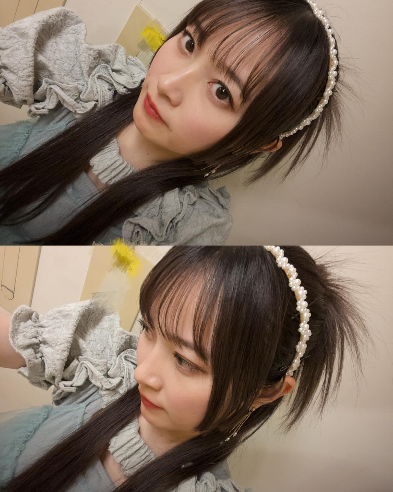
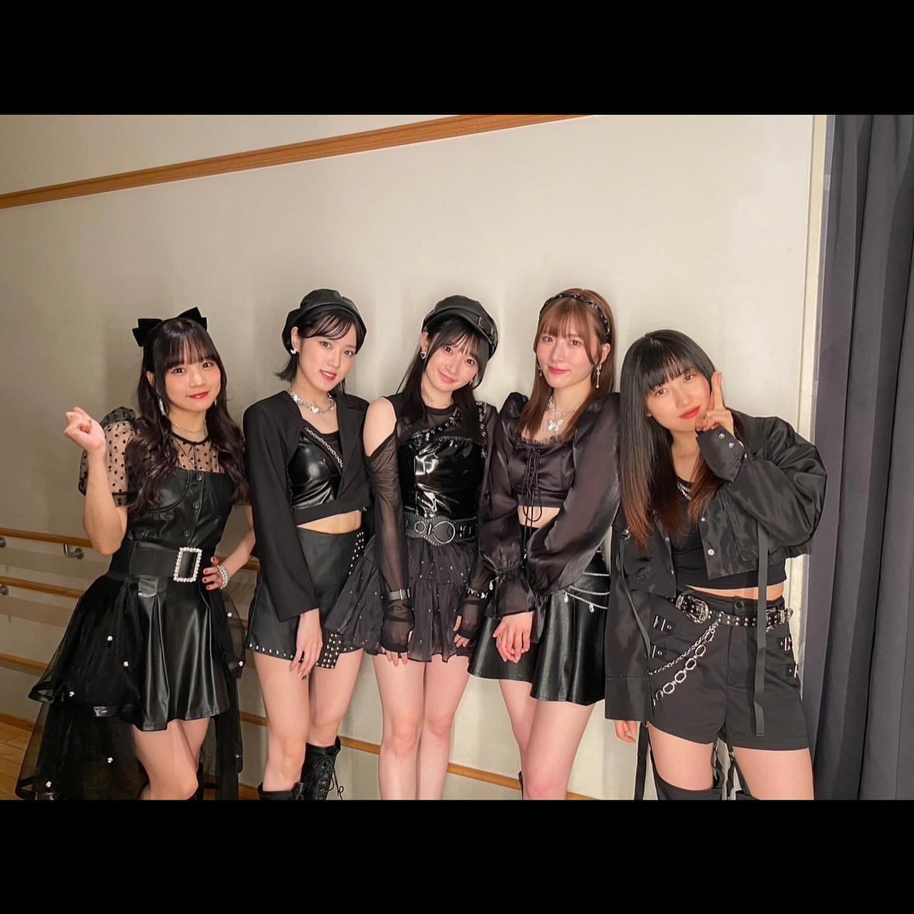
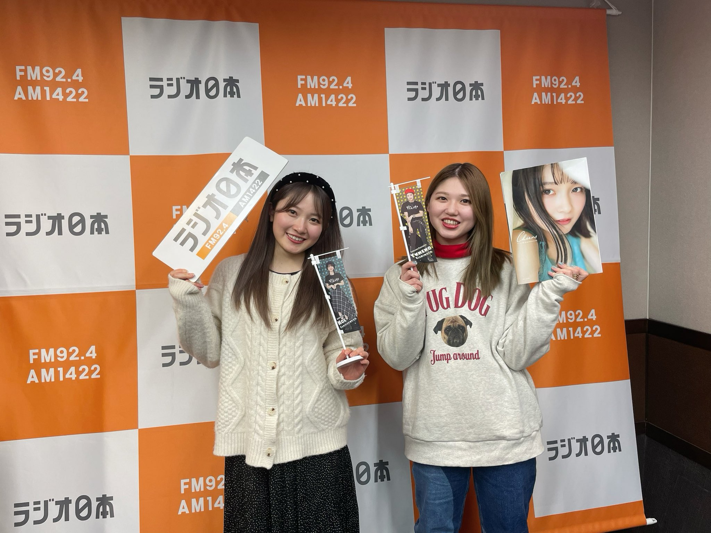
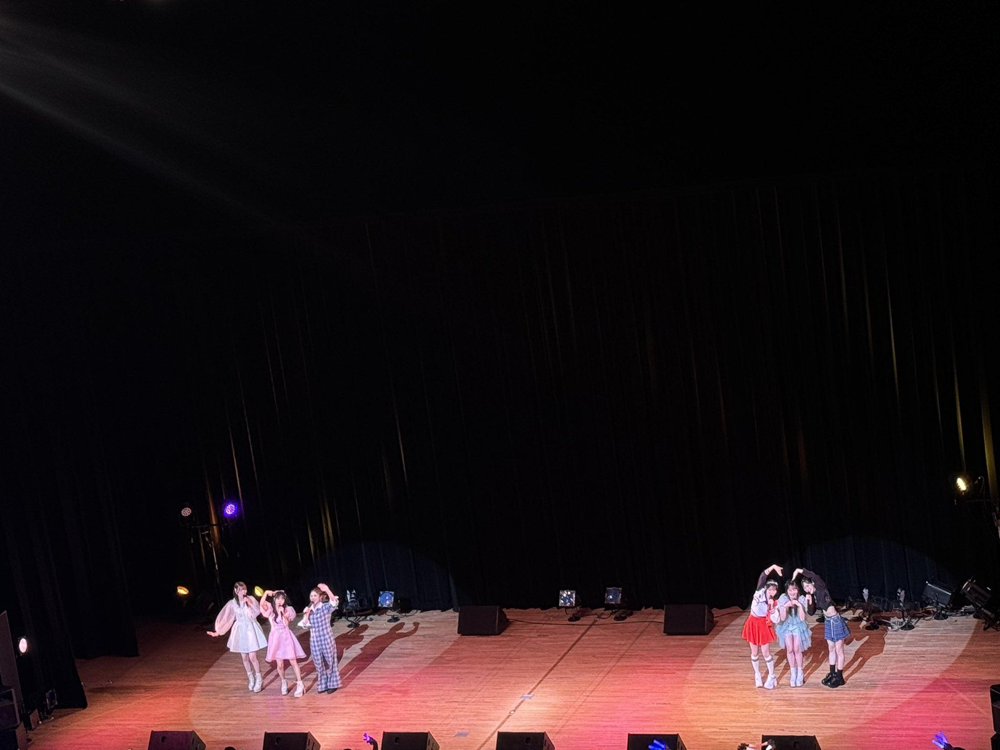
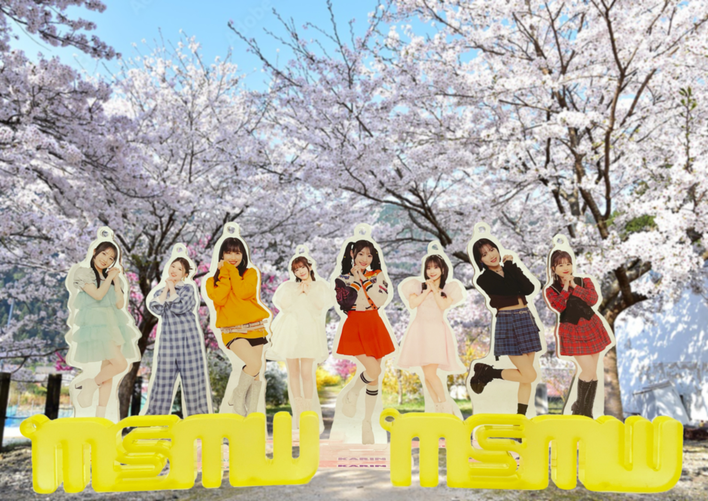

## 2024年3月25日 [#MSMW](https://twitter.com/search?q=%23MSMW){:target="_blank"} レポ！（3.24 めぐろパーシモンホール）～MSMWで待ち合わせ～ 

M-lineのヲタたちが首を長くして待ち望んでいた

* <big>**M-line Special 2024 ～Many well wishes～**</big>

の

* 3月24日（日） めぐろパーシモンホール 大ホール

の2公演に参加しました！

出演者は

* **竹内朱莉**
* **宮本佳林**
* **小片リサ**
* **稲場愛香**
* **小関舞**
* **森戸知沙希**<small>(ゲスト)</small>

のこちらの6人！

もうね、、大渋滞です、、

* **たけちゃん**は2024年のMSMW初登場
* ということは、**たけかりん**が2024年に揃うのもここが初！
* そして、**まるかりん**も2024年会合するのはここが初！
* **おぜちぃ！まなちー！カントリーオリメン！**
* **佳林ちゃん**の推しが二人おる！<small>（**たけちゃん**・**ちぃちゃん**）</small>
* 2024年初の**大集結ホールコン！**

要素が多すぎます。

### 目次 {#目次}

* [1曲目：竹内朱莉・宮本佳林・小片リサ・稲場愛香・小関舞・森戸知沙希「浮気なハニーパイ」](#song1)
* [MC(1)～竹内朱莉・宮本佳林・小片リサ・稲場愛香・小関舞・森戸知沙希～](#MC1)
* [2曲目：小片リサ「Happyを止めないで」（昼）／「虹を超える」（夜）](#song2)
* [3曲目：稲場愛香「記憶の迷路」](#song3)
* [4曲目：稲場愛香・宮本佳林「G.O.A.T」](#song4)
* [5曲目：小関舞「ミステリーナイト！」](#song5)
* [6曲目：竹内朱莉・宮本佳林「ズキュンLOVE」～MC(2)](#song6)
* [7曲目：小関舞・森戸知沙希「書いては消しての“I Love You”」](#song7)
* [8曲目：宮本佳林「Beautiful Song」（昼）／「ソリスト・ダンス」（夜）](#song8)
* [9曲目：竹内朱莉・宮本佳林・小片リサ「VERY BEAUTY」](#song9)
* [10曲目：竹内朱莉「ロマンティック浮かれモード」](#song10)
* [11曲目：SIOOM「C\C'24」～MC(3)](#song11)
* [12曲目：竹内朱莉・森戸知沙希「お願い魅惑のターゲット」](#song12)
* [13曲目：竹内朱莉・宮本佳林・稲場愛香「泣けないぜ・・・共感詐欺」](#song13)
* [14曲目：小関舞・小片リサ「宇宙でLa Ta Ta」](#song14)
* [15曲目：小関舞・小片リサ・稲場愛香「Midnight Temptation」](#song15)
* [16曲目：竹内朱莉・宮本佳林・小片リサ・稲場愛香・小関舞「初恋サンライズ」](#song16)
* [MC(ラスト)](#MC4)
* [ラスト：竹内朱莉・宮本佳林・小片リサ・稲場愛香・小関舞・森戸知沙希「ラヴ＆ピィ～ス!HEROがやって来たっ。」](#song17)

### 1曲目：竹内朱莉・宮本佳林・小片リサ・稲場愛香・小関舞・森戸知沙希「浮気なハニーパイ」 {#song1}

<big>**ハニパイ！！！！**</big>

MSMWは初手から容赦しません。初手に昇天するのがMSMWと言っていい。

分かってます。分かってはいるのですが、分かっていたところなのです。昇天は免れません。

私はステージ上にこの6人… とりわけ、カントリー・ガールズのオリメンである

* 稲場愛香
* 小関舞
* 森戸知沙希

が並ぶのが目に映り、カントリー・ガールズでも初期から繰り返し歌い続けられた**ハニパイ**が聴こえている。

そりゃ涙が溢れかえりますわ😭

この3人が同じステージに立ってカントリーの曲を披露していることって、もうね、長年の夢だったんですよ。。

MSMW夢叶いがち。。。

また、そこに M-line の先輩である**まるかりん**がこの歴史的な瞬間に立ち会っているのもまたエモい。。

そして、そこに**たけちゃん**がいることで私たちの脳は焦げ付いてます。

ハニパイって楽しいんですよ！ 振りコピはもちろん、二人ずつ手を挙げて、それに合わせてそのメンバーカラーを振っている客席も手を挙げたり、、

なによりも間奏のつんくパート…

> HEY HEY COME ON YO HEY 素敵な気分よ RIGHT 本心でマシ～ンをぶちかませ！

本日の**めぐろ**はメンバーも大集結していますが、ヲタたちも研ぎ澄まされた精鋭たちが集結しております。。

このわけのわからない**つんくパート**も歌いきるのです…

よい、、、もう、、、何度も夢に見た瞬間が現実に訪れたために崩壊しておりました

[<i class="fa-solid fa-square-caret-up"></i> 目次](#目次)

### MC(1)～竹内朱莉・宮本佳林・小片リサ・稲場愛香・小関舞・森戸知沙希～ {#MC1}

さて、、ハニパイという一撃必殺を浴びたあとは**宮本座長**よりMCです。

佳林ちゃんらしいと思ったのが、今回のめぐろ公演のチケットが完売していることを話していて客席から拍手が巻き起こりました。

2024年も始まってまだ間もないですが、この間にも**MSMW**の勢いは増すばかりです。

それぞれソロ活動をしているメンバーを応援しているヲタたちも多いわけですが、この **M-line Special** が大好きだ！ というヲタたちが多いはずです。その気持ちはヲタたちの間に分かち合われているのです。

それこそ、ハロー！プロジェクトでは各グループが好きという気持ちとハロー！プロジェクト全体が好きという気持ちを合わせて持っている方が多いはず！ だからこそ、ハロコンが楽しいわけです！

M-line ではそれがソロ活動をしているメンバーひとりひとりであって、そして、**M-line Club** そして **M-line Special** が大好きなのです！

佳林ちゃんは今回のテーマを**ハロコン**と言っていました！ もっといえば**夢のハロコン**と私は言いたい！！

[<i class="fa-solid fa-square-caret-up"></i> 目次](#目次)

### 2曲目：小片リサ「Happyを止めないで」（昼）／「虹を超える」（夜） {#song2}

MSMWと言えばですね、序盤はソロ楽曲コーナーがちなわけですが今回は**りさまる**からスタート！

**éclatant** ではしっとり腰を下ろして静かに鑑賞をするスタイルですがこの日の**めぐろ**はアツかった！

MCでも言っていましたが、ライブハウスが続いていたので客席の数が数倍違うのです。**COTTON CLUB** や **両国第一ホテル「清澄」** に比べればなおさらです。だからこそ全然違って聴こえる！！！

これもまた面白いですよね、、、

私はやっぱり**虹を超える**が好きですね🌈

**めぐろ**では**おい！おい！**とコールが楽しいライブ盛り上がり曲に大変身なのです！

[<i class="fa-solid fa-square-caret-up"></i> 目次](#目次)

### 3曲目：稲場愛香「記憶の迷路」 {#song3}

**りさまる**の次は**まなかん**のターン！

<big>**記憶の迷路**</big>

私が大好きなのは間奏のエレキギターがハモリながら**ﾋﾟﾛﾋﾟﾛﾋﾟﾛﾋﾟﾛ**🎸って鳴るところありますよね？

ここでポーズをリズムに合わせて決めるまなかん！ そして、激しく踊る！！！

MCでもまなかんは言っていましたがライブハウスに比べて会場も広いのでより大きく踊らないと！と思ったらしいです。

これはまなかんあるあるですが、ステージの上で激しく踊るまなかんは大きく見えるのですが、目の前にいるととっても小さい！

それだけダンスの表現力がやばいわけですわ、、そして、重量感のある歌声、、、強すぎる、、、

[<i class="fa-solid fa-square-caret-up"></i> 目次](#目次)

### 4曲目：稲場愛香・宮本佳林「G.O.A.T」 {#song4}

ここに来てですね、、まなかんはステージに残りながら佳林ちゃんが登場、、、

お？ Juiceメン2人で何を、、、

<big>**G.O.A.T**</big>

大好きいいいいいいいいいいい！ しかも、佳林ちゃんが卒業した後のJuice曲です！<small>（3rdアルバム『terzo』収録）</small>

このサプライズなんですよ！！！ こういうことを佳林ちゃんは仕掛けてくるんだな！

私この曲結構まなかんのイメージがありまして

> G.O.A.T My <big>**らあああああああああああああああああああああああああああああ**  </big>

ここのまなかん！！！

そして、ラストのフェイクは佳林ちゃんのFooooもありつつ、まなかんの**めぐろ**を揺らしたフェイクなんですよ！！！！！

ここ自然に歓声が上がってました！！！すごい！！！

[<i class="fa-solid fa-square-caret-up"></i> 目次](#目次)

### 5曲目：小関舞「ミステリーナイト！」 {#song5}

はい続いて！ **舞ちゃんのターン！**

<big>**ミステリーナイト！**</big>

> 未来はみすてりいいいいいいいいいいいいいぃ<big>**いいいいいいいいいいいいいいいいいいいいいいいい**</big>

強い！ 地鳴りがするほどのこの雄たけびなんですよ！ やっぱり今回会場が大きいのもあって、より何でしょう、舞ちゃんの歌声が倍増になっていた気がしていて、、、

うわあああああああああああああああって身体ごと揺らされました！

この序盤のメンバーが代わる代わる私たちに強力な一撃を送るのがもうねたまらないのです。

[<i class="fa-solid fa-square-caret-up"></i> 目次](#目次)

### 6曲目：竹内朱莉・宮本佳林「ズキュンLOVE」～MC(2) {#song6}

ここで佳林ちゃんソロとかたけちゃんソロかと思うじゃん？ 違うのです、、

**たけかりん**で**ズキュンLOVE**

こちらは先に**たけかりん**のMCから話した方がよいでしょう、、、

> たけちゃん「エッグにやばいやつきた！ってなってこの2人曲を佳林がかっさらった！」

どいうことでしょうか。実は佳林ちゃんは M-line Music でもこのことについて語っております。

* [<i class="fa-lg fa-brands fa-youtube"></i> 宮本佳林 私の一曲 ミニモニ。「ズキュンLOVE」](https://www.youtube.com/watch?v=PDj4BOE5PA8&t=18m17s){:target="_blank"}

> 佳林ちゃん「この楽曲は私が小学四年生でハロプロエッグに加入して初めて新人公演に出演したとき初めて披露した楽曲」

そのハロプロエッグに加入した佳林ちゃんを目の前で見ていたのが竹ちゃんなわけです。そして、新人がいきなり二人曲に抜擢される。しかも、もともと予定されていたメンバーの権利を奪い取るかたちで、、、

たけちゃんと佳林ちゃんはエッグ時代のこの熾烈な争いの時代が始まりにあるわけです、、**戦友**であり**盟友**なわけです。これを２人で披露するというのも意味深い。

私たちは**たけかりん**が手を合わせるところで

> Foooooooooooooooooooooooooooo💙💜

てなりまして、、たけちゃん

> 「わ、、そうだわ、、そらそうなるわ！ 全然そんなつもりなかった笑 ビジネスだから笑」

って、また、いつもの**たけかりん**やってるんですよ、、、

佳林ちゃんもエッグの頃のような激しめな踊りや鼻息荒い歌い方をしていました笑

夜公演のMCでは職権乱用の宮本佳林が**ちぃちゃん**をステージに呼びつけまして、、推しを２人並べるという罪に問われる何かをしていました（）

[<i class="fa-solid fa-square-caret-up"></i> 目次](#目次)

### 7曲目：小関舞・森戸知沙希「書いては消しての“I Love You”」 {#song7}

<big>**おぜちぃ！**</big>そして<big>**書い消し！**</big>

本日二回目の滝涙です😭

**書い消し**で**おぜちぃ**ですよみなさん！！！ お手紙 I Love You💌ですよ！

オリジナルのパートもあればね、カントリーの違うメンバーのパートをどちらかがやったりとですね、、エモエモのエモなわけです、、、

たとえば、ちぃちゃんの

> 好きです！

だったり、、

そして、**おぜちぃ** はやってくれました

> おぜちぃ「「月が綺麗ですね」」

ぶへぇ！！！！！！👼

ここで**おぜちぃ**をご覧ください。

<big>ぶへぇ！！！！！！👼</big>

さらに**ちぃちゃん**をご覧ください。

<big>**ぶへぇ！！！！！！**👼</big>

かちもっちゃってるじゃん！ かちもっちゃってるじゃん！

こんにちは、わたくしカチモリ大好きマンです、このたびはありがとうございました🙇‍♂️

[<i class="fa-solid fa-square-caret-up"></i> 目次](#目次)

### 8曲目：宮本佳林「Beautiful Song」（昼）／「ソリスト・ダンス」（夜） {#song8}

ここで**佳林のターン！**

新曲アディショナル曲！！！ **ソリスト・ダンス**の話は何度しても足りないので書きます

[<i class="fa-lg fa-brands fa-tiktok"></i> 宮本佳林💜🍬🗼 - アイドル曲コールに自信ある方集まれ！](https://www.tiktok.com/@karin_miyamoto/video/7298638408769948929)

* 👏👏👏👏
* フッフー！
* オーイオーイオイオイオイオイ！
* <small>ｳｰ!</small> オイ！<small>ｳｰ!</small> オイ！<small>ｳｰ!</small> オイ！<small>ｳｰ!</small> オイ！
* L・O・V・E Lovely かりん！
* かーりん！かーりん！

これを**めぐろ**でやったんですよ？ バカ盛り上がったわ！！！！

[<i class="fa-solid fa-square-caret-up"></i> 目次](#目次)

### 9曲目：竹内朱莉・宮本佳林・小片リサ「VERY BEAUTY」 {#song9}

**たけまるかりん**で**ベリビュ**！

本日3回目の滝涙いただきました👍

この3人も意外じゃありません！？

佳林ちゃんがMCで言っていましたが、**ベリビュ**はきっと彼女たちの音域的には地声でできるのですが、そこはこだわるのです。**裏声**で歌っていました！

> どうして春はドキドキしてくるのでしょう 街の中もお花の匂いがしてる

聴いてると涙が出ちゃうんですよ、、、

どのパートか明らかじゃないんですけど、たしか、

> それが女よおおおおおお

のところをたけちゃんが歌ってるのですが、ここの会場全体に響き渡る歌声がとてもとても感動的で‥ ここも歓声上がったような気がします

[<i class="fa-solid fa-square-caret-up"></i> 目次](#目次)

### 10曲目：竹内朱莉「ロマンティック浮かれモード」 {#song10}

やってくれました、、、イントロで困惑の歓声が上がっておりました笑

**ロマモー！！！**

マジで？笑という歓声ですね笑 「大の大人が」がくるくる回り出します。

何といったらいいのでしょうね、すでに最大のボルテージで狂い踊っていた私たちがさらに水を得た魚として暴れ踊り出してました笑

そして、たけちゃんの「あなたたちすごいわ笑」って感じの目線なのよ笑 想像してほしいのですけど、たけちゃんが

> 心の Big パレええええええ<big>えええええ**ええええ**<big>

って歌い上げるのです！ そりゃヤバいでしょって話だよね！？

[<i class="fa-solid fa-square-caret-up"></i> 目次](#目次)

### 11曲目：SIOOM「C\C<small>（シンデレラ\コンプレックス）</small>'24」～MC(3) {#song11}

<big>**！？**</big>

会場全体がパニックに陥りました。あのイントロが流れたのです。

そして、佳林ちゃんを中心にV字にステージ立つ黒い衣装の5人、、、

え？ あれ、だって、今日はまーちゃんいないはずだし、、でも数えると5人だな、、え？ ちぃちゃん？ でも、あの髪サラサラなのは

<big>**まままままままーちゃん！？**</big>

というわけで、

* **佐藤優樹**<small>（シークレットゲスト）</small>

が登場！！！そして、

* <big>**SIOOM**</big>（from M-lime Music）

の

* <big>**C\C**</big>（シンデレラ\コンプレックス）<big>**'24**</big>

初披露！！！！！

やってくれましたわ、、、、このときの衝撃はすごかったです、、、ひなフェスって聴いてたじゃん！！！

てか衣装マジでよくないですか？？？？ この5人がセンターを代わる代わる目まぐるしいフォーメーションで踊り続けるのです！！！！

つ☆よ☆す☆ぎ

それぞれ、衣装も少しずつ個性がありまして、、、あまりにもよい、、、

カッコよかった…

MCでも言っていたのですが、V字から5人が広がってステージ1列になるところとかね、、、無敵やん？って

世界獲れるやん？って

あれだけカッコいいパフォーマンスを披露しておきながら、いつものまーちゃんになる感じとかさ、、本当にいいわ、、、

[<i class="fa-solid fa-square-caret-up"></i> 目次](#目次)

### 12曲目：竹内朱莉・森戸知沙希「お願い魅惑のターゲット」 {#song12}

**たけちぃ！！**

実はこの2人は60TRY部にて急接近しておりまして、2024年4月28日(日)には

* たけちぃwith土谷 ～アロハなんつって春～

というイベントも予定しております

M-line って現役時代は関りが少なかった組み合わせが増えたりしてここも面白いんですよね～

[<i class="fa-solid fa-square-caret-up"></i> 目次](#目次)

### 13曲目：竹内朱莉・宮本佳林・稲場愛香「泣けないぜ・・・共感詐欺」 {#song13}

これも意外！！！！ たけちゃんいるからアンジュ曲はね？ あると思ってましたけど！ **共感詐欺**！

せっかくなのでMV見ましょう

* [<i class="fa-lg fa-brands fa-youtube"></i> アンジュルム「泣けないぜ・・・共感詐欺」MV](https://www.youtube.com/watch?v=eAtypTNHe48){:target="_blank"}

懐かしい！

コールも楽しいっすよね～

> 全米・感動・号泣！ 全然・颯爽・蒼穹！

とか！

そして驚きなのは！ 佳林ちゃんとまなかんは衣装戻ってたのです！！ 早着替え！！！

[<i class="fa-solid fa-square-caret-up"></i> 目次](#目次)

### 14曲目：小関舞・小片リサ「宇宙でLa Ta Ta」 {#song14}

これも意外でした！！ **ミニミニ**で**太シス**！

**宇宙でLa Ta Ta** も太シスですから大人なカッコいい曲のイメージがあったし、たしかにそうだったんですけど、、

ミニミニがイチャイチャしてました👍

M-line名物わちゃわちゃでございます！！

今回ね、、、もう、、、推しカプが多すぎて、、矢印がもう複雑なのよ、、、

[<i class="fa-solid fa-square-caret-up"></i> 目次](#目次)

### 15曲目：小関舞・小片リサ・稲場愛香「Midnight Temptation」 {#song15}

宇宙でLa Ta Ta 終わりに**まなかん**が現れてですね、**ミニミニ** の間に立ったのです。

はい、**Mi RooM** です。そこで始まったのが

**Midnight Temptation**

やばい！！

Mi RooM公演の初手がこちらなのですが、MSMWでも繰り返し歌われており、もはや定番の感さえあります。

これがまあああああああ盛り上がる！！

途中おい！を16回連続で言うところありますよね笑 あそこやばい！ 

あと、サビに入る前の

> わすうううれちゃえばいいいいいい

とか

> きみいいいのほんしょうおおおおおお

とか！！！ からの！ せくすぃな重量感まなかんボイスで

> 生きてゆくだけねぇ…

よいいいいい

会場全体が発汗してました👍

[<i class="fa-solid fa-square-caret-up"></i> 目次](#目次)

### 16曲目：竹内朱莉・宮本佳林・小片リサ・稲場愛香・小関舞「初恋サンライズ」 {#song16}

ラストスパート！ ここで**初恋サンライズ**！

**りさまる**をセンターにして、**たけかりん**＋**まなまい**ですよ！

> りさまる「こんな気持ち…初めて」

<big>**サン**🙌</big><small>ライズ</small>

よすぎる、、、しかも、この台詞パートがですね、、

> まなかん「きっとこれが恋」

でしたし！！

> 舞ちゃん「本当は私のすべてを見せたいの」

でした！！！🙌

やばいです

[<i class="fa-solid fa-square-caret-up"></i> 目次](#目次)

### MC(ラスト) {#MC4}

さあ、、汗だくになったところであっという間にラストMCです。。

ここでなんとですね、、要素が多い中、、、りさまるが1stアルバムのリリースを発表！！！！👏👏👏👏👏

* [小片リサ オリジナル1stアルバム2024年6月19日(水)発売決定！！](http://www.jp-r.co.jp/risa_ogata/news/17146/)

アルバムタイトルは

* montage

ういいいい！

最後のMCで何がエモかったかって全員にお知らせがあったんですよ！

* [宮本佳林 2ndアルバム「Spancall」2024年5月22日(水)発売決定！！](http://www.jp-r.co.jp/karin_miyamoto/news/17110/)
* [小片リサ オリジナル1stアルバム「Montage」2024年6月19日(水)発売決定！！](http://www.jp-r.co.jp/risa_ogata/news/17146/)
* [​稲場愛香 ソロデビューシングル「圧倒的LØVE/Pink Temperature」2024年4月17日(水)発売決定！！](http://www.jp-r.co.jp/manaka_inaba/news/16967/)
* [小関舞 ソロデビューシングル「涙のTomorrow/タイトル未発表」2024年4月24日(水)発売決定！！](http://www.jp-r.co.jp/mai_ozeki/news/17024/)
* [竹内朱莉・森戸知沙希によるイベント「たけちぃwith土谷 ～アロハなんつって春～」2024年4月28日(日)開催決定！](http://www.jp-r.co.jp/event/detail/928f862edb560a08e18f77b5cc8d024f666b2299)

たけちゃんについては書道アカウントも開設！

* [竹内朱莉　書道 (@akaritakeuchi_calligraphy)](https://www.instagram.com/akaritakeuchi_calligraphy/)

もうね、、**忙しいのよ！！！**

[<i class="fa-solid fa-square-caret-up"></i> 目次](#目次)

### ラスト：竹内朱莉・宮本佳林・小片リサ・稲場愛香・小関舞・森戸知沙希「ラヴ＆ピィ～ス!HEROがやって来たっ。」 {#song17}

ラストは**ラヴ＆ピィ～ス!HEROがやって来たっ。**

わちゃわちゃ曲です👍

* りさまる・まなかん・たけちゃん
* 佳林ちゃん・まいちゃん・ちぃちゃん

に分かれてですね、、

こんな感じ！！

よい🥰

> 大好きよ！ 愛してる！

のところがですね、、左右から**たけちゃん**と**佳林ちゃん**が出てきて、いつもの佳林ちゃんの**一方的LØVE**🫶があったり、**まなかん**と**ちー**がハグしたり！<small>（まなちー！ 最初ちーが気づかなかった🤣）</small>

何がすごいって、佳林ちゃんが言っていた通り今回の**MSMW**のテーマが**ハロコン**だったわけですけど、今回のセトリのオリジナルが

1. カントリー娘。
2. 小片リサ
3. High-King
4. Juice=Juice
5. スマイレージ
6. ミニモニ。
7. カントリー・ガールズ
8. 宮本佳林
9. Berryz工房
10. 藤本美貴
11. SIOOM
12. メロン記念日
13. アンジュルム
14. 太陽とシスコムーン
15. ℃-ute
16. つばきファクトリー
17. モーニング娘。

なんですよ、、、え？？？？ オリジナル全曲違うグループ or メンバーなの！？！？ なんだこの仕掛けは！！！！！！！

すごい、、、ハロコンでもはやハロコン25周年 ACT III なのよ、、、

[<i class="fa-solid fa-square-caret-up"></i> 目次](#目次)

### ＊

先日、、ハッシュタグ

* [#MSMWで待ち合わせ](https://twitter.com/search?q=%23MSMWで待ち合わせ)

が爆誕しました、、そして、この写真です。

笑笑笑笑笑笑笑笑笑笑

もうね、、これが **M-line Club** です👍

[<i class="fa-solid fa-square-caret-up"></i> 目次](#目次)
