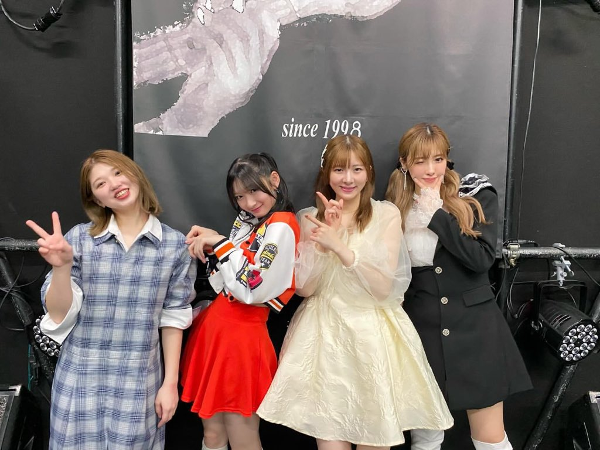

## 2024年4月8日 [#MSMW](https://twitter.com/search?q=%23MSMW){:target="_blank"} レポ！（4.7 郡山 Hip Shot Japan）～まるかりん大歓喜セトリ～ 

* <big>**M-line Special 2024 ～Many well wishes～**</big>

の

* 4月7日（日） 郡山 Hip Shot Japan

の2公演に参加しました！

出演者は

* **竹内朱莉**
* **宮本佳林**
* **小片リサ**
* **夏焼雅**<small>(ゲスト)</small>

の4人です！

### まるかりん大歓喜セトリ

>あ、話変わるんですけど   最近M-lineSpecialのセトリ決めをする機会が多くて（…）今決めてるセトリは   **まるかりん大歓喜セトリになりそうで**   もうちょい先になったらみんなに言うけど、、   セトリ公開したいレベル

[2024年3月5日「結局」（宮本佳林オフィシャルブログ「かりんの頭の中」）](https://ameblo.jp/miyamotokarin-official/entry-12843159636.html)

**まるかりん大歓喜セトリ！！** <small>（ぶへぇ！）</small>

これほど期待に胸を膨らませる言葉があったでしょうか。これほど妄想に目を眩ませる言葉があったでしょうか。「まるかりん大歓喜セトリ」とは何なのでしょうか… その答えは…

> 今回はスマイレージだった竹内朱莉ちゃん   スマイレージ大好きな小片リサちゃん   スマイレージに合格しなかった(笑)私   が揃ったので、**スマイレージスペシャル**になります

[2024年3月27日「うなぎコーラ」（宮本佳林オフィシャルブログ「かりんの頭の中」）](https://ameblo.jp/miyamotokarin-official/entry-12845991822.html)

**スマイレージスペシャル！！** <small>（ぶへぇ！！！！）</small>

竹内朱莉・小片リサ・宮本佳林がスマイレージですよ？ キラキラと輝く夢の記憶とともに思い起こされるスマイレージの楽曲たち… それを、2024年に竹内朱莉・宮本佳林・小片リサが歌うのです…😇

### 目次 {#目次}

* [1曲目：夏焼雅・竹内朱莉・宮本佳林・小片リサ「私、ちょいとカワイイ裏番長」～MC(1)](#song1)
* [2曲目：宮本佳林「Lonely Bus」（昼）／「パラレルハート」（夜）、3曲目：小片リサ「映画の趣味が合うだけ」](#song2-3)
* [4曲目：宮本佳林・小片リサ「サンキュ!クレームブリュレの友情」](#song4)
* [5曲目：竹内朱莉・宮本佳林「自転車チリリン」](#song5)
* [6曲目：竹内朱莉・宮本佳林・小片リサ「夕暮れ 恋の時間」](#song6)
* [MC(2)～宮本佳林・小片リサ～](#MC2)
* [7曲目：竹内朱莉「パン屋さんのアルバイト」](#song7)
* [8曲目：宮本佳林「Beautiful Song」（昼）／「ソリスト・ダンス」（夜）](#song8)
* [9曲目：小片リサ「ムーンナイト・シークレット」](#song9)
* [10曲目：竹内朱莉・小片リサ「「良い奴」」](#song10)
* [11曲目：夏焼雅・竹内朱莉「赤いフリージア」～MC(3)](#song11)
* [12曲目：夏焼雅「1/3の純情な感情」](#song12)
* [13曲目：竹内朱莉「ロマンティック 浮かれモード」](#song13)
* [14曲目：竹内朱莉・宮本佳林・小片リサ「旅立ちの春が来た」](#song14)
* [15曲目：夏焼雅・宮本佳林・小片リサ「恋愛♥ライダー」](#song15)
* [16曲目：夏焼雅・竹内朱莉・宮本佳林・小片リサ「スキちゃん」](#song16)
* [MC(ラスト)](#MC3)
* [ラスト：夏焼雅・竹内朱莉・宮本佳林・小片リサ「友達は友達なんだ!」](#song17)

[<i class="fa-solid fa-square-caret-up"></i> 目次](#目次)

### 1曲目：夏焼雅・竹内朱莉・宮本佳林・小片リサ「私、ちょいとカワイイ裏番長」～MC(1) {#song1}

**ちょいカワ！ ちょいカワ！ ちょいカワ！ ちょいカワ！**

4人がステージに一直線に並び、激しいヘッドバンキングですよ！ 初手からもう分かりますよね、容赦しないのよ

私たちも息を切らしながら大きな声で**ちょいカワ！**って繰り返し叫びました👍

また、昼公演初っ端に小事件がありまして笑 

ロックなギター🎸のイントロでたけちゃんが

> ？？？？？？のみなさん盛り上がってうわあああああ！！

という、言葉ではない何かで叫んで雅ちゃんとか爆笑

> たけちゃん「郡山か福島かで迷ってああなっちゃいました！」

このわちゃわちゃ感なのです…

[<i class="fa-solid fa-square-caret-up"></i> 目次](#目次)

### 2曲目：宮本佳林「Lonely Bus」（昼）／「パラレルハート」（夜）、3曲目：小片リサ「映画の趣味が合うだけ」 {#song2-3}

MSMW恒例のソロ曲のコーナーです👍

今回の公演に来ているヲタクたちは佳林党員もいますし、りさまるヲタもいます。もっといえば、**まるかりんヲタク**<small>（まるかりん党員？）</small>がいます。ヲタたちもかなり研ぎ澄まされているわけです。つまり、めちゃめちゃ盛り上がりました👍

**パラレルハート**のラスサビ前の台詞パート（「えーがーおーでいれるならーあーああー！！」の後！）

> 音も光も届かない 深い水底で 想い出たちを眺めている あの時 手を伸ばせば 声が出たなら 少しの勇気があれば…

ここ音としてはそこまで激しくはないのですけど、何でしょうか、滾る思いがあまりにも高ぶるため身体が壊れそうになりまして、大好きです

**映画の趣味が合うだけ**にもたくさん好きなところあるのですけど、

> エンドロールまで見る派だって **わかったあの瞬間** 👈

ここ！ ファルセットなハモリ入りますよね？ ここゾクゾクするんですよ…

[<i class="fa-solid fa-square-caret-up"></i> 目次](#目次)

### 4曲目：宮本佳林・小片リサ「サンキュ!クレームブリュレの友情」 {#song4}

**まるかりん！！！！！！**

しかも

**クレームブリュレ！！！！**

まるかりんがステージに立っていてクレームブリュレ流れてて、可愛さのあまりに、ちょっともう感動ですよね

りさまるの歌声も心なしか**ぶりっぶり**なんですよ、、きゃわええ…

胸がｷｭﾝｷｭﾝしたのはですね、Bメロの

> シフォンケーキにチーズケーは **角のお店の** ストロベリーのショートケーキにクレームブリュレ！

ここでまるかりんがお立ち台に上がって向かい合うんですよ…

はーん

まるかりんが向き合う

はーん

[<i class="fa-solid fa-square-caret-up"></i> 目次](#目次)

### 5曲目：竹内朱莉・宮本佳林「自転車チリリン」 {#song5}

まるかりんブリュレでもう限界を超えたわけですけど、MSMWは容赦しません

**たけかりん！！！！！！**

そして

**自転車チリリン！！！！！！**

😭😭😭😭😭😭

ちょっと選曲良すぎませんか？？？ 名曲**自転車チリリン**なのよ😭

胸が締め付けられたのは、サビでたけかりんがお立ち台にあがって、それはそれは幸せな歌声で私もとろけていたんですけど

> おそらく**恋愛対象外**～

ここをですね、、佳林ちゃんがたけちゃんを切なそうな顔で見つめながら歌うんですよ、、そのことにたけちゃん気づいてないんすよ、、、

<big>せつねええええええええええええええええええええ</big>

[<i class="fa-solid fa-square-caret-up"></i> 目次](#目次)

### 6曲目：竹内朱莉・宮本佳林・小片リサ「夕暮れ 恋の時間」 {#song6}

えぐいえぐい

まるかりん、たけかりん、**たけまるかりん**！

しかも、**夕暮れ 恋の時間**

死んでしまうて

めちゃめちゃ可愛いですよね！

**まるかりん**がお立ち台に上がりまして<small>（お立ち台の話多いのよ）</small>

> イチャチャ イチャイチャして 愛が咲く

ここの振り付けがもう可愛くて可愛くて… 🥰🥰🥰🥰

> 私～ う～ん どうしよっかな～

ここ**佳林ちゃあああああん** まー可愛い

可愛い

[<i class="fa-solid fa-square-caret-up"></i> 目次](#目次)

### MC(2)～宮本佳林・小片リサ～ {#MC2}

<big>**まるかりん漫才きたあああああああああああああああああああ**</big>

ずっと、、、ずーーーっと待ち続けていました、、、念願です😭

> りさまる「私ひとつ自慢することありますよ」   佳林ちゃん「なに」   りさまる「竹内さんが唐揚げ食べてて美味しそうだなあ、、、って言ったら、、、」   佳林ちゃん「え、、、」   りさまる「そのまま、、、（あーんのながれ、、、）」   佳林ちゃん「**やめて聞きたくない！！！もう許さない**」

りさまるが佳林ちゃんにたけちゃんマウント笑笑笑笑笑

このときの佳林ちゃんのギロリとした目が忘れられません笑 もう目線が真正面に固定されて怒りに震える佳林ちゃん

> りさまる「あれ、、一生こっちみてくれないおーい✋」   佳林ちゃん「大丈夫！視界には入ってるから！」

こわいて笑

> 佳林ちゃん「いいもん！わたしはつぶグミチョコをたけちゃんにもらうから！」  りさまる「あ、はいよかったですね😊」   佳林ちゃん「まるかりん漫才何も考えてなかったからオチとかないんですけど」  りさまる「いまので落ちたんじゃないんですか？」   まるかりん「「**ありがとうございましたー**🙇🙇‍♀️」」

もう長年連れ添った何かなのよ。佳林ちゃんのぐいぐい来る感じに笑顔で受け流すりさまる… そして、会話も言葉が少なくてもお互い理解できてしまうからどんどん先に進むんですよね、、本当によいです、、これです、、これが**まるかりん**です、、

映画の趣味どころか何も合わない二人ですが、、

> 佳林ちゃん「私たち全然趣味とか違うんですけど…見つけました！唯一の共通点！カメラ！」   りさまる「おおお〜 でも私、人は撮らなくて風景を撮るんですよね〜」   佳林ちゃん「🥺 わたしは**オート**で撮るんですけど…」   りさまる「私は**マニュアル**ですね」   佳林ちゃん「**すみませんでした**」

やっぱり合わない笑笑笑笑 見事に合わないんですよね笑

> りさまる「じゃあ花見とか行きます？」  佳林ちゃん「！！！今週って、、、空いてる？」   りさまる「木曜の夜なら、、、」   袖のMgさん😫（私たちには見えてない）   佳林ちゃん「だめみたいです」

やっぱり合わない笑笑笑笑 どうなってるんですか笑 この二人笑

この会話の流れでりさまるがMgさんの表情が最近豊かで好き！って話から、佳林ちゃんの知らないところでのMgさんの話も出て、、

> 佳林ちゃん「**人の女を取るなー！**」

って言ってました笑笑笑笑笑

そのほかにもつぶグミ（チョコ味）の話で盛り上がったり、もうね、、最高の**まるかりん漫才**でした👍

[<i class="fa-solid fa-square-caret-up"></i> 目次](#目次)

### 7曲目：竹内朱莉「パン屋さんのアルバイト」

もう大好きですこの曲！

すごく可愛らしいですよね🥰 パン屋さんのアルバイトで「慣れてそうなひと」にいろいろ考えちゃうわけですよ！ 可愛すぎるって

可愛いのにサウンドは高音でギター🎸が唸っててめちゃカッコイイ！！！

振り付けも可愛いし、もう大好きです

> これって恋かも～

ここで

> ドドスコスコスコ

コールがありました笑 あとで雅ちゃん「あれ面白過ぎるよね笑」って言ってました笑 スマイレージらしいですよね笑

ペンライトもみんな🔴を振ってて！ スマイレージだ！！！！ ってなりました👍

[<i class="fa-solid fa-square-caret-up"></i> 目次](#目次)

### 8曲目：宮本佳林「Beautiful Song」（昼）／「ソリスト・ダンス」（夜） {#song8}

さあ、ソロ曲2曲目です！！ **Beautiful Song** と **ソリスト・ダンス** ！

どちらも盛り上がりますよね～！ 特に**ソリスト・ダンス**！！

何度も書かせてください

[<i class="fa-lg fa-brands fa-tiktok"></i> 宮本佳林💜🍬🗼 - アイドル曲コールに自信ある方集まれ！](https://www.tiktok.com/@karin_miyamoto/video/7298638408769948929)

* 👏👏👏👏
* フッフー！
* オーイオーイオイオイオイオイ！
* <small>ｳｰ!</small> オイ！<small>ｳｰ!</small> オイ！<small>ｳｰ!</small> オイ！<small>ｳｰ!</small> オイ！
* L・O・V・E Lovely かりん！
* かーりん！かーりん！

**ソリスト・ダンス**にはこれらがすべて詰まっております

もう、私たちもここですべての体力をささげてよいという気持ちで全身全霊でコールをしてまして！ とてつもない盛り上がりでした！！

[<i class="fa-solid fa-square-caret-up"></i> 目次](#目次)

### 9曲目：小片リサ「ムーンナイト・シークレット」 {#song9}

<big>**！！！！**</big>

結構驚きました！ **ムーンナイト・シークレット**！

りさまる単独公演<small>（「Coeur à coeur」「éclatant」）</small>では結構前から披露されていたものの未音源化の楽曲がまさかMSMWで！

ラストMCでちょっと匂わされるのですが、どうやらニューアルバム **montage** に収録されそうな予感です！！！

> エ・ト・セ・ト・ラ… ぎゅっと抱きしめて…

ここ好きぃ で「じらして愛して」みたいにりさまるの吐息っぽいコーラス（「ah」みたいな）が入る都会っぽいサウンドなんですけど、、めっちゃいいんですよ、、、

音源楽しみだあああああ！！

[<i class="fa-solid fa-square-caret-up"></i> 目次](#目次)

### 10曲目：竹内朱莉・小片リサ「「良い奴」」 {#song10}

まるかりん、たけかりん、たけまるかりん…

続いて、**たけちゃん × りさまる** で **「良い奴」！**

カッコイイですよね～この曲！ このときはりさまるも歌声もカッコいい系でした👍

> 10年先でも！ 今と一緒くらい 愛せるって **証明できる～？ おうぉお<big>うぉおおおおおおおおお</big>**

ここのたけちゃんやばあああああああああああああああああああ

[<i class="fa-solid fa-square-caret-up"></i> 目次](#目次)

### 11曲目：夏焼雅・竹内朱莉「赤いフリージア」～MC(3) {#song11}

雅ちゃんとたけちゃんで**赤いフリージア！**

これ結構意外じゃないですか！？ この二人の組み合わせというのも新鮮ですし、しかも、赤いフリージア！

MCではたけちゃんのBerryz工房さんの話がすごく面白かったです笑

> たけちゃん「Berryzさんは「我らジャンヌ」で一緒だったときめっちゃ神！って感じで！」   雅ちゃん「え笑」   たけちゃん「遅れちゃう、やべぇ、怒られるってなっても…**大丈夫、私がいないと始まらないから**って言われてかっけえええ！一生ついてきます！ってなりました」   雅ちゃん「笑笑 え、それ誰？笑」   たけちゃん「**菅谷さんです**」

りさこおおおおおおお笑笑笑 かっこよすぎるでしょ笑

たけちゃんいわくたとえば「ああ…お腹すいたな…あれ、、弁当とか、、ないのかな、、、」ってなってもBerryz工房さんがいれば

> 「ごはんまだですか～」

って言ってくれると笑 もうね、、さすがなのよ👍

[<i class="fa-solid fa-square-caret-up"></i> 目次](#目次)

### 12曲目：夏焼雅「1/3の純情な感情」 {#song12}

はい、こちらもペンライト🔴です！

> 壊れるほど 愛しても 1/3も伝わらない 純情な感情は空回り I love you さえ言えないでいる My heart

もう名曲ですよね！ 雅ちゃんがソロで歌ってるのがまたカッコいいなああ！

[2024年3月16日 福岡 DRUM LOGOS 公演 ～ ロック🤘 ～](./20240320.md)

こちらでも披露をしていたのですが不思議なことにまた聴こえ方違うんですよねええ

福岡公演では**ロック**って感じだったんですけど、今回のは迫力というか歌！！！という感じで

[<i class="fa-solid fa-square-caret-up"></i> 目次](#目次)

### 13曲目：竹内朱莉「ロマンティック 浮かれモード」 {#song13}

2公演目で**事件**が起きました…

間奏が開けたところで、ステージ上に2人のただの**ヲタク**が乱入したのです…

ﾀﾞﾀﾞﾀﾞﾀﾞﾝ！さあ、落ちサビ！というところで、たけちゃんの前に立って観客と同じ向きで上体を反らしている手を差し伸べています<small>（「ロミオ」と呼ばれるヲタ芸）</small>

<big>**まるかりんが！！！！！**</big>

そして、たけちゃんが

> 心のビッグパレ～～～～ド

で、ぐるぐる回り出す**まるかりん**笑

後でたけちゃんがMCで言うように会場のヲタクたちも**2割増し**笑

ぴょんぴょんと手拍子しながら回り出してます笑 **ヲタク**も**まるかりん**も笑

> ろーまーんす！

で、腰を低く下ろした**まるかりん**がロマンス👆👆笑笑笑笑笑笑笑笑

腹ちぎれるかと思いました笑笑笑笑笑笑笑笑笑笑笑笑笑笑笑笑

マジで最高🤣🤣🤣🤣🤣🤣

ちなみにですけども、**まるかりん** ロマモーは前にもありまして…

* [<i class="fa-lg fa-brands fa-youtube"></i> 小関舞 / 宮本佳林・小片リサ「ロマンティック 浮かれモード」（MSMW 2022.10.16 横浜ランドマークホール） ](https://www.youtube.com/watch?v=fOuJvADoPIM&t=1m38s){:target="_blank"}

こちらで舞ちゃんのバックダンサーとして踊っております笑<small>（映像には残っていませんが一回だけロマンスをしていました笑）</small>

[<i class="fa-solid fa-square-caret-up"></i> 目次](#目次)

### 14曲目：竹内朱莉・宮本佳林・小片リサ「旅立ちの春が来た」 {#song14}

さて、、ささささと立ち去ったかと思ったら再び現れる**まるかりん**笑

再びたけまるかりんで **旅立ちの春が来た** ！

春ですしね！ りさまるが

> 笑顔で送り出して～

と歌ったら

> ＼＼おーがたりさ！／／

というコールがあってめっちゃ盛り上がった！ **旅立ちの春が来た** もめっちゃ6スマのイメージですよね！

* [<i class="fa-lg fa-brands fa-youtube"></i> スマイレージ 「旅立ちの春が来た」MV](https://www.youtube.com/watch?v=Xe1IOiDlwtc){:target="_blank"}

改めてMV見るとたけちゃん幼い！！！ いやあ6スマいいわあ、、それを2024年に最高の形で体験できてるんですよね、、改めて考えてすげええってなってます、、、

[<i class="fa-solid fa-square-caret-up"></i> 目次](#目次)

### 15曲目：夏焼雅・宮本佳林・小片リサ「恋愛♥ライダー」 {#song15}

それで言うとこれもですよ！！！ **雅ちゃん**と**まるかりん**の**3人**で**恋愛♥ライダー**！！！

こんな贅沢なことあります？？ Buono!曲のときに3人にする感じとかもマジ最高です👍

こちらも見ちゃいましょうかMV…

* [<i class="fa-lg fa-brands fa-youtube"></i> Buono!「恋愛♥ライダー」MV](https://www.youtube.com/watch?v=d8Kb0WD8kvE){:target="_blank"}

13年前！？

雅ちゃん全然変わらず可愛くておしゃれできれいで… ほんとすごい！！！ これをライブハウスで本人のを聴けるんですよ！？

> 好きだよお前えええええええええ

ここのユニゾンがまああよい！ 何というのでしょう、音域的にもジャストミートといいますか、、

[<i class="fa-solid fa-square-caret-up"></i> 目次](#目次)

### 16曲目：夏焼雅・竹内朱莉・宮本佳林・小片リサ「スキちゃん」 {#song16}

4スマ！！！！ 最後に最高に盛り上がる4スマ曲を持ってくるのもまたさすがです👍 しかも**4人**で！！

> 「どうしようかなー」  ＼＼しよかな！／／

楽しい！！！

> <small>スキちゃんスキちゃん…</small> **たけちゃんがスキちゃん！**   <small>スキちゃんスキちゃん…</small> **佳林がスキちゃん！**    <small>スキちゃんスキちゃん…</small> **小片がスキちゃん！**   <small>スキちゃんスキちゃん…</small> **みやびがスキちゃああああん！** 

コールも楽しいし、ここで4人がひとりずつぎゅっと集まるんですよね🥰

で、手拍子しながら

> おい！おい！おい！おい！おい！おい！おい！おい！おい！おい！おい！おい！

楽しい！ たけちゃんがそこにいて、まるかりんがいて、雅ちゃんがいて、ライブハウスで、スキちゃんですよ！？ スマイレージだああああ！ってなってもう嬉しかったです

[<i class="fa-solid fa-square-caret-up"></i> 目次](#目次)

### MC(ラスト) {#MC3}

さあ、あっという間のラストMCです。

雅ちゃんが

> M-line って本当に自由で、だからこそ、セットリストだったりいろいろ決めないとだったりいろいろ大変なのね？ 前回も稲場愛香ちゃんがすごく大変そうにしてて、、今回はね（佳林ちゃんを指しながら）リーダーとして仕切ってくれてさ

って、M-line メンバーのことをすごく愛情をこめて話してくれるんですよね

このとき佳林ちゃんはすごく恐縮した顔をしていたんですけど、何でしょう、雅ちゃんだからこそ、こういう目線でのお話を私たちに伝えてくれるというか

みんなソロで活動していて、あらゆることを自分ひとりでやらないといけなくて、それは自由ということでもあるけど大変なんだと思うんですよね。でも、だからこそ、スマイレージスペシャルみたいなライブとかヲタクが乱入したりとか笑 最高のライブになるんだよなー！って

そのことに改めて感謝できる気持ちに雅ちゃんはさせてくれて

今回の**たけまるかりん**のMSMWにゲスト参加している一方で、**ききまなまい**のMSMWにもゲスト参加してるんですね、雅ちゃんって。そこでもすごく愛情にあふれてて、本当に大好きです。雅ちゃん。本当にありがとう。

[<i class="fa-solid fa-square-caret-up"></i> 目次](#目次)

### ラスト：夏焼雅・竹内朱莉・宮本佳林・小片リサ「友達は友達なんだ!」 {#song17}

最後 **ベリーズ** なのもまたいいわあああああ

この曲本当に本当に大好きで、、、てか、泣いちゃうのよ、、愛情あふれる言葉を聞いたあとだからこそより一層胸に来まして、、、😭

> とはいえ年一度くらいそう昼でもいいランチして情報交換もしたいな **ドタキャンもありで** この仲間で会いたいな

* [<i class="fa-lg fa-brands fa-youtube"></i> Berryz工房「友達は友達なんだ！」MV](https://www.youtube.com/watch?v=DB3rcZiNpL4){:target="_blank"}

もう本当に素敵… 佳林ちゃんはここからしばらくまたソロ活動に専念ということでMSMWの出演予定はしばらくないのですけど、まさに、何て言うのですか？ ソロ活動を目いっぱいやって、その帰る場所としてMSMWがあって、そこには雅ちゃんがいて😭😭😭😭

[<i class="fa-solid fa-square-caret-up"></i> 目次](#目次)

### ＊

まるかりんが一緒になってライブハウスでMSMWをやるのも、まなまいがソロ活動中だからってのがあると思うんですよね？ 青森公演の日は名古屋でまなまいはリリイベをしていましたし。

一方でまるかりんがそれぞれ単独をしているときはまなまいがMSMWを支えていたり。

M-line Specialのこの構成って画期的だと思うんですよね。それぞれソロ活動をしていて、そのスケジュールだったりリソースを調整しながらMSMWがあって、っていう。

M-lineに舞ちゃんやまなかんが入ったのが2022年でそこから2年近くたって、お互い磨き合い競い合う関係でもあって、それもまたいいな～って

それがまためぐろMSMWみたいに全員集結するような特異日があったりして、、、

M-line最高なのよ