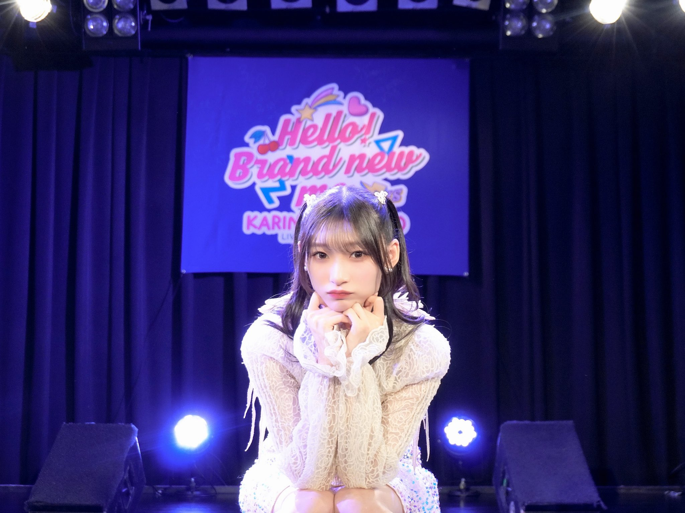

## 2024年4月15日 ～Hello! Brand new me ～RETURNS レポ！（4.14 横浜 Bay Hall） 

佳林ちゃんの単独ライブ

* <big>**～Hello! Brand new me～RETURNS**</big>

の

* 4月14日（日） 横浜 Bay Hall 公演

に参加しました！

<big>**※ めーーっちゃネタバレなのでご注意を！**</big>

### 目次 {#目次}

* [1曲目：Beautiful Song](#song1)
* [2曲目：愛し合わなきゃもったいない（新曲）](#song2)
* [3曲目：パラレルハート～MC(1)](#song3)
* [4曲目：水色メロディ（月島きらり）](#song4)
* [5曲目：コピンクメドレー～MC(2) <small> カリーナノッテ，最高視感度，兎tocome，リバース，カリーナノッテ (polaris mix) </small>](#song5) 
* [6曲目：桜ノ雨](#song6)
* [7曲目：氷点下](#song7)
* [8曲目：イイオンナごっこ](#song8)
* [9曲目：少です。女K（昼）／Lonely Bus（夜）～MC(3)](#song9)
* [10曲目：アンフェアな事情（新曲）](#song10)
* [11曲目：Juice=Juiceメドレー <small>「ひとりで生きられそう」って それってねえ、褒めているの?，  私が言う前に抱きしめなきゃね，大人の事情，微炭酸，銀色のテレパシー，Va-Va-Voom，Wonderful World</small>](#song11)
* [12曲目：桜ノ雨](#song12)
* [13曲目：Happy Days](#song13)
* [14曲目：自分ファースト](#song14)
* [15曲目：バンビーナ・バンビーノ～アンコール](#song15)
* [16曲目：未来のフィラメント～MC(ラスト)](#song16)
* [ラスト：ソリスト・ダンス](#song17)

[<i class="fa-solid fa-square-caret-up"></i> 目次](#目次)

### 1曲目：Beautiful Song {#song1}

> 届け！ わたしの心 美しさも醜さも 映す歌に換えて

**Beautiful Song** 大好きです。タイトルは**美しさ**ですがその陰には**醜さ**もあり、それもひっくるめて**美しい**んですよね。そして、それが宮本佳林なんだよなって。「軽蔑と羨望の複雑<small>（みっくす）</small>」もいかにも佳林ちゃんらしい。佳林ちゃんの作る美しさは決して順風満帆ではなく醜い思いを少し抱きつつそれを乗り越えて手に入れた美しさなんですよね。

そういう、なんでしょう、佳林ちゃんの血の滲むようなものの先に現れる美しさを感じて感動をするんですね。

**HBNM** での映像は M-line Music で配信されています<small>（この曲について佳林ちゃん本人が話しているのでぜひ）</small>。

* [<i class="fa-lg fa-brands fa-youtube"></i> 宮本佳林「Beautiful Song」（HBNM）](https://www.youtube.com/watch?v=doV8B5rZrLA&t=11m40s){:target="_blank"}

**HBNMR** では、佳林党員のみなさんと一緒に

> La La La ...

の部分を合唱するんですね。これがまた感動的で。いつかもっともっと大きいステージで佳林ちゃんにこの合唱を届けたい。

[<i class="fa-solid fa-square-caret-up"></i> 目次](#目次)
### 2曲目：愛し合わなきゃもったいない（新曲） {#song2}

新曲！ めちゃめちゃタイプでした！ 曲調はノリノリで結構何というのですか？ イカしてるんです！

歌詞のスケールもまたいいんですよ。同じ地球（ほし）に生まれた私たち**愛し合わなきゃもったいない**っていうようなスケールなんですね。「世界が奏でる歌」というようなフレーズもあったと思います。

何でしょう、たとえば**Wonderful World**とか**46億年LOVE**といった曲を思い浮かべてくれれば！

早く音源で聴きたいな～

[<i class="fa-solid fa-square-caret-up"></i> 目次](#目次)
### 3曲目：パラレルハート～MC(1) {#song3}

**パラレルハート**もいい、、、

> 音も光も届かない 深い水底で 想い出たちを眺めている あの時 手を伸ばせば 声が出たなら 少しの勇気があれば…

ここの台詞部分が胸を激しく揺さぶられるんですよね、、、楽曲的には台詞を立てるために少し静かになるんですけど、物凄く激しく聞こえるんですよ、、

[<i class="fa-solid fa-square-caret-up"></i> 目次](#目次)
### 4曲目：水色メロディ（月島きらり） {#song4}

MCで佳林ちゃんが「私が憧れていた曲をカバーします」と言って流れたのが**月島きらり**の**水色メロディ**でした！

先日のオーイシマサヨシさんのヤンタンでも月島きらりちゃんが憧れだったという話をしてましたね。アニメ・漫画・ゲームについてもアツく語っていました！

佳林ちゃんの世代前後は**きらりん☆レボリューション**ど真ん中ですよね。私も夕方アニメをやっていたの憶えてます。

今でも貫かれていると思いますが、佳林ちゃんって、アニメ・漫画・ゲームのカルチャーととても合うんですよね。いつかアニメの主題歌とかやってくれたらいいな～！！！

[<i class="fa-solid fa-square-caret-up"></i> 目次](#目次)
### 5曲目：コピンクメドレー～MC(2) {#song5}
 * カリーナノッテ
 * 最高視感度
 * 兎tocome
 * リバース
 * カリーナノッテ (polaris mix) 

**コピンクメドレー**です！ こちらは**HBNM**に引き続きですね😊

**水色メロディ** で書いたことはここにも重なりますよね。2000年代アニメと佳林ちゃんがとても合うのです。何というのでしょう。深夜で切なくてそっと寄り添ってくれる素敵な歌声…みたいな。

**兎tocome**の

> 君が駆けてくる 少し**追ってみたけど** 風みたいに飛んでく フレー！ **フレー！**

ここのハイトーンボイスがですね、、まあ、良いんですわ、、

佳林ちゃんって80年代アイドルへのリスペクトもとてもありますが、2000年代以降のアニメ音楽カルチャーへのリスペクトもすごく感じます。

[<i class="fa-solid fa-square-caret-up"></i> 目次](#目次)
### 6曲目：桜ノ雨 {#song6}

ここから、じっくり、しっとりです。ということで、着席をして聴きました。1曲目はhalyosyさんの**桜ノ雨**です。

* [<i class="fa-lg fa-brands fa-youtube"></i> halyosy - 桜ノ雨 feat. 初音ミク](https://www.youtube.com/watch?v=1UAkQP8tytM){:target="_blank"}

ちょうど4月ですから季節感もぴったりですね。名曲です。。

佳林ちゃんが思いを込めて歌うとものすごく感動します。

> 教室の窓から桜ノ雨

雨（あ**め**）の高音が身体に染み込む心地よい佳林ちゃんの歌声で、、すーっと涙が落ちるんです。何か浮かぶじゃないですか、あの桜の季節に思い出の場所から離れるという切ない気持ちと、陽気と風に吹かれて舞い散る桜のあの感じが、、、

[<i class="fa-solid fa-square-caret-up"></i> 目次](#目次)
### 7曲目：氷点下 {#song7}

佳林ちゃんのしっとり曲というと**氷点下**ですよね

ラストの

> あたたかい春なんて知らなければ 氷点下一人でも歩けていたの 君に触れて 溶けた心の 弱くなったの **弱くさせたんでしょう？**

ここのわずかに**怒り**すら垣間見るですね、、佳林ちゃんの訴えかけるような歌声にわたしは震撼しました

[<i class="fa-solid fa-square-caret-up"></i> 目次](#目次)
### 8曲目：イイオンナごっこ {#song8}

**イイオンナごっこ** … この曲も切ない、、というよりはやはり**怒り**を感じますよね

> 嘘もつけない 君の代わりに 嘘をついて 笑ってるのは誰

佳林ちゃんってきっと何もかもを分かってしまうひとって感じがして、、そして、何が最善かがわかってるんです。でも、相手は幸せになるけど自分自身は不幸せになる選択というか、、でも、それを選ぶんですよね

でも、それを選べるのは分かっている自分しかいないから仕方なく選んでいる、、みたいな

[<i class="fa-solid fa-square-caret-up"></i> 目次](#目次)
### 9曲目：少女K（昼）／Lonely Bus（夜）～MC(3) {#song9}

**氷点下**、**イイオンナごっこ**と続いて**少女K**です。

改めて並べて聞いてみると暗いですね。。

しかし、これも宮本佳林なんですよ、、、佳林ちゃんというとエッグ時代にオーディションに何度も不合格になり、苦渋の思いに悩み苦しんだ時期が長いと思うんですね。自分と同時期にエッグだったメンバーのライブでバックダンサーをしたり。

> だってさ私は少女K エンドロールで 名前もないような役柄なの

重い…

そう思うと **Lonely Bus** は何でしょう、微炭酸MV的な前向きさを感じますよね

[<i class="fa-solid fa-square-caret-up"></i> 目次](#目次)
### 10曲目：アンフェアな事情（新曲） {#song10}

先日、雑ラジでも初OAになった**アンフェアな事情**！

こちらもすごくノリノリな楽曲で！ しかもオシャレでRAPパートあります！

何というのでしょう、ディスコっぽい？ そんな楽曲でした！ 音源楽しみ！

[<i class="fa-solid fa-square-caret-up"></i> 目次](#目次)
### 11曲目：Juice=Juiceメドレー {#song11}
 * 「ひとりで生きられそう」って それってねえ、褒めているの?
 * 私が言う前に抱きしめなきゃね
 * 大人の事情
 * 微炭酸
 * 銀色のテレパシー
 * Va-Va-Voom
 * Wonderful World

**Juice=Juice**メドレーです！

個人的にはやはりメドレーラストの**Wonderful World**ですね。思い出すのはやはり

[<i class="fa-lg fa-brands fa-youtube"></i> Juice=Juice「Wonderful World」（Juice=Juice LIVE MISSION FINAL at 日本武道館）](https://www.youtube.com/watch?v=cyFB7sB6CYs)

です。この映像にもある通り、この日も客席全員で

> \\\\ La La La ... //

と大合唱します。この映像の**Wonderful World**はJuice=Juiceの初単独武道館で披露されたものでした。ですから、横浜 Bay Hallで「La La La...」と歌いながらステージの上に立つ佳林ちゃんが**ソロ**で武道館に立つ光景が浮かぶのです。

きっとそのときも

> みんなだけで歌って～

と佳林ちゃんの合図を受けて武道館を響き渡らせるのです。その日が決して遠くない未来に待っている。

[<i class="fa-solid fa-square-caret-up"></i> 目次](#目次)
### 12曲目：なんてったって I Love You {#song12}

さあ、ここからどんどん盛り上がります。佳林ちゃんのソロ曲でこれぞ**アイドル**！ というのが**なんてったって I Love You**ですよね🥰

この曲って私たちヲタク賛歌なところあると思うんですよね？

> 感情ぶっ飛ばして今すぐ会いに行くわ

ですから！ 佳林ちゃん × アイドルソング はもう最強なのです。**重すぎるくらいでOK**なんです！

[<i class="fa-solid fa-square-caret-up"></i> 目次](#目次)
### 13曲目：Happy Days {#song13}

いいですね～ **なんLove**から**ヒトリトイロ**の明るい楽曲ゾーンに突入しております

佳林ちゃんのくしゃっとした笑顔あるじゃないですか。ものすごく元気出るんですよ！ 佳林ちゃんの歌って日常に元気を届けてくれる感じがしてます。別世界に連れてってくれるというよりは、今あるこの日常に**Happy**を届ける感じ！

わりとたとえば仕事してて疲れたな～ってときに思い浮かぶの佳林ちゃんがちじゃないです？

ちなみに**ヒトリトイロ**のときの映像は配信されてますので、ぜひ！

* [<i class="fa-lg fa-brands fa-youtube"></i> 宮本佳林「Happy Days」](https://www.youtube.com/watch?v=NgAsR--Sq1A&t=10m25s){:target="_blank"}

ちょうど1年前ですね。このころはコールができませんでしたが、この曲もコール付きになって進化しています！

> しあわせ～？ ＼＼しあわせー！／／   ふしあわせ～？ ＼＼ふしあわせー／／   うらおもて～ ＼＼おらおもてー／／   **気持ちの持ちようだね～！！！**

楽しい～～～！ 本当にね毎日**Happy**ですよ！

[<i class="fa-solid fa-square-caret-up"></i> 目次](#目次)
### 14曲目：自分ファースト {#song14}

**なんLove**、**Happy Days**、**自分ファースト** という**ヒトリトイロ**の感じ！

このときの映像もございます！

* [<i class="fa-lg fa-brands fa-youtube"></i> 宮本佳林「自分ファースト」](https://www.youtube.com/watch?v=dZpljq8vxSQ&t=14m38s){:target="_blank"}

タオル振り回し曲です👍

この曲もコール＆レスポンスがすごく楽しい！ そして佳林ちゃんの伸びる

> 自分ふ<small>ぁ</small>ぁあ<big>あ**ああああああああああ**</big>

ここなんですよ！ なんでしょう、元気がみなぎるし、今なら何でもできそうな気持になるんですよ

[<i class="fa-solid fa-square-caret-up"></i> 目次](#目次)
### 15曲目：バンビーナ・バンビーノ～アンコール {#song15}

ああもうやばいね。ここで**バンビーナ・バンビーノ**ですよ。

こちらも大合唱曲です！

> Na Na Na 

はみんなで歌います！ やっぱり佳林ちゃんはたしかに深く怒りに滾るあの感じもあるんですけど、そういう負の感情をすべて吹き飛ばすバッチバチ明るさがあるんですよ！

> 強がってても強いわけじゃないのさ そこんとこ重要

そうです、そこんとこ重要なんです。佳林ちゃんは負の気持ちもすべてひっくるめて**LOVEパワー**で吹き飛ばしてくれる！ ここにまた感動しちゃんですよ

[<i class="fa-solid fa-square-caret-up"></i> 目次](#目次)
### 16曲目：未来のフィラメント～MC(ラスト) {#song16}

さて、アンコール曲です。このときの衣装がまた素敵で✨

花柄の白いワンピースにキラキラしたカチューシャ？みたいな感じでした。可愛い。

> 答えはいつだって未来にしかないよ ここにはなくったって作り出せるよきっと

**未来のフィラメント**です。佳林ちゃんが卒業をしたときの最初の配信シングルですね。時間が経過すればするほど奥行きが生まれて感動します。過去のことを思い返しては、そのころの自分にとっての未来のいまを感じるというか…

最後のMCでこういう話をしていました。今回のコンサートのスタッフさんはJuice=Juiceの「220<small>（ダブルツーオー）</small>」をしていたころのスタッフさんらしくて、ちょうど佳林ちゃんが機能性発声障害で休養をしていてその復帰公演が横浜 Bay Hallだったらしいのです。

このころ佳林ちゃんは自分が歌えなくなることを深く思い悩んでいたようで、「私が必要なくなるかもしれない」とそう思い詰めていたみたいです。どころか今でも「私は必要とされなくなるかもしれない」ということを考え続けている。歌えなくてもこの業界に関わり続けるために作曲の勉強を始めたとも言っていました。

佳林ちゃんを追いかけて改めて思うのが、佳林ちゃんはとてももう息がもたないところまで深く潜り悩むんですよね。そんな佳林ちゃんにとって、

> 答えはいつだって未来にしかないよ ここにはなくったって作り出せるよきっと

という歌詞は深く突き刺さるものがあるらしいのです。つまり、悩んでも現状を変えることはできないし、答えは未来にあるし、答えは作れるのである、と。

佳林ちゃんはエッグのころの苦労とか、Juice=Juiceで乗り越えてきたものとか、ソロで向き合ったものとか、そのすべての時代を未来へと届けるようなスケールを感じるんですよね。

こういう話もしてました。「私はひねくれてたから」と前置きを入れながら、たとえば、手を振ったり目を合わせたりで喜んでくれることに、それでいいのか！ 私は歌とダンスじゃないのか！ と。でも、いまでは「幸せを届けられれば方法は何でもいいじゃないか」とも思う、と。

佳林ちゃんがファンのSNSを見て、いろいろ悩んでいるのを見て、頑張れるように元気を届けたいと思う一方で「頑張る正義」だけじゃないと思う、と。

もう、なんでしょうね、佳林ちゃんの歌がどうしてこんなにも私たちの人生を震わせるのかと思うと、こういうところまで深く潜ってくれるからなんだろうなって思います。そこにはいろいろ醜い気持ちだったり嫌なものもあるのですが、宮本佳林はそこまで付いてくるんです。

ある方が書いてて素敵だなと思ったのですが、**HBNMR**は1～2時間の間に宮本佳林の15年間を体験できるんです。そして、未来まで見せてくれる。今日がある未来にとっての過去になっててこのときの気持ちが未来に届くんだって思えるようなスケールなんです。

[<i class="fa-solid fa-square-caret-up"></i> 目次](#目次)
### ラスト：ソリスト・ダンス {#song17}

さあ、、最後は**ソリスト・ダンス**！ いつの間にか宮本佳林楽曲で最も盛り上がる楽曲になったのではないでしょうか。。

[<i class="fa-lg fa-brands fa-tiktok"></i> 宮本佳林💜🍬🗼 - アイドル曲コールに自信ある方集まれ！](https://www.tiktok.com/@karin_miyamoto/video/7298638408769948929)

* 👏👏👏👏
* フッフー！
* オーイオーイオイオイオイオイ！
* <small>ｳｰ!</small> オイ！<small>ｳｰ!</small> オイ！<small>ｳｰ!</small> オイ！<small>ｳｰ!</small> オイ！
* L・O・V・E Lovely かりん！
* かーりん！かーりん！

もう私たちもこちらが最後の楽曲ですから体力ここで使い果たしてよいわけですよ！ だからもう全身全霊でコールですよね👍

そして、私は2公演目でなぜか涙が止まらなくなってしまいまして、、なんかすげえカッコいいなって😭 宮本佳林という生きざまがまさに**ソリスト・ダンス**じゃないですか！ そこに佳林党員が全力で応答するこの感じ？ 感動なんですよ

[<i class="fa-solid fa-square-caret-up"></i> 目次](#目次)

### ＊

佳林ちゃんのライブ特有のこの感動ってのがあるんですよね、、6月には舞台も決まっていてもうどんどん進化するんですよ、、私はいま伝説に立ち会えているんだなって感覚があります。

[<i class="fa-solid fa-square-caret-up"></i> 目次](#目次)
