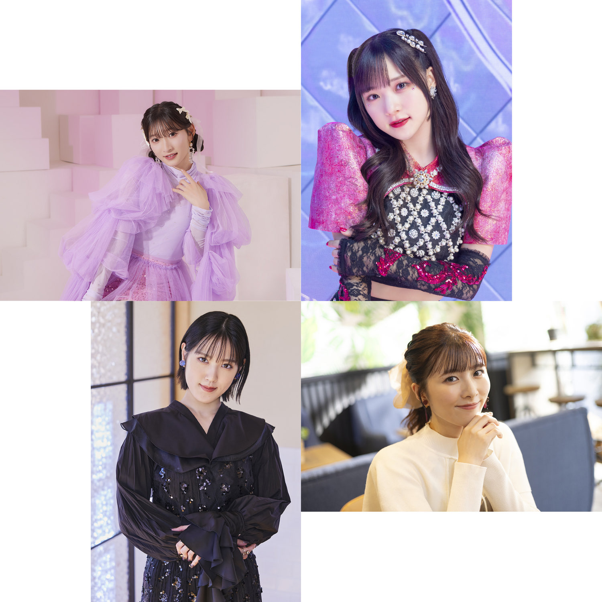

## 2024年4月22日 稲場愛香・小関舞・宮本佳林・小片リサ リリースイベント レポ！（4.20 プライムツリー赤池 プライムホール） 

プライムツリー赤池にて開かれました

* **稲場愛香** <small>2024年4月17日 1stシングル『圧倒的LØVE／Pink Temperature』発売</small>
* **小関舞** <small>2024年4月24日 1stシングル『涙のTomorrow/Yes! 晴れ予報』発売</small>
* **宮本佳林** <small>2024年5月22日 2ndアルバム『Spancall』発売</small>
* **小片リサ** <small>2024年6月19日 1stアルバム『montage』発売</small>

の**リリースイベント**🩷💙💜🧡<small>（ミニライブ＆お話し会）</small>に参加しました！

この4人が連続でリリース

**まなまい**がソロデビューシングル、**まるかりん**がオリジナルアルバム

で、4人が同じ日に同じ会場でリリースイベント

え？ 豪華すぎませんか？ 楽しすぎませんか？ やばすぎませんか！！

### 目次 {#目次}

* [12:00～：稲場愛香 ソロデビューシングル発売記念イベント](#稲場愛香)
* [14:00～：小関舞 ソロデビューシングル発売記念イベント](#小関舞)
* [16:00～：稲場愛香・小関舞・宮本佳林・小片リサ トークイベント](#トークショー)
* [17:00～：宮本佳林 2ndアルバム発売記念イベント](#宮本佳林)
* [19:00～：小片リサ 1stアルバム発売記念イベント](#小片リサ)

[<i class="fa-solid fa-square-caret-up"></i> 目次](#目次)

### 12:00～：稲場愛香 ソロデビューシングル発売記念イベント {#稲場愛香}

トップバッターは**まなかん**！ セトリは

1. 圧倒的LØVE
2. LOVE is BlIND <small>（通常版A収録 アディショナル）</small>
3. Pink Temperature
4. Borderline<small>（Dance）</small>
5. もしも…
6. チャプターⅡ <small>（通常版B収録 アディショナル）</small>

でした！

衣装は **Pink Temperature** の白いロングコート

膝下部分をフラメンコスカートのように翻しながら踊っていて、それはそれはカッコいいのです✨

まなかんって長い髪であったり衣装だったりもともに舞い踊るのがいいですよね～

まなかんといえば**ダンス**！ てことで、マイクを置いての**Borderline**！

MCで話していた通り、この曲はまなかんにとっては特別な曲です。まなかんがJuice=Juiceのメンバーとして活動を復帰して最初の武道館公演<small>2018年秋</small>

* **TRIANGROOOVE**

この1曲目が**Borderline**でした。まさにまなかんにとって

> ここが人生のBorderline

だったわけです。そこから5年が経過して、ソロデビューというもうひとつの**Borderline**に立っているわけですね<small>（**チャプターⅡ**！）</small>

> 出来っこないさのその先にいる   見たことない私のこと探しに行こう    きっと出来るさのその先で待つ   夢叶えた私のこと迎えに行こう

とても素敵な詞ですよね。まなかんがあるリリイベで会場にひとが来てくれなかったらということを考えていた、と話していました。きっと、ソロデビューという決断って勇気がたくさん要ることだと思うんですよね。不安と戦わないといけない。その不安に勇気を与えてくれるのがこの曲だなーって改めて思います。

「出来っこないさ」に負けないで「きっと出来るさ」に期待して、、、そう思えるように精いっぱい歓声を届けたいです。

さて、まなかんの魅力は**ダンス**に留まりません。**歌唱**もヤバいのです。

> 見つめていて 夜が明けるまで👈

まなかんの歌声が響き渡っていました。また、プライムホールはショッピングモールの吹き抜けの1階ですから空間全体に広がるのです。これがいい！

また、音源ではまなかんが**トラックダウン**や**マスタリング**に立ち会い意見を出しながら制作できていたという話をしていまして、たしかに、音源ではライブとは違う歌い方になってるのです、、、

よい、、、まなかんのこういう歌声を聴けたのもこういう形だからなんですよね、、、すばらしい、、

**ダンス**、**歌唱**。これだけではまだまなかんの魅力を語るには足りません。。まなかんといえば**あざかわ**！

それを堪能できるのが**もしも…**！

まー可愛いのよ。台詞が多いこちらの曲ですが、各地域ごとに方言を交えるというのがありまして、ファンの方から教えてもらい東海の方言で

> できるだらー？

って言っておりました👍

[<i class="fa-solid fa-square-caret-up"></i> 目次](#目次)

### 14:00～：小関舞 ソロデビューシングル発売記念イベント {#小関舞}

さて、続きましては**舞ちゃん**！ セトリは

1. 涙のTomorrow
2. ロマンティック 浮かれモード
3. 浮気なハニーパイ
4. お別れのKISS <small>（通常版A収録 アディショナル）</small>
5. メインキャスト <small>（通常版B収録 アディショナル）</small>
6. Yes!晴れ予報

でした！ 衣装は**涙のTomorrow**の黒い衣装！

いやーダンスいいですよね！ **ワック**（？）というのでしょうか、舞ちゃんの長い手足がヌンチャクのように（語彙）振り回されるあのカッコよさ。

舞ちゃんのMCは初めて小関舞を見たという方へ！という感じがすごく伝わります。これがリリースイベントですよね～ パブリックに向けて届けるというか。

きっとそういう気持ちもあって選曲したと思われる定番の**ハロプロ**曲！

* **ロマンティック 浮かれモード**

イントロとともに続々と土下座を始めるヲタたち笑 いいですね笑 ショッピングモールの広場で土下座をするこの光景笑 そして、響き渡るヲタたちのコール笑

なんでしょう、リリースイベントをヲタたちとともに盛り上げていこう！ という感じというのか、ヲタたちの立場もショッピングモールでお買い物中のみなさん！ よければ今から面白いものをお見せしますので足を止めてみてください！ みたいな笑

アディショナルの**お別れのKISS**もいいですよね🥰

**涙のTomorrow**は感傷に浸るタイプの楽曲ですけど、こちらはすごく爽やかです！ この曲は全編クラップできるような曲調になっていて、とはいえ、ずっとだと…ってことで舞ちゃんの誘導によってイントロと間奏だけクラップになりました。育っております👍

そして、これもすごく評判のいいアディショナルの**メインキャスト**！

繰り返される

> Let's go for the top

という歌とともに振り上げられる👆

よい。曲調もノリノリでオシャレ！ 歌詞の内容も**メインキャスト**とあるように私がこの物語の主人公！という自信に満ち溢れた曲です！ 舞ちゃんによく合うのよ！

間もなく音源が聴けますから、、、いやー楽しみ楽しみ！

そして最後は**Yes!晴れ予報**

この対比がまたいいですよね！ **涙のTommorow**☔ と **Yes! 晴れ予報**🌞 みたいな！

とても前向きで晴れ渡る明日が待ってる！ って感じなんですけど、MVのこともあって舞ちゃんってその元気をみんなに届けてですね

> Let's be FRIEND

って歌うんですよ🥰 本当に素敵！

[<i class="fa-solid fa-square-caret-up"></i> 目次](#目次)

### 16:00～：稲場愛香・小関舞・宮本佳林・小片リサ トークイベント {#トークショー}

#### 愛知で旅行に行くなら
犬山

#### 自分の人生を映画にするなら
まなかん→私の人生全部（4歳からダンスして、、、）
舞ちゃん→いつか西武の試合で始球式
佳林ちゃん→これからもっと映画になるようなすごい経験を
りさまる→まなかんと逆で丁寧な日常を

#### スパンコールのように輝く右隣の推しポイント
りさまる→佳林ちゃん
りさまる「実は推しでした、言ったことなかったでしたっけ？ 好きな人と今一緒にいる、照れてきた」
佳林ちゃん「えっー！？褒められ慣れてないからどうしていいかわかんない！」

まるかりん「「🫶🧡💜」」

佳林ちゃん→舞ちゃん

佳林ちゃん「舞ちゃんは「正解」なんです！ 私は醜いものがあるけど舞ちゃんはない！漫画やアニメの主人公なんです」

佳林ちゃんの舞ちゃん評 首もげるほど頷きなのよ メインキャストなのよ

舞ちゃん→まなかん

舞ちゃん「いつも言ってるんですけど女の子としてタイプなんです！可愛いのにダンスはかっこよくて！ギャップが好き！」

このときずーーーっとわちゃわちゃジェスチャーしてるまなかんね☺️

可愛いわーーまなまい仲良いわーー！！！

まなかん→りさまる

まなかん「りさまるはー」
りさまる「ひとつでいいよっ！」
まなかん「ここ！ここなんですよ！すごく急に可愛い瞬間があって、実はあざといんですよ！！」

肌白いし、着替えの時、、
佳林ちゃん「え！」
まなかん「ちがうちがう！」
りさまる「一緒に着替えるのやめよ、、」

笑
#### 晴れ予報になってほしい日はどんな日
舞ちゃん「私、晴れ女なんです、でも特別な日は雪女で！」
まなかん「嵐女で次の写真集撮影の日は…」
佳林ちゃん「私の葬式の日…盛大に盛り上げたくて！」👈！？
りさまる「いつかM-line Specialを野外でやれたら晴れて欲しいですよね！」

[<i class="fa-solid fa-square-caret-up"></i> 目次](#目次)

### 17:00～：宮本佳林 2ndアルバム発売記念イベント {#宮本佳林}

1. バンビーナ・バンビーノ
2. アンフェアな事情
3. 愛し合わなくちゃもったいない
4. パラレルハート
5. BAD
6. ソリスト・ダンス

[<i class="fa-solid fa-square-caret-up"></i> 目次](#目次)

### 19:00～：小片リサ 1stアルバム発売記念イベント {#小片リサ}

1. 映画の趣味が合うだけ
2. Kitty
3. ムーンナイト・シークレット
4. ちいさな世界
5. Oh, Sunny days
6. 裸の"Mew"

[<i class="fa-solid fa-square-caret-up"></i> 目次](#目次)