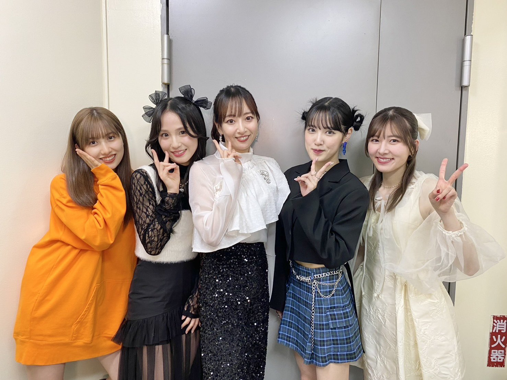

## 2024年5月17日 [#MSMW](https://twitter.com/search?q=%23MSMW){:target="_blank"} レポ！（5.17 新宿ReNY）～ごめんね✋～

**MSMW** 5月17日 新宿ReNY 公演に参加しました！

出演者は

* **小片リサ**
* **小関舞**
* **佐藤優樹** <small>(ゲスト)</small>
* **Bitter & Sweet** <small>(ゲスト)</small>

です！

今回のMSMWはあらゆる意味で久しぶりでした！

* りさまるは4月6～7日の青森・郡山MSMWぶり
* 舞ちゃんは3月24日のめぐろMSMWぶり（ライブハウスという意味では3月23日の清水MSMWぶり）
* まーちゃんは3月23日の清水MSMWぶり（めぐろMSMWはSIOOMのみ参加）
* ビタスイは今年初！ 昨年11月12日の奈良MSMWぶり

というのもあって、ワクワクなのです

### 目次 {#目次}

* [1曲目：小片リサ・小関舞・佐藤優樹・Bitter & Sweet「ラヴ＆ピィ〜ス！HEROがやってきたっ!」～MC(1)](#song1)
* [2曲目：小関舞「涙のTomorrow」](#song2)
* [3曲目：小片リサ「ムーンナイト・シークレット」](#song3)
* [4曲目：小片リサ・小関舞「青春まんまんなか!」](#song4)
* [5曲目：小片リサ・田﨑あさひ「原色GAL 派手に行くべ!」](#song5)
* [MC(2)～小片リサ・Bitter & Sweet～](#MC2)
* [6曲目：小関舞「Yes!晴れ予報」](#song6)
* [7曲目：小片リサ「映画の趣味が合うだけ」](#song7)
* [8曲目：小関舞・長谷川萌美「奇跡の香りダンス。」](#song8)
* [9曲目：小関舞・小片リサ・長谷川萌美「シャイニング愛しき貴方」](#song9)
* [MC(3)～小関舞・小片リサ・長谷川萌美～](#MC3)
* [10曲目：佐藤優樹「明日を作るのは君」](#song10)
* [11曲目：Bitter & Sweet「月蝕」](#song11)
* [12曲目：小関舞・Bitter & Sweet「Dream Last train」](#song12)
* [13曲目：Bitter & Sweet「インストール」](#song13)
* [14曲目：小関舞・小片リサ「宇宙でLa Ta Ta」](#song14)
* [15曲目：小関舞・小片リサ・田﨑あさひ「初恋サイダー」](#song15)
* [MC(ラスト)](#MC4)
* [ラスト：小片リサ・小関舞・佐藤優樹・Bitter & Sweet「今夜だけ浮かれたかった」](#song17)

[<i class="fa-solid fa-square-caret-up"></i> 目次](#目次)

### 1曲目：小片リサ・小関舞・佐藤優樹・Bitter & Sweet「ラヴ＆ピィ〜ス！HEROがやってきたっ!」～MC(1) {#song1}

きました！ 超わちゃわちゃ曲です！

めぐろMSMWではラスト曲でしたが今回は初手という不意打ちです！ しかも、めぐろではまーちゃんとビタスイさんはいませんでしたから、新しいわちゃわちゃが見られるのです！

個人的にはですね、、舞ちゃんとまーちゃんが固まってたんですけども、そこが楽しそうにわちゃわちゃしていたのが、もう嬉しくて嬉しくて…

> 大好きよ 超大好きよ

🥰

[<i class="fa-solid fa-square-caret-up"></i> 目次](#目次)

### 2曲目：小関舞「涙のTomorrow」 {#song2}

ついに！ MSMWで舞ちゃんのソロ曲！

思えばこのちょうど3か月前の2月17日ですよ。この日に

* [<i class="fa-lg fa-brands fa-youtube"></i> 小関舞 ソロデビューシングル発売決定！](https://www.youtube.com/watch?v=Zc7-o-E6_7E&t=10m44s){:target="_blank"}

これです。ここからMVが公開されて、リリイベが始まって、ビジュアルが公開されて、アディショナルが初披露になって、発売日になって…

MSMWでは、とりわけ佳林ちゃんとりさまるがリリース時期になると新曲を披露するのがお馴染みですが、そこに舞ちゃんが加わったわけですよ、、

えもし

[<i class="fa-solid fa-square-caret-up"></i> 目次](#目次)

### 3曲目：小片リサ「ムーンナイト・シークレット」 {#song3}

すっかりムンナイもお馴染みになってまいりました。

ムンナイ × 新宿ReNY がすごく映えてましたわ。新宿ReNYってなんでしょうミラーボールと照明の雰囲気がすごく都会のネオン街！って感じが合って、よいんですけども、ムンナイがぴったりなんすよね。

[<i class="fa-solid fa-square-caret-up"></i> 目次](#目次)

### 4曲目：小片リサ・小関舞「青春まんまんなか!」 {#song4}

**<big>これ！</big>**

驚きました！ MSMWでつばき曲はたくさん披露されてきましたが**青春まんまんなか!**

めちゃめちゃテクノ（しかも昭和の？笑）でつばきのオリメン6人が研修生時代の面影を残したまま歌っている記憶がすごくあって、、それを2024年にりさまる×舞ちゃんで！

せっかくなので映像を見ましょうよ、、、

* [<i class="fa-lg fa-brands fa-youtube"></i> つばきファクトリー「青春まんまんなか！」(LIVE Ver.)](https://www.youtube.com/watch?v=jM3gyGYdCKg){:target="_blank"}

2015年の映像ですかね？ 幼い！ テクノ的な曲大好きなので個人的にはキタ！ってなりました👍

[<i class="fa-solid fa-square-caret-up"></i> 目次](#目次)
### 5曲目：小片リサ・田﨑あさひ「原色GAL 派手に行くべ!」 {#song5}

面白い！ りさまる×あさひちゃんというと **éclatant** などで一緒に歌うことは多いわけですけど、こういうかなりアップテンポでロックな曲はめずらしい！

ここが **MSMW** の面白いところですよね～

めちゃめちゃ盛り上がりました！ あさひちゃんが激しく踊っているのも楽しい気持ちになりました

[<i class="fa-solid fa-square-caret-up"></i> 目次](#目次)

### MC(2)～小片リサ・Bitter & Sweet～ {#MC2}

**原色GAL**の話をしてましたね

前回？のビタスイさんが出演したMSMWの楽屋でりさまると歌いたい曲…という話になったとき**原色GAL**があがったとか！

って、あさひちゃんが話してたんですけど、りさまる全然憶えていない笑

そして、**青春まんまんなか!**の話も！

りさまるによれば、MSMWでは出演者のグループの曲は入れようというのがあるらしく、つばき曲を舞ちゃんに何が良い？って聞いたところ

* 青春まんまんなか!
* 独り占め

だったらしいです！ 渋い！ どちらもインディーズ時代の楽曲です！

カントリーとつばきは結成も同時期でしたし、初期は帯同もしていたのでそのイメージがあるのかもしれませんね🥰

[<i class="fa-solid fa-square-caret-up"></i> 目次](#目次)
### 6曲目：小関舞「Yes!晴れ予報」 {#song6}

舞ちゃんソロ曲2曲目！

この日はリード曲の2曲を披露というセトリでしたね

リリイベのときの客層とも違って、りさまる、まーちゃん、ビタスイさんそれぞれのファンの方たちが集まっているので、初めて聴いた！って方も多かったと思います🥰

どんどん広がるといいな～ で、いつかたとえばM-lineのメンバーと一緒に歌ったりとかできるといいですよね～

[<i class="fa-solid fa-square-caret-up"></i> 目次](#目次)

### 7曲目：小片リサ「映画の趣味が合うだけ」 {#song7}

りさまるソロ2曲目です！

なんというかソロ曲ゾーンで舞ちゃん・りさまると続くのが改めていいですよね、、、

**映画の趣味が合うだけ** もきっと新アルバム **montage** に収録されると思う？ので改めて披露する数が増えてる感じがそこはかとなくします

[<i class="fa-solid fa-square-caret-up"></i> 目次](#目次)

### 8曲目：小関舞・長谷川萌美「奇跡の香りダンス。」 {#song8}

こちらも意外でした！ **原色GAL** もそうだったのですけど、原色GALは舞ちゃん×りさまるのイメージがあって、**奇跡の香りダンス。**はまーちゃんのイメージがあったんですよね

それがまるでシャッフルされたようなところがこの日の**MSMW**にはあって！

まーちゃんの場合はもうちょっとロック？な感じがあったんですけど、舞ちゃんと萌美さんの場合は優しい感じというのでしょうか、、陽気に包まれてる感じというか、、これもいいんですよね～

最後ふたりが向き合って息を合わせて

> センキュー

っていうところがなんとも微笑ましく素敵でした

[<i class="fa-solid fa-square-caret-up"></i> 目次](#目次)

### 9曲目：小関舞・小片リサ・長谷川萌美「シャイニング愛しき貴方」 {#song9}

よい… 

カントリー曲なのでもちろん舞ちゃんにとても合うのですが、りさまるや萌美さんが歌うのもとても雰囲気が合っていて素敵な時間だったなあ

[<i class="fa-solid fa-square-caret-up"></i> 目次](#目次)

### MC(3)～小関舞・小片リサ・長谷川萌美～ {#MC3}

先ほどのMCで舞ちゃんがいないのに舞ちゃんの話をしていたりさまるに

> 舞ちゃん「もう！ 私がいないところで私の話しないでよ！」   りさまる「✋（ごめんねポーズ）」

かわ ミニミニ最近ほんとますますなのよ

りさまるの中でどうやらごめんねポーズが流行ってるらしく笑

> りさまる「汎用性高い笑」  舞ちゃん「カントリーのメンバー普段しないけどね笑」   りさまる「やってよ」   舞ちゃん「謝ることーーーない」

笑

ここでなんと萌美さんが！

> 萌美さん「私も何か謝ることないかなー！って考えたんだけど…思いつかなくてーーごめんね✋」

笑笑笑笑笑笑笑 さすがです👍

こういう話もしてました。**シャイニング 愛しき貴方** 意外にも候補として

* **愛おしくってごめんね**

があったそうなんですね。というのも、実は仮歌を萌美さんが入れているんです！ ちなみにコーラスも萌美さんです！

今からおよそ9年前にですよ、萌美さんが仮歌を入れて、それを舞ちゃんたちが聴いてあのデビューシングルがあるわけです。それが9年経過した2024年にこうやって同じステージに立っているのですからエモいですわ。いつか歌ってほしい！

そして、こんな尊いやりとりも…

> 舞ちゃん「MCノープランなのがM-lineの醍醐味だよね！」   りさまる「MC何も考えてなくて…？」   舞ちゃん「MC何も考えなくてごめんなさいね✋」   りさまる「それ怒られるやつじゃない笑」   舞ちゃん「あ！！MC考えてないとか絶対怒られる！みんな書かないでね！！（小指を高く指す舞ちゃん🍑）」

笑笑笑笑 トークのカントリーなのよ笑

[<i class="fa-solid fa-square-caret-up"></i> 目次](#目次)

### 10曲目：佐藤優樹「明日を作るのは君」 {#song10}

これもおお…ってなりました！ まーちゃんソロで**明日を作るのは君**！

まーちゃんのモーニング娘。を聴くことをできるという恩恵にあずかりました…

> I Love you I Love you I love you But you are you 明日を作るのは君 

よい… ゆっくりと丁寧に歌声を届けるまーちゃんの自然体な感じ… あぁ素敵だったなぁ

[<i class="fa-solid fa-square-caret-up"></i> 目次](#目次)

### 11曲目：Bitter & Sweet「月蝕」 {#song11}

**明日を作るのは君** に続いてしっとりが続きます。ビタスイさんの **月蝕**

一気にビタスイさんの世界に包まれました。美しく静かで感情がずっしりと乗っていて…

> どこから人はやって来たのでしょう どこへと人は進みゆくのでしょう

なんでしょう、、染み込みますよね、、

[<i class="fa-solid fa-square-caret-up"></i> 目次](#目次)

### 12曲目：小関舞・Bitter & Sweet「Dream Last train」 {#song12}

トリプレットの楽曲です！

舞ちゃんはなんと9年前に開催されたカントリー初期のバスツアー「SATOYAMA体験ツアー第3弾！ カントリー・ガールズと過ごす1泊2日バスツアー in 足利」でも披露しています！（サンキュー ®） 

そのときはももち先輩、まなかん、舞ちゃんと披露してます👍

Bitter & Sweet さんもSATOYAMAとの関係は深いと思いますのできっとこういう選曲になったのではないかなと！（ビタスイさんももしかして披露したことある？）

MVあります👍

* [<i class="fa-lg fa-brands fa-youtube"></i> Dream Last Train (MV) / トリプレット](https://www.youtube.com/watch?v=tIsZvlVRZIk&t=1m43s){:target="_blank"}

いいですよね～ ギターでさわやかで！ 舞ちゃんとビタスイさんにもぴったりです

[<i class="fa-solid fa-square-caret-up"></i> 目次](#目次)

### 13曲目：Bitter & Sweet「インストール」 {#song13}

さあ！ ビタスイさんが続きます！ ここで**インストール**！

M-line Music でも話題になってましたね！

* [<i class="fa-lg fa-brands fa-youtube"></i> 【M-line Music#121】スタジオトーク③「インストール」について](https://www.youtube.com/watch?v=faeEy5maNVw&t=10m21s){:target="_blank"}

ライブハウスで**インストール**聴けたの嬉しい！ MSMWでも披露されていたとは思うんですけど、声出しありでってのはきっと初めてなはず！（？）

ぶっぱなしてました👍

[<i class="fa-solid fa-square-caret-up"></i> 目次](#目次)

### 14曲目：小関舞・小片リサ「宇宙でLa Ta Ta」 {#song14}

> ドキドキしてんだな クラクラきてんだな ダラダラしてね **イチャイチャしてね**

はいー ミニミニ**イチャイチャ**曲です

この曲のステージングではですね、、2人は左右に分かれずに固まって移動します。そして、**イチャイチャ**します

舞ちゃんがりさまるを指でツンツンしてました👉👉

😇

[<i class="fa-solid fa-square-caret-up"></i> 目次](#目次)
### 15曲目：小関舞・小片リサ・田﨑あさひ「初恋サイダー」 {#song15}

**初恋サイダー**！

**初恋サイダー**もMSMWでは何回か披露されているとは思うんですが、この組み合わせで歌うとは！

**インストール**、**宇宙でLa Ta Ta** と続いて盛り上がりが頂点に達しました！！

また、3人というのがいいですよね～ 今回あさひちゃんが**原色GAL**だったり結構盛り上がり曲をすごく跳ねながら歌ってるのを見て嬉しくなりました🥰

[<i class="fa-solid fa-square-caret-up"></i> 目次](#目次)

### MC(ラスト) {#MC4}

さあ、あっという間にラストです。ここでまーちゃんが現れたのですが笑

>まーちゃん「今日は舞ちゃんとか小片のファンの方だから緊張してー！とくにりんかいるときとか！すごい緊張する！」   りさまる「宮本さん笑 それ伝わっちゃいますよ笑 **一生**SNS見てますから笑」   まーちゃん「**一生**笑」   りさまる「今日いない人の話しがち笑」

笑笑笑笑笑笑

まーちゃんいつもMSMWに登場したときに全然知らないよね？お邪魔します！って感じなんですけど、みんなまーちゃん大好きですよ！！！！（届け）

[<i class="fa-solid fa-square-caret-up"></i> 目次](#目次)

### ラスト：小片リサ・小関舞・佐藤優樹・Bitter & Sweet「今夜だけ浮かれたかった」 {#song17}

ラストは**今夜だけ浮かれたかった**！

最後の最後にバカ暑い曲！！！！ 鬼盛り上がりました！！！！

渋いのから定番曲まで全部取り揃えられてるのがMSMWなのよ！

しかも、ビタスイさんいるんでハモりがあるんですよ！ ビタスイさんいるといつも聴いてるハロプロ曲がパワーアップするのです

> 泣きたいわあああああああぁ

ここ舞ちゃん👍

みんなも最後って分かってるから客席ももう今あるすべての体力をここで使いきっちゃおうっていう感じで盛り上がるんで、最後の

> 何でもないよ さようなら

ここでの出し切った感がすごいのよ

[<i class="fa-solid fa-square-caret-up"></i> 目次](#目次)

### ＊

楽しかった～ この組み合わせもめずらしいし少なくともしばらくはないと思うので、こういう貴重な回がたくさんあってMSMWすごすぎるんよ

[<i class="fa-solid fa-square-caret-up"></i> 目次](#目次)
