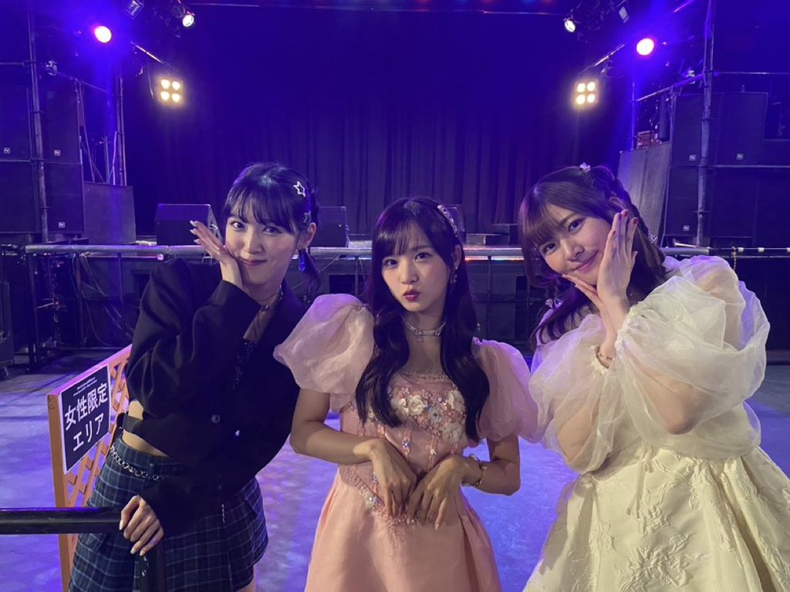

## 2024年5月18日 [#MSMW](https://twitter.com/search?q=%23MSMW){:target="_blank"} レポ！（5.18 岐阜 Club G）

**MSMW** 5月18日 岐阜 Club G 公演に参加しました！

出演者は

* **小片リサ**
* **稲場愛香**
* **小関舞**

です！

### 目次 {#目次}

* [1曲目：小片リサ・稲場愛香・小関舞「CHOICE & CHANCE」](#M1)
* [2曲目：小片リサ・稲場愛香・小関舞「抱きしめられてみたい」～MC](#M2)
* [3曲目：小関舞「涙のTomorrow」（昼）／「メインキャスト」（夜）](#M3)
* [4曲目：小片リサ「ムーンナイト・シークレット」](#M4)
* [5曲目：稲場愛香「LOVE is BLIND」（昼）／「Pink Temperature」（夜）](#M5)
* [6曲目：小片リサ・稲場愛香・小関舞「Midnight Temptation」～MC](#M6)
* [7曲目：小片リサ・稲場愛香・小関舞「VERY BEAUTY」](#M7)
* [8曲目：小片リサ・小関舞「愛が止まらない～Turn it Into Love～」](#M8)
* [9曲目：小片リサ・稲場愛香「銀色のテレパシー」](#M9)
* [10曲目：小関舞「お別れのKISS」（昼）／小関舞「Yes!晴れ予報」（夜）](#M10)
* [11曲目：小片リサ・稲場愛香・小関舞「ハルウララ」～MC](#M11)
* [12曲目：稲場愛香「圧倒的LØVE」／「チャプターⅡ」](#M12)
* [13曲目：小片リサ「Kitty」（昼）／「じらして愛して」（夜）](#M13)
* [14曲目：稲場愛香・小関舞「ブギウギLOVE」](#M14)
* [15曲目：小片リサ・稲場愛香・小関舞「恋人は心の応援団」](#M15)
* [MC](#MC)
* [16曲目：小片リサ・稲場愛香・小関舞「気まぐれプリンセス」（昼）／「わがまま気のまま愛のジョーク」（夜）](#M16)
* [17曲目：小片リサ・稲場愛香・小関舞「46億年LOVE」](#M17)

[<i class="fa-solid fa-square-caret-up"></i> 目次](#目次)

### 同じメンバー同じセトリ！

今回は

* 2月17日（土） 新宿ReNY
* 2月18日（日） 柏PALOOZA

に行われたMSMWとメンバーそしてセトリが同じです。

しかし、違うのです。

* [<i class="fa-lg fa-brands fa-youtube"></i> 稲場愛香 ソロデビューシングル発売決定！（2024年2月4日 横浜Bay Hall）](https://www.youtube.com/watch?v=IoF3qYSecSM&t=11m1s){:target="_blank"}
* [<i class="fa-lg fa-brands fa-youtube"></i> 小関舞 ソロデビューシングル発売決定！（2024年2月17日 新宿ReNY）](https://www.youtube.com/watch?v=Zc7-o-E6_7E&t=10m44s){:target="_blank"}

この3か月で状況はガラリと変わりました。

なんといっても**まなまい**のソロデビューです。3か月前はソロデビューが発表されたばかり、舞ちゃんについては当日発表です。まだ、曲名も発表されていません。しかし、3か月が経過して、私たちは**リリースイベント**やリリースされたCDでもう繰り返し聞いているのです。

しかし！ まだ、**MSMW** では披露されたことがありませんでした。

2月17日、18日の**MSMW**を思い出しましょう。

* [#MSMW レポ！（2.17 新宿ReNY / 2.18 柏PALOOZA）～ Mi RooM が暴れてました👍 ～](./20240221.md)

特にソロです。

* [3曲目：小関舞「ミステリーナイト!」](./20240221.md#song3)
* [4曲目：小片リサ「Happyを止めないで」](./20240221.md#song4)
* [5曲目：稲場愛香「記憶の迷路」](./20240221.md#song5)
* [10曲目：小関舞「世の中薔薇色」](./20240221.md#song10)
  * [<i class="fa-lg fa-brands fa-youtube"></i> M-line Music](https://www.youtube.com/watch?v=CmJt6wKKEYA&t=16m52s){:target="_blank"}
* [12曲目：稲場愛香「アレコレしたい」](./20240221.md#song12)
* [13曲目：小片リサ「虹を超える」](./20240221.md#song13)
  * [<i class="fa-lg fa-brands fa-youtube"></i> M-line Music](https://www.youtube.com/watch?v=T_GZW_myPSM&t=16m1s){:target="_blank"}

それぞれ2曲ずつ披露しています。**りさまる**はオリジナル曲の「Happyを止めないで」「虹を超える」ですが、**まなまい**はカバー曲です。

MSMWでは**まるかりん**や**ビタスイ**さんがソロでオリジナル曲を披露するというのが定番でした。他メンバーはカバーです。

それがですよ、、ついに**まなまい**が！！！

えもし

[<i class="fa-solid fa-square-caret-up"></i> 目次](#目次)

### 3曲目：小関舞「涙のTomorrow」（昼）／「メインキャスト」（夜） {#M3}

執筆中（メインキャスト大人気）

[<i class="fa-solid fa-square-caret-up"></i> 目次](#目次)

### 5曲目：稲場愛香「LOVE is BLIND」（昼）／「Pink Temperature」（夜） {#M5}

執筆中（LOVE is BLIND の歌よ）

[<i class="fa-solid fa-square-caret-up"></i> 目次](#目次)

### 8曲目：小片リサ・小関舞「愛が止まらない～Turn it Into Love～」 {#M8}

執筆中（ウィンク）

[<i class="fa-solid fa-square-caret-up"></i> 目次](#目次)

### 10曲目：小関舞「お別れのKISS」（昼）／小関舞「Yes!晴れ予報」（夜） {#M10}

執筆中（お別れのKISS楽しい）

[<i class="fa-solid fa-square-caret-up"></i> 目次](#目次)

### 11曲目：小片リサ・稲場愛香・小関舞「ハルウララ」～MC {#M11}

執筆中（また聴けて嬉しい）

[<i class="fa-solid fa-square-caret-up"></i> 目次](#目次)

### 12曲目：稲場愛香「圧倒的LØVE」／「チャプターⅡ」 {#M12}

執筆中（チャプターⅡ感動する）

[<i class="fa-solid fa-square-caret-up"></i> 目次](#目次)

### 13曲目：小片リサ「Kitty」（昼）／「じらして愛して」（夜） {#M13}

執筆中（じら愛！）

[<i class="fa-solid fa-square-caret-up"></i> 目次](#目次)
