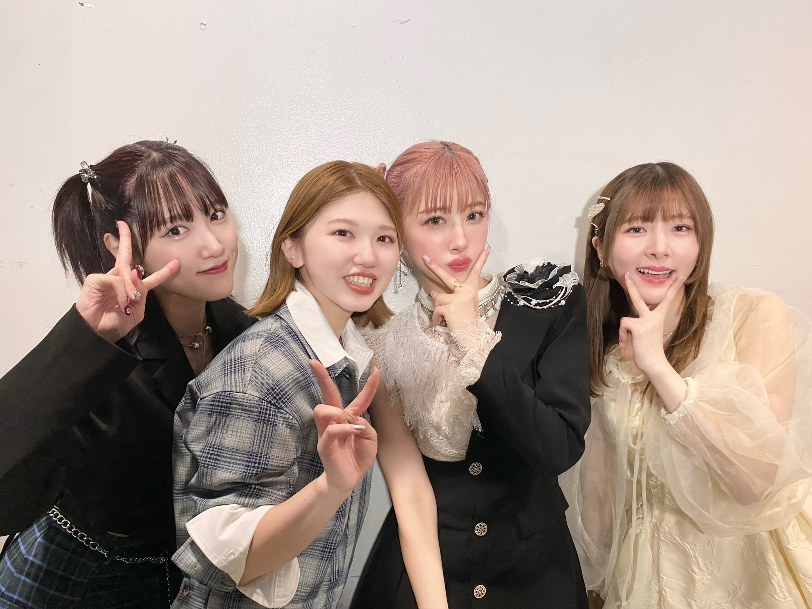

## 2024年5月26日 [#MSMW](https://twitter.com/search?q=%23MSMW){:target="_blank"} レポ！（5.26 横浜 Bay Hall）

**MSMW** 5月26日 横浜 Bay Hall 公演に参加しました！

出演者は

* **竹内朱莉**
* **小片リサ**
* **小関舞**
* **夏焼雅** <small>(ゲスト)</small>

です！

### 目次 {#目次}

* [1曲目：竹内朱莉・小関舞・小片リサ・夏焼雅「初恋サンライズ」](#M1)
* [MC（全員）](#MC1)
* [2曲目：夏焼雅「恋の呪縛」](#M2)
* [3曲目：竹内朱莉「ドッキドキ! LOVEメール」](#M3)
* [4曲目：竹内朱莉・小片リサ「「良い奴」」](#M4)
* [5曲目：小片リサ「紫陽花アイ愛物語」](#M5)
* [6曲目：小関舞「メインキャスト」](#M6)
* [MC（小関舞・小片リサ）](#MC2)
* [7曲目：小片リサ「どっち」](#M7)
* [8曲目：竹内朱莉・小関舞「ミステリーナイト」](#M8)
* [9曲目：竹内朱莉「恋ING」](#M9)
* [10曲目：小関舞「Yes! 晴れ予報」](#M10)
* [11曲目：竹内朱莉・小関舞・小片リサ・夏焼雅「パン屋さんのアルバイト」](#M11)
* [MC（竹内朱莉・夏焼雅）](#MC3)
* [12曲目：夏焼雅・竹内朱莉「横浜蜃気楼」](#M12)
* [13曲目：夏焼雅・小関舞・小片リサ「恋愛♡ライダー」](#M13)
* [14曲目：小関舞・竹内朱莉・小片リサ「恋人は心の応援団」](#M14)
* [15曲目：小関舞・小片リサ「宇宙でLa Ta Ta」](#M15)
* [16曲目：竹内朱莉・小関舞・小片リサ・夏焼雅「バカにしないで」](#M16)
* [MC（全員）](#MC4)
* [17曲目：竹内朱莉・小関舞・小片リサ・夏焼雅「一丁目ロック」](#M17)

[<i class="fa-solid fa-square-caret-up"></i> 目次](#目次)

執筆中