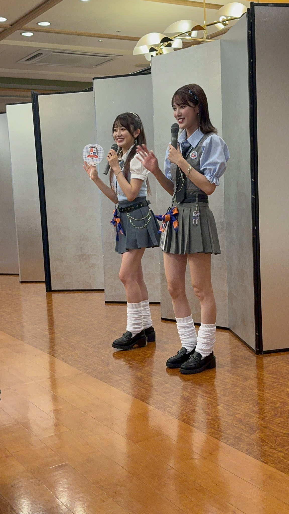

## 2024年8月3日～4日 森戸知沙希・小関舞 おぜちぃバスツアー ～ 遅れてやってきた修学旅行in群馬 ～ 1日目！

**おぜちぃバスツアー** に参加しました！

今回の記事は**1日目**です！

### 日程 {#日程}

* 1日目（8月5日）
  * [出発（東京駅）～ 到着（磯部温泉 舌切雀のお宿）](#section1)
  * [おぜちぃと記念撮影会](#section3)
  * [チェックイン～ルンルンルームコール](#section3)
  * [夕食～おぜちぃと夜のおしゃべり会](#section4)
  * [夏の思い出作り（手持ち花火）](#section5)
  * [自由時間](#section6)
* 2日目（8月6日）
  * 朝食
  * おぜちぃ！許してにゃん体操
  * チェックアウト
  * 出発
  * 到着（伊香保グリーン牧場）
  * おぜちぃと体験学習（バター作り体験）
  * 昼食（BBQ）
  * 出発
  * 到着（榛名文化会館）
  * おぜちぃと音楽の時間
  * 出発
  * 到着（東京駅）

### 出発～到着まで {#section1}

ヲタクたちが東京駅に集まります。**修学旅行**ということで制服コーデな方がいたり、オリジナルで制作した衣装を着ている方もいました。なにより全員テンションが高い笑

私もテンション上がってました！ いままで**バスツアー**ってDVDで観たり、SNSで追いかけたり、いいな、楽しそうだな、いつか行ってみたいな、って夢に思うものだったのです。**おぜちぃ**がその夢叶えてくれました👍 冷静でいられるはずがありません。

私は**1号車**でした。みんな乗車するやいなや**MFT**（マイクロファイバータオル）を養生テープで窓に貼り付けてバスを装飾！

私は一緒に申し込んだ

* バンブーさん [<i class="fa-lg fa-brands fa-square-x-twitter"></i>](https://x.com/country_bamboo){:target="_blank"}
* こばたくさん [<i class="fa-lg fa-brands fa-square-x-twitter"></i>](https://x.com/Kobataku_0912){:target="_blank"}
* フルーツ味さん [<i class="fa-lg fa-brands fa-square-x-twitter"></i>](https://x.com/fruitsaji){:target="_blank"}

と一列に並んで、車内でもわいわい盛り上がりました。お知り合いのヲタたちもたくさん同じ号車にいたりして、一体感ありましたね笑 添乗員さんのお話にもしっかりヲタク特有のリアクションで**はーい**って返事してたり、👏👏👏👏 って拍手したり。さすがです👍

バス車内VTRも面白かった～笑

2024年に5年ぶりの復活

[<i class="fa-lg fa-brands fa-youtube"></i> **<big>CGN ～Country Girls News～</big>**](https://www.youtube.com/watch?v=op3Hoeuqvxo){:target="_blank"}

笑

VTR冒頭にアナウンサー口調で

> C・G・N

って言うあの感じ笑

今回の修学旅行先が群馬県ということで、こんにゃくにどういうトッピングが合うかだったり、だるま落とし対決をしたり。

だるま落とし対決に敗退したちぃちゃんが罰ゲームで

> あ！見つかっちゃった！

って、だるま落としからひょっこりスタイルで可愛く台詞を言ってました😊 このときの

> まいちゃん「可愛い～」  ちぃちゃん「帰ります」

この掛け合いね笑 ずっとちぃちゃんがゲラゲラ🤣笑ってて、まいちゃんが鋭く返したりしてるのが、やっぱり **おぜちぃ** 面白いな笑 ってずっと見てられて、あっという間に温泉宿

* 磯部温泉 舌切雀のお宿

に到着です。

[<i class="fa-solid fa-square-caret-up"></i> 日程](#日程)

### おぜちぃと記念撮影会 {#section2}

> おぜちぃ「きんこんかんこーん きんこんかんこーん🔔」

制服姿のおぜちぃがチャイムとともに登場しました！！！ [<i class="fa-lg fa-brands fa-square-x-twitter"></i>](https://x.com/moritochi_staff/status/1819651251644387476){:target="_blank"}

目が眩みました。可愛すぎませんか？

おぜちぃによれば、私たちは同級生であり同い年です。学生のころに戻って修学旅行を楽しみましょうというわけです👍 同級生にこんな可愛い2人がいたら学級崩壊なのよ

というわけで、3ショットを撮影しました！

磯部温泉は温泉マーク♨発祥の地ということで、温泉マークポーズです！ おぜちぃに挟まれてますやん。可愛い。

撮影後はグッズを買って、コレ写を開封して、みんなで一枚一枚可愛い！！なんて言いながらいよいよチェックインです。

[<i class="fa-solid fa-square-caret-up"></i> 日程](#日程)

### チェックイン～ルンルンルームコール {#section3}

私たちは**456号室**（白鷺）でした！ お部屋も広い！

みんなで部屋を装飾しつつも、緊張感が漂っています。

<big>**ゴゴゴゴゴゴゴ**</big>

そうです。なんと、おぜちぃから電話が掛かってくるというのです。とはいっても、いつ掛かってくるかは分かりません。私たちはお茶を飲みながら、お煎餅をポリポリ食べて、あ、美味しい～なんて言ってたら

<big>📞「🔔🔔🔔🔔🔔🔔🔔🔔🔔🔔🔔🔔」</big>

このときの私たちは驚いた猫のように飛び跳ねて、わわわわわ！となりました！！

近かったこばたくさんが受話器を取り、通話開始！！ 呼び出し元は

> こばたくさん「まいちゃん！？」

まいちゃんでした！！！ この間も私たち3人はぴょんぴょん飛び跳ねてます。「まいちゃーん！」なんて言ったりして。

かろうじて落ち着きを取り戻した私たちは、一人ずつ電話変わりましてお話ししました。結構普通に通話してて、私は「いまお部屋で大騒ぎでした」「楽しそうだね笑」みたいな会話をしました👍

[<i class="fa-solid fa-square-caret-up"></i> 日程](#日程)

### 夕食～おぜちぃと夜のおしゃべり会 {#section4}

夕食のお時間です！ 夕食会場に並んで入るのですけど、入り口近くで悲鳴が聞こえるんですね。え？え？と思っていたら、[<i class="fa-lg fa-brands fa-square-x-twitter"></i>](https://x.com/ozeki_mai/status/1819675131645730857){:target="_blank"}

**浴衣姿**のおぜちぃ！！！

ちぃちゃんの浴衣には金魚が泳いでいます😊 二人ともお髪を束ねていて可愛い。こんばんは～なんて言ったりして。

> いただきます🙏

というおぜちぃの号令で私たちも

> いただきます🙏

って笑 さすが修学旅行です！ ずーっと学校要素が散りばめられてるのも楽しかったな～

夕食がこちら！！！ 贅沢！！！ 鍋の蓋が雀（**舌切雀のお宿**なので雀のモチーフもあちこちにありました）なのも可愛い🥰

煮魚とか上州麦豚とか！ 釜めしもおこげが付いてたりして美味しかったな～

そして、食事も食べ終わったころにおぜちぃが再び登場！ そして、全員何かしらが当たる抽選というのが始まりました。席によってはおぜちぃとジェンガをしたり、ジャンケンをしたり、ミニコントをしたり笑

[<i class="fa-solid fa-square-caret-up"></i> 日程](#日程)

### 夏の思い出作り（手持ち花火） {#section5}

夕食会場を出て、私たちはホテルのロビー前に集合しました。夕食が始まった頃はまだ外は明るかったのですが、すっかり暗くなっています。涼しくはなったけど、汗も流せてない肌のあの感覚。ひとつひとつの細かい記憶がまだ残っています。このあと、

<big>**手持ち花火**</big>

です。

今回のバスツアーは4号車まであって、たしか、各号車に44名ずつ参加者が乗車していました。各参加には前席から番号が振られていて私は1号車の39番でした。ロビー前に1～15番、16～30番、31番～45番とプラカードを最前のひとが持って並びます。そして、少し離れた駐車場へと移動します。

暗い中、よく見ると、スチール製のバケツが3、4個置かれていて、そして、小さい缶の中に炎がありました。そして、おぜちぃが浴衣姿で待っているのです。各15名のブロックごとに手持ち花火が配られます。手持ち花火がたくさん入った箱を抱えたスタッフさんが、どうぞ、と箱を差し出して、私たちは一本ずつ抜き取ります。

久しぶりの手持ち花火でした。かたい芯のある手持ち花火を指で持ったあの感覚、先に花火が始まっているところからは花火の色に照らされた煙が立ち込めていて、火薬のにおいもただよっていて、歓声が聞こえてきました。

私たちの番です。おぜちぃを中心に半円を描くように私たちも手持ち花火を持って並びます。ちぃちゃんが「準備はいいですか？ では、点火～！」と言います。私たちも「点火～」と答えて、缶の中の炎に手持ち花火を差し出しました。ひとりずつ手持ち花火から火花が綺麗に散らされる音が聴こえます。

とても綺麗でした。ひとりひとり違う形の花火で、真っ直ぐ伸びるものもあれば、球体をつくるような花火もあります。

ちぃちゃんが「One Summer Night みたい」と言いました。全員が思い出していたと思います。というのも、行きのバスで私たちは車内VTRで

[<i class="fa-lg fa-brands fa-youtube"></i> **<big>カントリー・ガールズ「One Summer Night ～真夏の決心～」MV </big>**](https://www.youtube.com/watch?v=GnYwKQA3_w4){:target="_blank"}

を見ていました。このMVでは夏休みの校庭でカントリーのメンバーが**手持ち花火**をするシーンがあります。

私たちは

> One Summer Night 今日初めて 柄にもなく塾をサボった

と歌ったりしました。このときの幸せな気持ちは言葉にならないです。

そして、ひとりひとり花火の火が消え始めます。少しずつ暗くなっていく光景はとても切なかったです。夏の夜の楽しさと寂しさが混ざり合うあの感覚を思い出しました。いよいよ最後の花火になると、みんなその花火に注目して、「あ～！」「消えないで～！」とカントリー特有のあの盛り上がり方笑

そして、しゅぅっと花火が消えて「ああぁ～」とみんなで言って、役目を終えた花火がたくさん入ったバケツにじゅっと音を立てながら入れました。そして、あっという間だったけど、何かあまりにも特別な時間を過ごした感覚が残ったまま私たちは部屋に戻ります。

細かいことですけど、私たちは**夜のおしゃべり会**でゲットしたペヤングを持っていたので、ちぃちゃんが「夜食ですか～？」「召し上がれ～」と言って、私たちも「いただきま～す」と返したり、最後も「おやすみなさ～い」と言ったり、なんというか、とっても心地よい空間だったな～と思います。

[<i class="fa-solid fa-square-caret-up"></i> 日程](#日程)

### 自由時間 {#section6}

部屋に戻ると布団が敷いてあって、テンションが高い私たちも再び盛り上がりました。そして、手持ち花火の思い出に浸りつつ、小さなスマホを囲んでMVを観てみたり、まさに、あのMVの夜の教室で4人でお話をしたように、ゆっくりと話をしました。あの時間も特別です。

私たちは**カントリー・ガールズ**ヲタク仲間で、最初はtwitter上でいいねを送り合うだけの関係でしたが、舞ちゃんが**M-line Club**に入ってから、現場でも会うようになって、仲良くなって、現場で公演が終わった後、放心状態の私たちはいま何が起きたかという事実を確かめ合い、その感動を分かち合い、楽しかった、良かった、可愛かった、好き、と盛り上がる。とても素敵な関係でした。

カントリー・ガールズのことだけじゃなく、次第に個人的に話もできるような関係になって、私生活ではバラバラだけどやっぱり同じものを好きになってるからこそ、理解し合える関係で、一生の宝物だなと思います。

そして、私たちも部屋に用意された浴衣に着替えちゃったりして！ 大浴場へGO！ たしか露天風呂でも4人で歌ってたと思います笑

浴場にも普段は青いのに裸になったヲタクたちがいたりして笑 不思議な空間でした笑

脱衣所で扇風機の前で飲んだ冷水美味しかったな～笑

部屋に戻って私たちはジュースを飲んだり、お菓子食べたり、お話ししたり、わいわい盛り上がって眠りました😌

[<i class="fa-solid fa-square-caret-up"></i> 日程](#日程)

### ＊

というわけで、**1日目** 終了です！！！ **2日目** も盛りだくさんです！！！ また次のブログで！👍