## 2024年8月3日～4日 森戸知沙希・小関舞 おぜちぃバスツアー ～ 遅れてやってきた修学旅行in群馬 ～ 2日目！

先日に引き続き **おぜちぃバスツアー** です。1日目は[こちら](./20240805.md)！

この記事は**2日目**です！

### 日程 {#日程}

* 1日目（8月5日）
  * 出発（東京駅）～ 到着（磯部温泉 舌切雀のお宿）
  * おぜちぃと記念撮影会
  * チェックイン～ルンルンルームコール
  * 夕食～おぜちぃと夜のおしゃべり会
  * 夏の思い出作り（手持ち花火）
  * 自由時間
* 2日目（8月6日）
  * [朝食～おぜちぃ！許してにゃん体操](#section1)
  * チェックアウト～出発～到着（伊香保グリーン牧場）
  * [おぜちぃと体験学習（バター作り体験）～自由時間](#section2)
  * [昼食（BBQ）](#section3)
  * 出発～到着（榛名文化会館）
  * [おぜちぃと音楽の時間](#section4)
  * [出発～到着（東京駅）](#section5)

### 朝食～おぜちぃ！許してにゃん体操 {#section1}

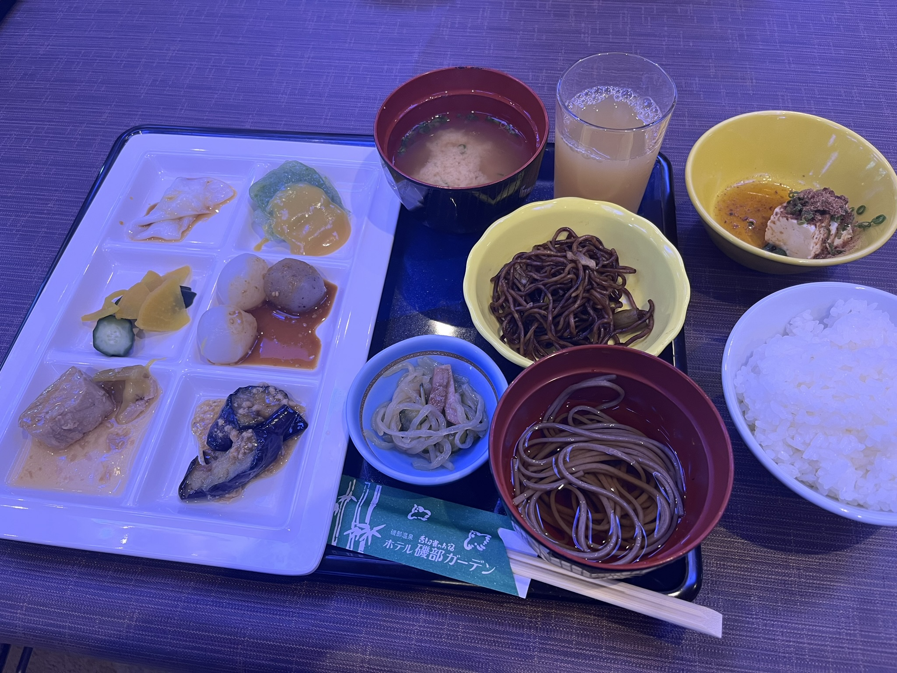

朝食はバイキングでした！ **CGN**（車内VTR）でも紹介されていましたが、**こんにゃく**が名産ということで、玉こんにゃく、刺身こんにゃく、湯葉こんにゃく、こんにゃく蕎麦など、こんにゃく尽くしです👍 ヘルシー！

普段は朝ごはんって食べないし、食べたとしてもこんなに食べないですけど、旅館の朝って食べれちゃうんですよね。

そして… 会場でもちらほら猫の手を上げたり下げたり… 間もなく始まります…

ホテルのロビー前に集合するヲタクたち。そして、**おぜちぃ** 登場！ [<i class="fa-lg fa-brands fa-square-x-twitter"></i>](https://x.com/moritochi_staff/status/1819884117745717715){:target="_blank"}

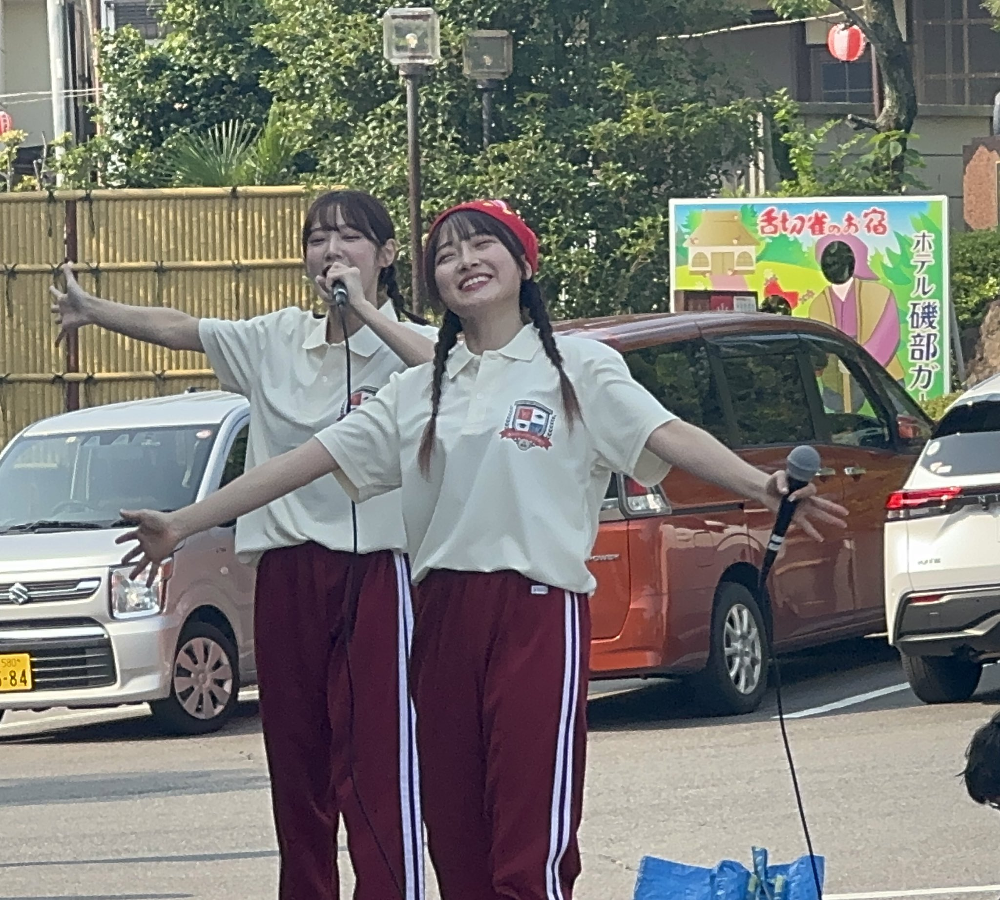

三つ編み！ ジャージ姿！ そしてポロシャツ！<small>（このイエローは特Aクラス用で、私たちのはネイビーブラックでした）</small>

朝からばっちり目が覚めます。そして…

> にゃん にゃ にゃんにゃんにゃーん！🐾

始まりました。**おぜちぃ！許してにゃん体操**。私たちも猫の手をして、一生懸命踊りました！！ これが結構難しい笑

> そこ言わんのんかい！

はヲタクたちで言いました笑

> まいちゃん「何でちぃだけ帽子かぶってるの？」   ちぃちゃん「逆になんでかぶってないの？」

笑 ちぃちゃんがだるまの帽子をかぶってます。可愛い。**CGN**内で行われただるま落とし対決で敗退した罰ゲームだったみたいです笑

[<i class="fa-solid fa-square-caret-up"></i> 日程](#日程)

### おぜちぃと体験学習（バター作り体験）～自由時間 {#section2}

体操で身体も温まってきたところで、ホテルをチェックアウトして課外学習会場へ出発です。

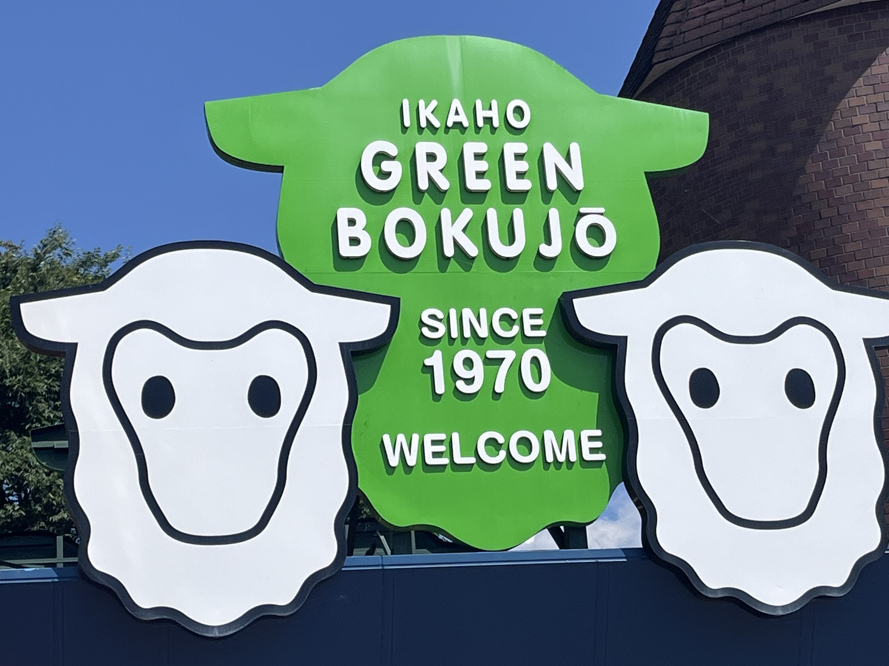

<big>**伊香保グリーン牧場**</big>

に来ました！ まずは**バター作り体験！**

各参加者の前に置かれたのはこちら

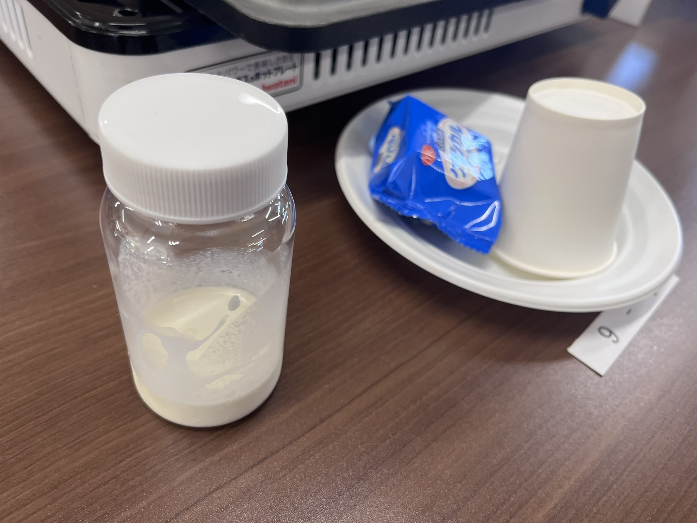

生クリーム？が入ったビンとクラッカーがありました。そして、現れたのが

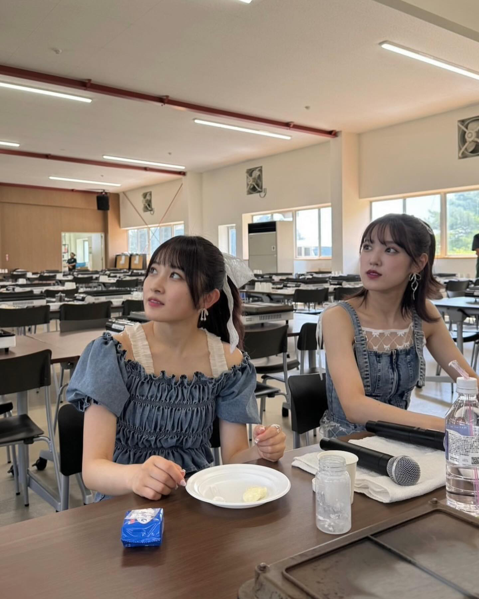

デニム衣装のおぜちぃ！！！ かわいいいいいいいいいいいいい！！！ 牧場にぴったりですし、カントリーにもぴったりです🥰

おぜちぃと一緒に私たちはビンをひたすらシェイク！

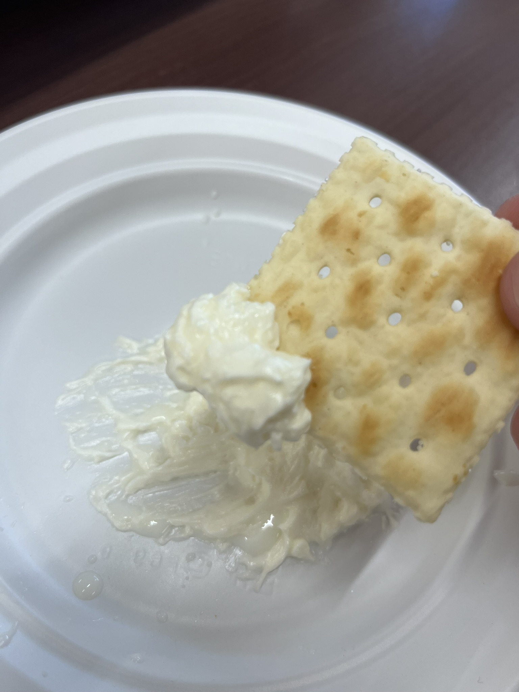

すごい！ もっと難しいと思ったんですけど簡単にできました！ クラッカーに付けて食べました。美味しかった～

その後は馬車にゆっさゆっさと運ばれるおぜちぃを見送ったり、あとは、牧場にいる動物さんたちに癒されておりました。

個人的にお気に入りなのがこちらです

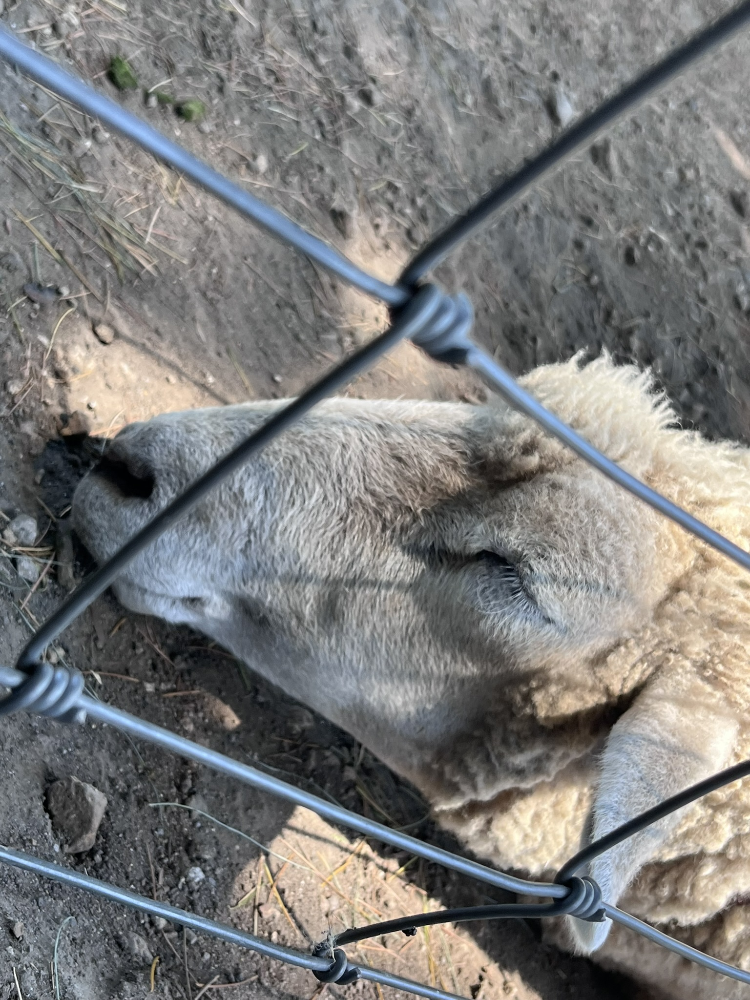

とても天気がよい日で！ 太陽もギラギラの日を私たちに差し込んでいましたので、暑い暑い！

そんななか日陰でのほほんとしているこの姿に、わかるよ、、暑いよな、、と笑

<blockquote class="twitter-tweet" data-media-max-width="560">
<a href="https://twitter.com/hashtag/%E3%81%8A%E3%81%9C%E3%81%A1%E3%81%83%E4%BF%AE%E5%AD%A6%E6%97%85%E8%A1%8C?src=hash&amp;ref_src=twsrc%5Etfw">#おぜちぃ修学旅行</a>  伊香保グリーン牧場での課外学習🐴🌳 夏×牧場は「ためらいサマータイム』でしか🌻<a href="https://twitter.com/hashtag/%E6%A3%AE%E6%88%B8%E7%9F%A5%E6%B2%99%E5%B8%8C?src=hash&amp;ref_src=twsrc%5Etfw">#森戸知沙希</a> <a href="https://twitter.com/hashtag/%E5%B0%8F%E9%96%A2%E8%88%9E?src=hash&amp;ref_src=twsrc%5Etfw">#小関舞</a> <a href="https://twitter.com/hashtag/%E3%81%8A%E3%81%9C%E3%81%A1%E3%81%83?src=hash&amp;ref_src=twsrc%5Etfw">#おぜちぃ</a> <a href="https://t.co/5ivyb1hdss">pic.twitter.com/5ivyb1hdss</a>
&mdash; 森戸知沙希STAFF【公式】 (@moritochi_staff) <a href="https://twitter.com/moritochi_staff/status/1819932341126791290?ref_src=twsrc%5Etfw">August 4, 2024</a></blockquote> 

これもエモくないですか？ 実は**CGN**（バス車内VTR）で、**ためらいサマータイム**のMV撮影メイキングが少し流れたんですね。映っているのは、写真にある通り、カートに乗る**おぜちぃ**。

> まいちゃん「今日は！2015年6月21日です。あとで懐かしくなるかなと思って日付を言いました」

って言うんですよ。9年後に私たちの目の前で同じ光景が広がるんですよ？？？ ちょっとわけがわからないよ！！

[<i class="fa-solid fa-square-caret-up"></i> 日程](#日程)

### 昼食（BBQ） {#section3}

再びバター作り会場に戻ると私たちの前に用意されていたのが

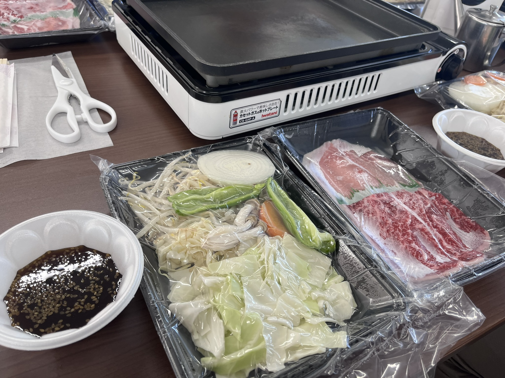

どーん！ **B**・**B**・**Q**！ Foooooooooo!

私はこんな感じでBBQ丼を作っちゃいました👍

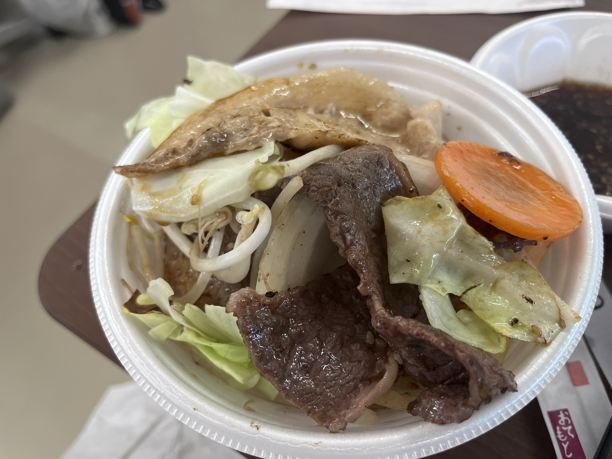

美味しかったな～ 書いている今もお腹空いてきました… いいですよね、、この鉄板で焼いた野菜のあの感じとお肉の感じ？ 楽しかったな～

ただめちゃめちゃ暑くて笑 食べ終わったひとたちが会場の冷房の前に集まってるのがなんか面白かったです笑

[<i class="fa-solid fa-square-caret-up"></i> 日程](#日程)

### おぜちぃと音楽の時間 {#section4}

さあ、すっかりエネルギーもチャージして、いよいよ最後です。ふたたびバスで移動します。到着したのが

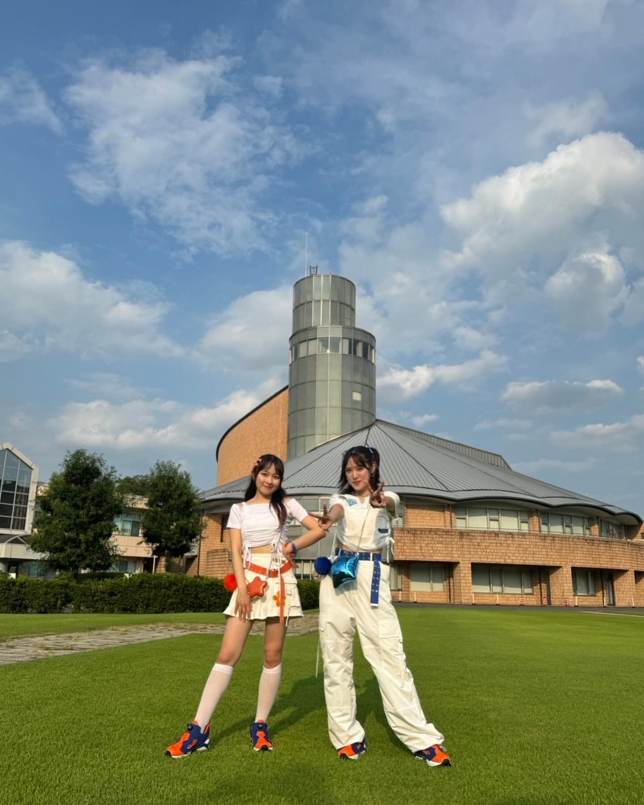

<big>**榛名文化会館 エコール**</big>

こちらで音楽の時間（ライブ）です！！！ 衣装も見てくださいよ！！ 白ベースにお互いのメンバーカラーがリボンだったり、ベルトだったりに差し込まれていて！ また、まいちゃんがパンツ姿でちぃちゃんがスカートなのよ。ね、**わかごめ**とか**GBBG**もね！ まいちゃん男の子側、ちぃちゃんが女の子側ですし！

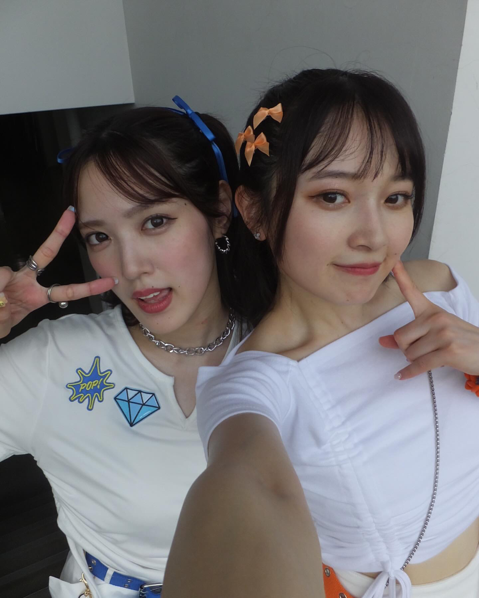

可愛い！！！！！

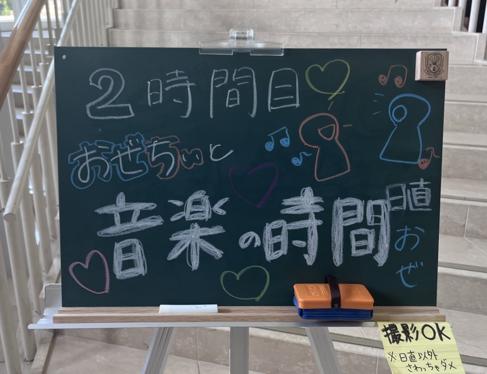

セットリストはこちら！

* 1曲目：わかっているのにごめんね
* MC
* 2曲目：One Summer Night ～真夏の決心～
* 3曲目： 夏色のパレット
* MC
* 4曲目：友情〜心のブスにはならねぇ!〜（ちぃちゃんソロ）
* 5曲目：Yeah! めっちゃホリディ（まいちゃんソロ）
* 6曲目：ロボキッス
* MC ～ イントロサビダンスクイズ
* 7曲目：Good Boy Bad Girl
* 8曲目：キスより先にできること
* 9曲目：SEXY BOY ～そよ風に寄り添って～
* MC
* 10曲目：待てないアフターファイブ

カントリー曲がこんなにも！！！ 

#### 1曲目：わかっているのにごめんね ～ MC

もうイントロで涙腺崩壊しました。会場からも悲鳴が湧き上がってました。わかってましたよ？ ずっと匂わされていましたから！ でも、耐えられないのです。

> まいちゃん「…え？ ごめん、怒ってる……？」   ちぃちゃん「もう！あなたって、なんにもわかってない！」

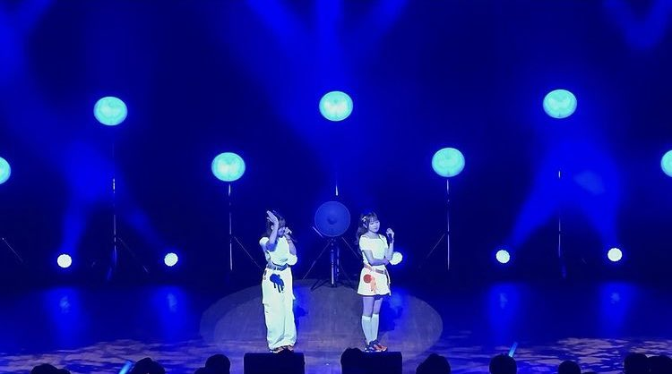

😭😭😭😭😭😭😭😭😭😭😭😭😭😭

涙流している暇はありません。すぐに

> あなたは少し鈍感 円周率は言えるのに

<big>**＼＼＼3.14!!!!／／／**</big>

会場には参加者だけなので200人もいないはずなのですけど、何千人いるの？ってほど大きな**3.14コール**でした😭 

そして

> 記念日だとか～ ＼＼おぜき！！！／／   君が好きだとか～ ＼＼おぜき！！！／／   恋愛だけ苦手科目～ ＼＼ちさき！！！／／   

ついに…ついに…最高の舞台で**わかごめ**が😭

もうこれだけで満足なのですけど、これだけじゃないのです。

> 付き合ってるの？ うそでしょ？   なんか、意外な組み合わせだね   若いっていいわね～ 何をしてもカワイイんだもんね～ あったあった、私にもそんな頃あったわ～！

この台詞パートでは、梨沙ちゃん、まなかん、ももちの声が聴こえるんです😭

そうなのです、おぜちぃはあえて歌わずオリジナルの音源にしているのです😭 おぜちぃはステージ上で耳に手を当てて、まるでここにオリメンが集結しているかのようにしていて。

#### 2曲目：One Summer Night ～真夏の決心～

**わかごめ**、**MC**が終わり、さあ続いての曲…というときにマイクスタンドが現れました。

> まいちゃん「わかるよね？ やなみんじゃないほうね笑」

マイクスタンドパフォーマンスのある楽曲と言えばそう、、**One Summer Night ～真夏の決心～** です。先日の**手持ち花火**もありますし、2019年というカントリーにとっても特別な年の夏のこともあり、感情がぐっちゃぐちゃになりました。

> すごいじゃん、そんな未来 君は驚いた

カントリーを結成してもうすぐ10年を迎える**おぜちぃ**が最高のステージでこれを歌うのです😭

#### 3曲目： 夏色のパレット

エモい時間はまだまだ続きます。**夏色のパレット！**

> ずっと友だちって💙 約束もしたっけ🧡

ここのアイコンタクトもヤバかったです😭 アイコンタクトというより、もうバッチリ目を合わせてて笑 まいちゃんが笑みになりつつもちょっとウルってなってるようにも見えて、ちぃちゃんは笑ってて…

2019年の夏を思い出しますよね… 夏休みのあの楽しいけど終わっちゃうっていう寂しさもあるあの感覚… カントリーも久しぶりにファンクラブイベントが開かれたり、ミュージックビデオも作られたり、盛り上がってはいましたけど、何か寂しさのある夏でした。あのときの切ない気持ちがずっと残っていて、それが5年後にこういう形で**塗りつぶされる**んだなって。

**ワンサマ**も**夏色のパレット**もカントリーヲタにとっては大好きな曲だけど切ない曲でもあって、それが**おぜちぃバスツアー**によって更新された感じがあります。

#### MC

> ちぃちゃん「One Summer Night ～ま・な…つの？けっしん？～」   まいちゃん「ねえ！ そこうろ覚えなのなんで！」   ちぃちゃん「ホニャララ（～）があるの苦手だから笑」

エモくて感動的な気持ちも吹き飛ばす、この**おぜちぃのかけあい**よ笑

#### 4曲目：友情〜心のブスにはならねぇ!〜（ちぃちゃんソロ）

ここからソロコーナー！ちぃちゃんはモーニング娘。乙女組の**友情〜心のブスにはならねぇ!〜**でした！

ロックな感じがまたちぃちゃんっぽい！ 今回の衣装も作業着っぽい感じもあったのですごく合ってました。

#### 5曲目：Yeah! めっちゃホリディ（まいちゃんソロ）

そして、まいちゃんは**めちゃホリ**！ 盛り上がったなー！ いいですね！ ちぃちゃんは学校要素でまいちゃんは夏休み要素というか！

#### 6曲目：ロボキッス

こちらもイントロで悲鳴です。ﾀﾞｯﾀﾞﾀﾞｰﾀﾞﾀﾞｰﾀﾞ！ **ロボキッス**！

おぜちぃは**カントリー・ガールズ ライブツアー2015 秋冬** で**ロボキッス**を披露しています！ それが9年後に復活！

振り付けが可愛いですよね🥰 ステップを踏みながら2人がくるくる回ったり、社交ダンスみたいに相手をくるくる回したり、中でも印象的なのはまいちゃんがポンプ？を踏み込んで、ちぃちゃんがどんどん膨らむというあの振り付け！！

可愛かったな～ MCでも言っていたのですが、このために当時のレッスン映像を見返したらしく

> まいちゃん「結構一生懸命やってるのに！ 先生も😠って顔してて」   ちぃちゃん「🤣」  まいちゃん「だから、まいもすっごい大きく動いてて！」  ちぃちゃん「面白かったね」

いいですよね。どうやら今回のライブのために結構昔の映像を2人で見返したらしくって、それも素敵だなーって。

#### MC ～ イントロサビダンスクイズ

**音楽の時間** ということで、いったん着席してクイズコーナーが始まりました。イントロを聴いて早押し。そして、回答はサビに合わせて踊り、私たちの拍手で踊れていたか踊れていなかったかを判定する、というものでした。

> 天の声「モーニング娘。は除外します！」   ちぃちゃん「ええーーーー！！！」

笑 出題されたのは

* 本気ボンバー!!（ちぃちゃん正解）
* 奇跡の香りダンス（ちぃちゃん正解）
* 桃色スパークリング（まいちゃん正解）
* 好きすぎて バカみたい（まいちゃん正解）
* ドスコイケンキョにダイタン（ちぃちゃん回答をするものの判定で不正解）
* チョトマテクダサイ！（ちぃちゃん回答をするものの判定で不正解）
* Love take it all（最後ということで2人でいきなりサビダンス！ まいちゃんに軍配が上がりました）

サビを聴いてすぐ踊るのもすごかったです！ 私たちは許してにゃん体操どれだけ大変だったか…

そして、またしても笑 ちぃちゃんの敗退ということで罰ゲーム！ 教室のマドンナとしてセリフを言うというもの。

> ちぃちゃん「ねえ、セリフだけ考えてよ」   まいちゃん「意味わかんない！」

笑笑笑笑笑 このおぜちぃの尊いかけあいですよ。。。

#### 7曲目：Good Boy Bad Girl

> なななんで今キスしたの？💙   待ってなんで嫌がってんの？🧡

こちらも**おぜちぃ**曲ですよね😊 冒頭キスするところの歓声もヤバかったです！

#### 8曲目：キスより先にできること

これも楽しかった～

> もんだい～ ＼＼おお～お／／   ばっかり～ ＼＼おお～お／／

ここのコールとかも懐かしい！！ 序盤が**真夏の決心**や**夏色のパレット**でちょっとしんみりしてましたけど、後半は初期のカントリー感があって、懐かしくて、でも、あのころの可愛らしい感じもあって！

ちぃちゃん帰国報告会のときも卒業してから時間も経過してるし、分からないひと多いんじゃないかって心配をしていたと思うんですけど、大丈夫なのです👍 この5年間でも新しくカントリーヲタは増えてますし、むしろ交流は盛んですし、カントリーが残した思い出たちもたくさんありますし、いつもいつも語り合ってますし！ こういう気持ちが声援で伝わるといいなあ！

#### 9曲目：SEXY BOY ～そよ風に寄り添って～

そしてまさかの**セクボ**！ たしかに「海に風太陽のシャワー」とか夏っぽいイメージあります！

おぜちぃがステージ上を縦横無尽に駆け巡りですよ、客席を見渡しながら、私たちも声援で答える時間！

めちゃめちゃ盛り上がりました。まいちゃんも「SEXY BOY たくさん見つけちゃった」って言ってました笑 さすがなのよ👍

#### MC（ラスト）

さて、あっという間にラスト1曲です！ おぜちぃが最後にこの**修学旅行**全体の感想を言います。

このときの**おぜちぃ**も**おぜちぃ**だったな～笑 まいちゃんが話し出そうとすると、ちぃちゃんがあの話笑？ってなって、もう先にゲラゲラ笑ってたり笑

おぜちぃはなんと**前泊**しており、しかも**同部屋**だったのです！！ 

前泊の日はしかも梨沙ちゃんとテレビ電話！！！

> まいちゃん「前泊してるんだ～」

笑 カントリーのメンバーは今でも仲良しらしくって、こうやって定期的に連絡を取ってるんですね😊 

1日目の夜もまいちゃんがどうしてもオリンピックが見たいってことで笑 ちぃちゃんが横になってるのに、まいちゃんが、あ！いけ！とか声をだしてて、

> ちいちゃん「あ、勝ったのかな、、負けたのかな、、😪」

ってなってたらしいです笑

まいちゃんが言ってましたけど、**おぜちぃ** というあまりにも特別な関係の2人ですが、一方で「当たり前」な感じがあるんですよね。

それは有難さを忘れてしまうというよりは、ブランクを全く感じさせなくて、絶好調な感じと言いますか、いつものかけあいがここにはあって、私たちはそれを見るのが大好きなんです。

> まいちゃん「週1で遊んでるよね」   ちぃちゃん「うそ、2週間に1回くらいじゃない？」   まいちゃん「会ってるよ！」   ちぃちゃん「あれじゃない、仕事・プライベート合わせると週1みたいな」   まいちゃん「そう！ バスツアーもあったからいろいろ決めた後ごはんにいったりして」

この感じ伝わってほしい… このよどみのないやりとりなんですよ。すごくリラックスしてて、こうじゃない？ ちがうよ、え、そうだよ、ねえ！ みたいなこの掛け合いなのです。。

#### 10曲目：待てないアフターファイブ

これとっても意外でした！ カントリーで最後の曲っていうと、たとえば、**VIVA**とか**取り調べタイム**なんですけど、**待てアフ**にそのイメージないんです。

ジャジーでスウィングでノリノリになれて、わくわくする曲です！

> おぜちぃ「いつものそこらのどっか～」

でアウトロ～ 私たちも💙🧡ペンライトをくるくる回して、Foooooといいながら終わる！

ここに一切のさみしさがなくて、すごく爽やかで健やかな気持ちになれたんですよね。ああ、終わっちゃった…って不思議と思わなかったというか。

[<i class="fa-solid fa-square-caret-up"></i> 日程](#日程)

### 出発～到着（東京駅） {#section5}

さあ、というわけで、楽しかったバスツアーもあっという間に終わっちゃいました。最後、各号車に**おぜちぃ**も顔を出して、

> おうちに帰るまでがバスツアーですよ！

という話をしてました！

最後に添乗員さんとジャンケンをして勝ったら、各号車にぶら下げてあった**おぜちぃ**の制作したてるてる坊主を獲得するというコーナーがありました。

そこで、なんと、うちの（うちの？） **バンブーさん** [<i class="fa-lg fa-brands fa-square-x-twitter"></i>](https://x.com/country_bamboo){:target="_blank"} と **こばたくさん** [<i class="fa-lg fa-brands fa-square-x-twitter"></i>](https://x.com/Kobataku_0912){:target="_blank"} がやりました👏

とっても素敵だな～って思ったのは、おぜちぃにも私たちはバスの中から手を振ったんですけど、ビッグホリデーのスタッフさんたちにも「ありがとう～！」「楽しかった～！」って手を振るんですよね。最後に添乗員さんのご挨拶のときも、大きな大きな歓声を上げて拍手をしました👏

この2日間が最高に楽しくて、添乗員さんや運転手さん、スタッフさん、旅館の方、みなさんに感謝の気持ちであふれてたんです。みなさまのおかげで最高の思い出ができましたって気持ちをとても伝えたくて。

改めてありがとうございました。一生の思い出ができました。

そして、同室だったバンブーさん、こばたくさん、フルーツ味さんにも改めて感謝です。2日間一緒におぜちぃを分かち合い修学旅行をともにできて楽しかったです。ありがとうございました！ また、いつものヲタクさんたちや初めましてだった方たちにも感謝！！！

不思議と名残惜しい気持ちもなくて！ また会いましょう！ という気持ちでいっぱいです！ 東京駅に到着してからもさらっと別れましたが、気持ちはそんな感じでした！ また、次の現場で会いましたらよろしくお願いします👍

[<i class="fa-solid fa-square-caret-up"></i> 日程](#日程)