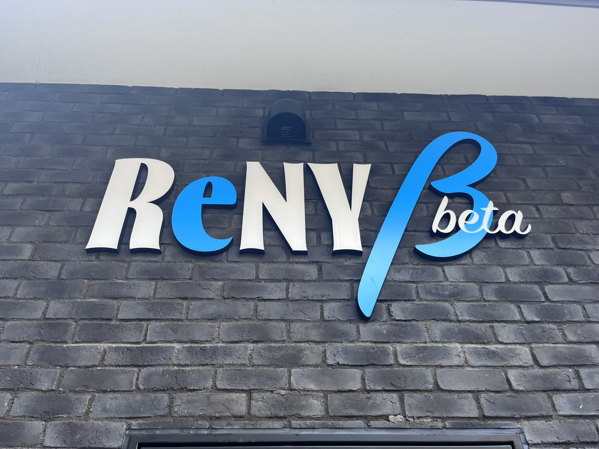
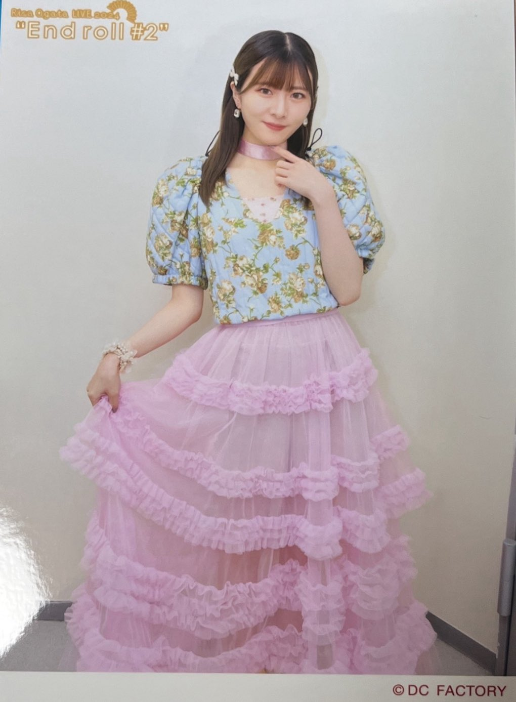
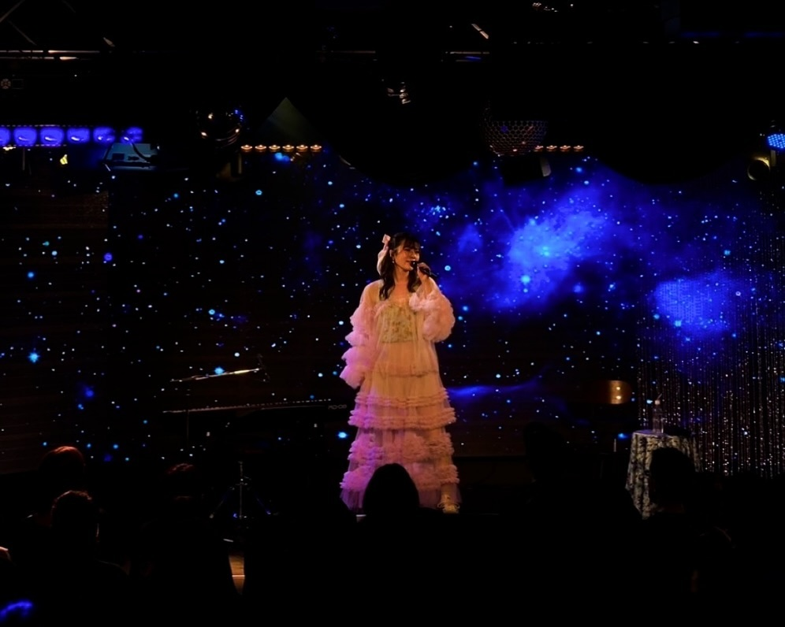
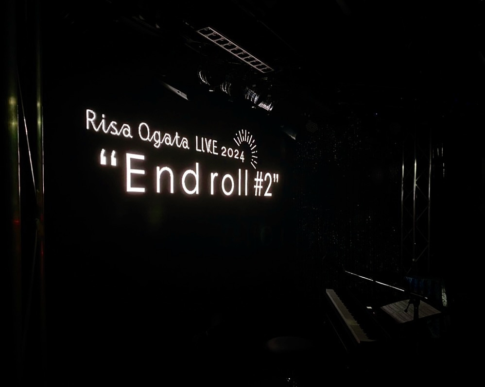

## 2024年8月18日 小片リサ LIVE 2024 "End roll #2"

**小片リサ LIVE 2024 "End roll #2"** の千秋楽に行きました！

会場は

 * **横浜ReNY beta**

でした！ とっても素敵な会場でした！

### 目次 {#目次}

* [1曲目：パラレルファンタジア](#M1)
* [2曲目：幻](#M2)
* [MC](#MC1)
* [3曲目：Happyを止めないで](#M3)
* [4曲目：Painter](#M4)
* [5曲目：Kitty](#M5)
* [6曲目：真夜中のドア～stay with me～](#M6)
* [MC](#MC2)
* [7曲目：歌うたいのバラッド](#M7)
* [8曲目：君が好き](#M8)
* [9曲目：Umbrella](#M9)
* [MC](#MC3)
* [10曲目：あかとき](#M10)
* [11曲目：裸の“Mew"](#M11)
* [12曲目：散歩道](#M12)
* [13曲目：Air](#M13)
* [14曲目：ムーンナイト・シークレット](#M14)
* [15曲目：じらして愛して](#M15)
* [16曲目：ちいさな世界](#M16)
* [17曲目：映画の趣味が合うだけ](#M17)
* [MC](#MC4)
* [18曲目：Actress](#M18)
* [19曲目：虹を超える](#M19)
* [20曲目：Oh,Sunny Days!](#M20)
* [21曲目：君はスターゲイザー](#M21)
* [アンコール：どっち for montage](#encole)
* [MC](#MC5)
* [ダブルアンコール：どっち](#encole2)

[<i class="fa-solid fa-square-caret-up"></i> 目次](#目次)

### 1曲目：パラレルファンタジア {#M1}

開演前、りさまるの丁寧な事前アナウンスがあり、ブザーが鳴り、暗くなり、静まり返ります。まるで**映画館**です。すると、

> ギリリ… ギリリ…

**ゼンマイ** の音です。ステージが照明で照らされて、りさまるが素敵な衣装で現れました。音楽が始まり、りさまるが歌います。

> 何者にもなれないままで 閉じこもっていた箱の中

**パラレルファンタジア**です。なんて素敵な始まりなのでしょうか。箱の中に眠る人形たち、ゼンマイを巻くことで人形は動き出して物語が始まる。このイメージで **End roll #2** は始まるのです。アルバムでは9曲目ですが、改めて聴くと、開幕に相応しい。

そして、音が美しい。静かなのに、音がはっきりと聴こえる。少なくとも私は音響機材の存在を忘れました。まるで静かな空間だから肉声がはっきりと聴こえるかのようなのです。まったく歪みがない。息交じりの歌声が届けられます。なんて贅沢な時間なのでしょうか。

> 水しぶきが 星に変わる

この瞬間、りさまるのバックにあるビジョンに**海の水面**が映し出されます。一気に会場が海に連れていかれるのです。とても感動的でした。

ちなみに衣装はこちらです（グッズの2Lオフショットから）。

いいですよね。キルティング生地で、**素朴**な印象があります。お姫様ではないのです。その世界に住む住人のひとりというか…

[<i class="fa-solid fa-square-caret-up"></i> 目次](#目次)

### 2曲目：幻 {#M2}

照明が**オレンジ**だったのを憶えています。そこはかとなく**フィルム**を感じさせるサウンドです。**パラレルファンタジア**では明るくて絵本の登場人物のようだったりさまるが、一気に幻影的です。さっき**パラレルファンタジア**を歌っていたひととは思えませんでした。次の曲になったというよりも、さっきとは違う空間に身を置いているかのような感覚になりました。それくらい没入感がありました。

> 私が悪かった

特別な歌い方をしていたわけではなかったと思うのですが、細かい息遣いによって、感情が合わせて届けられます。まるで溜息をついて、涙は流していないけど、何か悔しさも覚えるような。

私は不思議でした。ほとんど修辞的な要素は差し引かれているのに、こんなにも感情を受け取るのか。

[<i class="fa-solid fa-square-caret-up"></i> 目次](#目次)

## MC {#MC1}

**幻** が終わり、最初のMCがありました。7公演やってこの公演で**End roll #2**は千秋楽であること、そして、歌声を**丁寧に**届ける、というお話をされていたと思います。

### 3曲目：Happyを止めないで {#M3}

ここで**Happyを止めないで**です。

> Happyを止めないで 🤟

私たちもりさまるに合わせて、この可愛らしいHappy🤟の振り付けを真似します。このとき**ライブ**だ！ って思ったのを憶えてます。1、2曲目は曲の世界に引き込まれていたように思うんですね。だから、ライブを観に来た！というよりは、まるで映画みたいにその世界にのめりこんでいた。でも、ここで一気にライブになるんです。

[<i class="fa-solid fa-square-caret-up"></i> 目次](#目次)

### 4曲目：Painter {#M4}

いい！！ イントロで興奮したなー！ めちゃめちゃかっこい**ギター**！

会場全体もいままで比較的静かだったのにノリノリになりました笑 しかも、**コール & レスポンス** があります。

> ペインター！   ＼＼ペインター！／／   ペインター！

このときも改めて思いましたけど、ロックな曲ですが、りさまるの声は大声ってわけじゃないんですよね。でも、はっきりと聴こえる。とても心地よいんです。

**Happyを止めないで**と**Painter**は**ライブ！**という感じでした。**Happyを止めないで** は **Coeur à coeur** でたしか初披露だったと思います。新曲だ！ってなったのを懐かしく思い出します。この曲が**Painter**に並ぶことでライブ！としての顔を見せたというか、また聴こえ方が変わった気がします。

[<i class="fa-solid fa-square-caret-up"></i> 目次](#目次)

### 5曲目：Kitty {#M5}

また、一気に世界が変わります。たしか照明もネオン色っぽい雰囲気だったような記憶があります。この **Kitty** も今までと聴こえ方が違いました。今まではもっと子どもっぽい印象があったように思います。甘えたような。

ですが、今回はもっと誘惑的な感じ？ 振り付けも猫！というはっきりとしたものではなく、ナチュラルな振り付けのない動きをしていたと思います。

甘えた声の記憶はないんですよね。もっと余裕のある、大人っぽい、慎ましやかな **Kitty** というか。

[<i class="fa-solid fa-square-caret-up"></i> 目次](#目次)

### 6曲目：真夜中のドア～stay with me～ {#M6}

> To you ...

いい… **真夜中のドア～stay with me～** です。こちらも**大人**な曲ですね。こちらも振り付けが慎ましいんです。

> 置いたレコードの針

で、そっと針を落とすのです。お洒落な雰囲気に包まれて、その空気の中で私の身体は漂っていました。

[<i class="fa-solid fa-square-caret-up"></i> 目次](#目次)

### MC {#MC2}

**真夜中のドア**の話がありました。

> オリジナル曲だけでライブができるようになった。だけど、この曲は歌いたかった。

この曲はりさまるがソロ活動を始めた最初のカバー曲なんですね。

* [<i class="fa-lg fa-brands fa-youtube"></i> 真夜中のドア〜stay with me / 小片リサ](https://www.youtube.com/watch?v=LpFTzsG23Pw){:target="_blank"}

2021年6月公開なので、もう3年前なんですね。

今回の **End roll #2** はひとつの**長編映画**です。りさまるは2021年にソロで歌い続ける道を選びました。その始まりが**真夜中のドア**なのです。私たちはいまこの3年間を1本の映画にしたものを観ている。

続いて、りさまるはステージ上の椅子に腰を掛け、私たちも着席して、バラードコーナーが始まります。

[<i class="fa-solid fa-square-caret-up"></i> 目次](#目次)

### 7曲目：歌うたいのバラッド {#M7}

> 嗚呼 唄うことは 難しいことじゃない ただ 声に身をまかせ 頭の中を空っぽにするだけ

このとき、歌詞のひとつひとつの意味が胸に突き刺さり、涙が止まりませんでした。

MCの最後でこういうお話がありました。

> 私はこういうところでお話しすることが得意ではありません。でも、歌にすると気持ちを素直に届けられる。

歌って本当に不思議です。言葉にすることが難しい気持ちも歌で聴くと受け取ることができるし、そしてきっと「歌うたい」にとっては、素直に届けられる。身体的に言葉の意味が理解されているかのような感覚があります。

いままで何度も聴いた曲ですが、この日ほど、この歌詞の言葉のひとつひとつが私の中で言葉として理解されたことはなかったかもしれません。かけがえのない体験をしました。

[<i class="fa-solid fa-square-caret-up"></i> 目次](#目次)

### 8曲目：君が好き {#M8}

もう歌声があまりにも心地よくて、目を閉じてました笑

> 風がさやや

目を閉じてると、**君が好き** のちょっと古風な世界に没入してゆき、身体と空間の境界が溶けていく感覚になりました。この時間は逆にあまり記憶に残ってないんですよね。ただただ心地よい歌声に身を任せて漂っていたような気がします。

[<i class="fa-solid fa-square-caret-up"></i> 目次](#目次)

### 9曲目：Umbrella {#M9}

大好きです。**Umbrella**。

この楽曲も音源とはまったく違う聴こえ方でした。うまく表現できないのですが、立体感があったように思います。

> ねぇ **Umbrella** この恋 **隠して** 確かな時間を頷きながら **Umbrella** ふたりだけの**世界は** 狭すぎて脆くて 霞ながらきらめいた

この部分のハーモニーがとても美しい **Umbrella** ですが、会場では、声の重なりというよりは、包み込まれるような感覚でした。後半になるにつれて音が豪華になってゆき、鳥肌が立ちました。

[<i class="fa-solid fa-square-caret-up"></i> 目次](#目次)

### MC {#MC3}

**歌うたいのバラッド** の話をしていました。この曲はソロ活動を始めた当初にどの曲をカバーするかを選ぶ中で、唯一りさまるが選んだ曲らしいです。この曲には、

> ハッピーエンドの 嗚呼 **映画**をイメージして 唄うよ

という歌詞があります。もちろんこの段階では**映画**のモチーフについて意識してません。たまたまなのですが、偶然以上のものを感じる。そういうお話をしていました。

すごいですよね。私も、**小片リサ × 映画** というコンセプトには偶然以上のものを感じます。劇場で、席に腰を下ろして、静かにスクリーンを眺めて、いろいろな世界を体験できるあの贅沢な時間。素朴で、切なくて、美しくて、感動的な。

[<i class="fa-solid fa-square-caret-up"></i> 目次](#目次)

### 10曲目：あかとき {#M10}

開演前から気になっていたことがありました。ステージ上に電子ピアノがあるのです。私はきっと演奏される方が登場して、**どっち for montage**が披露されると想像をしていました。そうではありませんでした。

MCを終えたりさまるは何も断りなしに電子ピアノの椅子に座ります。そして、丁寧に両手で鍵盤を引き始めました。

> 🎹🎵 🎹🎵 🎹🎵 🎹🎵

これは…

> 響く沈黙と重なる息の音

**あかとき** です。なんとりさまるの**弾き語り**！

音源ではドラムの音などピアノ以外の音が入りますが、りさまるのピアノだけでした。いわゆるピアニストのように流れるような手つきではありません。**あかとき**のピアノはメロディというよりはコードを連ねるタイプです。ひとつひとつ鍵盤と指先を見つめて、丁寧に歌い、そして演奏をしていました。

私たちも耳を澄まして、静寂に包まれた会場には、りさまるのピアノと歌声だけが聴こえます。とてもとても素敵でしたし感動的でした。

[<i class="fa-solid fa-square-caret-up"></i> 目次](#目次)

### 11曲目：裸の“Mew" {#M11}

**裸の"Mew"**です。バラードではありますが、**あかとき** とは打って変わってメロディアスですよね。

こちらも **君が好き** と同じで不思議とはっきりとした記憶がないのです。それは印象に残るものがなかったということではないのです。あまりにも心地よいので何も考えられないという感じなのです。

> 東の窓が白んできて

このとき夜の群青から白い光が差し込んだときのあの色の照明でりさまるが照らされていたように思います。基本的にはバラードコーナーはここまで比較的暗かったように思います。イメージとしても夜明け前です。少し肌寒くて静かで深い時間ですね。

[<i class="fa-solid fa-square-caret-up"></i> 目次](#目次)

### 12曲目：散歩道 {#M12}

**散歩道**です。

> 軽やかな 足取りで

まさに軽やかな歌声だったように思います。**あかとき**、**裸の"Mew"**は軽やかなというよりは浸されていた感じでした。りさまるの歌声も低いときのあの歌声ではなく、高いときの可愛らしさが混じるあの歌声です。

よく憶えているのは

> 空に広がる 雲みたいに

サビに入るところでビジョンに**青空**とふわふわと形をゆっくりと変える**雲**が映し出されていました。身体的にも私たちは空に漂っていた心地よさがありました。

[<i class="fa-solid fa-square-caret-up"></i> 目次](#目次)

### 13曲目：Air {#M13}

バラードコーナーは終わり、りさまるは衣装替えのために一時的にステージを離れます。

このとき、会場に流れていた音楽は、私のそのときの感覚は

> **montage**のある曲のサウンドだ、きっとライブアレンジされたイントロだ、すごく心躍る、かっこいい… この曲は…

こういう感じでした。そして、より一層軽くなった衣装でりさまるが現れます。

> 2歩3歩先のドアが遠くて 大人になっても 踏み出せなくて

**Air**です！！！ このイントロがめちゃめちゃかっこよくて！！ 興奮しました！！

**End roll #2** の全体がそうなのですが、とりわけ、この曲のりさまるの表情が自信に満ち溢れていたように思います。たしかに、今もまだいろいろ模索中なのだとは思います。ただ、とても満足感や達成感が伝わるんですね。

最後にお立ち台に上がります。きっとただ立っていただけなのですが、イメージでは、仁王立ちして腰に手をかけていたような感じです。つまり、とても頼もしいお姿でした。

> うつむいた君へ 風を送る **大丈夫** **君は** **大丈夫**

感動しました。私はリリースイベントで**Air**は生で聴いたことがあったのですが、このときは、踏み出すことをためらう気持ちを歌が追い風になって背中を押してくれている、つっかえていた気持ちを素直に届けられる、という印象でした。そのときも感動したのですが、この日はそうじゃないのです。

ひとつの達成を迎えたりさまるが、ソロ活動を始めて、孤独と戦い、自分と向き合い、不安に悩まされている自分自身に向けて、

> **大丈夫** **君は** **大丈夫**

と、今のあなたは間違えてない、その方向で大丈夫、そしたらこんな素敵な光景が待ってる！ って言ってるような感じがしたんです。

そう思えて涙が止まりませんでした。

[<i class="fa-solid fa-square-caret-up"></i> 目次](#目次)

### 14曲目：ムーンナイト・シークレット {#M14}

**ムーンナイト・シークレット** はもともとの私の印象では、大人に憧れる子どもっぽさを感じていました。しかし、この日はその中にも余裕を感じました。必死さではなく、遊びを感じたというか、楽しんでいる感じ。

たとえば、

> 気のない素振りみせて やっぱ まだバイバイ したくない そんなのも覚えたの

のところは、ね、私もこういうことできるようになったでしょ？ という誇らしげな感じ。それがまた可愛らしかったりするのです。

[<i class="fa-solid fa-square-caret-up"></i> 目次](#目次)

### 15曲目：じらして愛して {#M15}

**じらして愛して**。まず、**ムーンナイト・シークレット** からの **じらして愛して** ってすごく分かりますよね笑

**Happyを止めないで** と **Painter**、そして、**じらして愛して** と **ムーンナイト・シークレット**。なんとなくこの2曲が連続しているのがよく分かる感じがするんです。

**じらして愛して** は、

* どっち EP
* montage

の2バージョンがあります。**どっち EP** の方は比較的淡々としている気がします。一方、**montage** は息が切れていて限界を迎えている感じ。

**End roll #2** では、不思議なんですけど、余裕な感じと切迫感の両方を感じたんですよね。感情が前面には現れていないのですけど、ちょっと心配になるような。なんでそう思ったのだろう。たとえば、最後の

> その視線だけで

のところは **montage** の方はかなり息切れ！って感じなのですけど、**End roll #2** はそこまで激しくないと思いつつも、なにかこう、切迫感なんですよね。

もし映像が残っているのであれば、もう一度確認をしたい。

[<i class="fa-solid fa-square-caret-up"></i> 目次](#目次)

### 16曲目：ちいさな世界 {#M16}

さて、また場面転換というか、雰囲気が変わります。全体的に **End roll #2** はあまり振り付けのあるダンスはしていなかったと思います。ただ、**ちいさな世界** は結構踊っていた記憶があります。逆に踊っているのが新鮮なくらい。

ただ、つい1年前くらいのりさまるはこうだったような気もするんですね。りさまるのソロ活動って、

* **2021年**：bon voyage
* **2022年**：どっちEP
* **2023年**：映画の趣味が合うだけ
* **2024年**：montage

おおむね、こういう時代になると思うんです。そして、この4年間を1本の映画にしたのが **End roll #2** なんだと思うんです。それでいうと、この**ちいさな世界**と**映画の趣味が合うだけ**が**2023年**の感じかなって。

なので、わずかに懐かしささえ思ったというか、つい最近のことなんですけど、**montage** のりさまるの印象が強すぎて、**montage** 以前をもはや歴史的に思ってしまうというか。

[<i class="fa-solid fa-square-caret-up"></i> 目次](#目次)

### 17曲目：映画の趣味が合うだけ {#M17}

さて、**ちいさな世界** に続いて **映画の趣味が合うだけ** です！

なんというかもはや感慨深かったですよね笑 この曲がきっかけでここまでの**映画**モチーフが生まれたんだよなって。実はこの会場の **横浜 ReNY beta** って、横浜の**関内**って場所にあるのですが、**映画の趣味が合うだけ** の撮影スポット周辺なんですよね。私も**映画の趣味が合うだけ**のMV

[<i class="fa-lg fa-brands fa-youtube"></i> 小片リサ『映画の趣味が合うだけ』Promotion Edit](https://www.youtube.com/watch?v=11D-FGWW_Ew)

が公開されたときに、待ち合わせ場所に行ったり、カフェに行ったりしたなあって！ **montage** 聴いているときは、アルバム内の曲として聴いていたんですけど、**End roll #2** はりさまるのソロの歴史の中の一曲という聴こえ方でした。

[<i class="fa-solid fa-square-caret-up"></i> 目次](#目次)

### MC {#MC4}

ここではたしか続く**Actress**の話をしていたと思います。ただ、なんというのですかね。この曲ってかなり重たいというか、多くのものを賭けている曲だと思うのですが、やはりここでも、誇らしげであり、自信を感じたんですよね。

[<i class="fa-solid fa-square-caret-up"></i> 目次](#目次)

### 18曲目：Actress {#M18}

**Actress** は **montage** の中でも特別な楽曲だと思います。そして、最も差し迫る歌です。歌詞も深刻であり、胸が苦しくなるものです。

そのため、会場では生でそれを浴びるわけですから、覚悟をしなければ、と思っていたのです。しかし、想像とは違っていました。やはり、**Actress** が抱えている困難に克服の兆しがあるんですよね。

たしかにまだ模索をしている最中なのだとは思うのですが、ひとつの答えを見つけているかのような。

> 窓に映る私 目を逸らさずに見つめて

ここも何というか**懇願**ではないのです。**誇示**のような。「見つめて」と言い放ち、会場に静寂が一瞬生まれたとき、鳥肌が立ちました。かっこいいのです。

[<i class="fa-solid fa-square-caret-up"></i> 目次](#目次)

### 19曲目：虹を超える {#M19}

**虹を超える**！

**虹を超える** と続く **Oh, Sunny Days!** は 

* Coeur à coeur
* éclatant

といった、**COTTON CLUB**や**清澄**で開催された単独公演のイメージが思い出されました。これらもりさまるの歴史の一つの場面ですよね。

> ほら風を切って まだ走れるって 傘なんてもういらないの 水溜まり蹴とばしてくんだよ

やっぱりライブですから、より一層、胸が躍るし気持ちも跳ねます。また、サビの

> 虹を超える ような アーチ

のところで、ビジョンが虹が映し出されて、天井の照明たちも虹色に輝いていました。改めて、りさまるって空のイメージもありますよね。分厚い雲に覆い隠されるような空、そして、一気に晴れ渡る青空！ そして、虹！

会場全体も後半のたたみかけを予感したりもしてとても盛り上がっていました！

[<i class="fa-solid fa-square-caret-up"></i> 目次](#目次)

### 20曲目：Oh,Sunny Days! {#M20}

そして！ **Oh, Sunny Days!**

こちらもお馴染みですね😊 この2曲で会場には一気に太陽が差し込んで、みんなも笑みがこぼれます。

> Oh, Sunny Days! So, Fine Days!

ここでみんなで手を振るんです✋ とっても幸せでした！

**Oh, Sunny Days!** って、イメージですけど、ライブの最後に会場全体を照らして、みんなで盛り上がりましょう！ っていう感じなんですよね。だから、楽しかった～最高だった～みたいな終わった気持ちになったんです。そしたら…

[<i class="fa-solid fa-square-caret-up"></i> 目次](#目次)

### 21曲目：君はスターゲイザー {#M21}

これがめちゃめちゃ盛り上がった！！

まず、音源では

> 届かない手を 抱きしめてずっと

と、歌から始まりますよね？ ライブでは**Air**と同じくライブアレンジされたイントロが流れたんです！！ りさまるが歌い出して、そして、煽るんです！！

> ＼＼Wow Wow Wo Wo Oh Oh!／／

会場全体で歌いました！ **End roll #2** では、**Painter** のペインターコールを除けば、ここまで大きなコールはここだけです！！

**Air** のときは青空を滑空する感じだったんですけど、この時間は夜空にキラキラ眩しいくらいに輝いていたイメージです。

あそこはたしかに「満天の星空の下」でした。

> あの夏の涙――――――――――――

なんでしょう、あの広大な輝きは！

そして、アウトロでもう一度

> ＼＼Wow Wow Wo Wo Oh Oh!／／

しかも、りさまるも合わせて歌うんです！ 会場一体になって最高のファイナルを祝福するかのようで！

[<i class="fa-solid fa-square-caret-up"></i> 目次](#目次)

### アンコール：どっち for montage {#encole}

**君はスターゲイザー** が終わり、ステージからりさまるははけて、会場は大拍手に包まれます。私たちはすっかり満足していました。

そして、拍手はアンコールの手拍子に変わります。静かに現れたりさまる。私たちも静まり返ります。

> 最期の時 何を思う？

完全な静寂。ただ唯一聴こえるのは歌声です。伴奏はありません。アカペラ。**どっち for montage** です。

**montage** の最終曲です。しかし、アルバムのバージョンとは違いました。**1コーラス目に入っても伴奏が始まりません。** 1コーラスまるまるアカペラでした。

りさまるの歌だけが聴こえる時間です。歌声と歌声の間には完全な静寂であり、その時間もりさまるにすべて委ねられています。

息遣いまで聴こえるほど静かなのに、言葉がはっきりと聴こえる、あの美しい声。

[<i class="fa-solid fa-square-caret-up"></i> 目次](#目次)

### MC {#MC5}

「**最期**のとき」の話をしていました。今回のライブのタイトルも**End roll #2**です。「どっち」は確かに「最期のとき」の歌です。

> 月並みではあるけれど、終わりだからといって寂しいとは限らない

そう言っていました。

2021年に **真夜中のドア** のカバーから始まり、カバーアルバム **bon voyage** のリリース。そして、単独公演が始まります。2022年には、初めてのオリジナルEP **どっち** がリリース。単独公演でも未音源の新曲 **ムーンナイト・シークレット**、**Happyを止めないで**、**虹を超える** が披露されました。少しずつオリジナル曲が増えます。2023年には、初めてのシングル**映画の趣味が合うだけ**、**ちいさな世界**。2024年には、1stアルバム **montage** です。

この全体がまるで1本の映画のように上映されていたかのようでした。**最期** にはきっと過去を思い返します。そして、最高のエンディングを迎えてた今、あるのは満足感や達成感です。

> 一生の思い出です

りさまるはこうも言っていました。映画はたしかに**一生**を体験するところがあります。私たちもそういう気持ちになりました。今日だけのものというより、**一生**というスケールを感じたのです。

[<i class="fa-solid fa-square-caret-up"></i> 目次](#目次)

### ダブルアンコール：どっち {#encole2}

まだ、拍手は鳴りやみません。そして、再び手拍子です。改めて現れたりさまるが

> それでは、もう一曲

と言って、流れたのが

* どっち

**for montage ではありません。** EPのバージョンです。素敵な演出です。まるで最終回はエンディングがオープニングになるような。円環を感じました。しかも、**for montage** のあとに。**どっち** はりさまるにとって**最初**のオリジナル曲です。

**最期**と**最初**が繋がり**円環**が描かれる。このときたしかにひとつの完成を私は見ました。

[<i class="fa-solid fa-square-caret-up"></i> 目次](#目次)

### End roll #2

上演終了です。会場にはたしか**あかとき**が流れていました。私たちは拍手を続けました。このときの拍手はあまりにも素晴らしいものを見たこの感動を身体で表現したいから生まれたものでした。少なくともこの会場の音楽が終わるまでは続けよう。会場でこの気持ちが分かち合われていたと思います。

そして、音楽が終わり、改めて大きな拍手をしました。

> エンドロール 見る派 だって 分かったあの瞬間

会場は上演終了後の映画館の光景そのものでした。私たちに包まれていたのは最高の映画を観た後の沈黙です。

不思議と寂しい気持ちはありませんでした。「終わっちゃった」ではなく「いい終わりだった」なのです。

> だけど、明確なのは   声を届けられる人であり続けたいということ。[<i class="fa-lg fa-brands fa-instagram"></i>](https://www.instagram.com/p/C-z5w1GPjQ5){:target="_blank"}

次どうなるのかは分からないけど、今日までの月日がきっと未来に実を結ぶんだろうな、という思いが確かにあります。来たる日のことを楽しみにしつつ、この映画の余韻にしばらくは浸りたいと思います。

[<i class="fa-solid fa-square-caret-up"></i> 目次](#目次)
